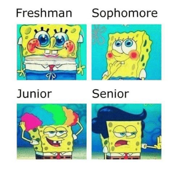
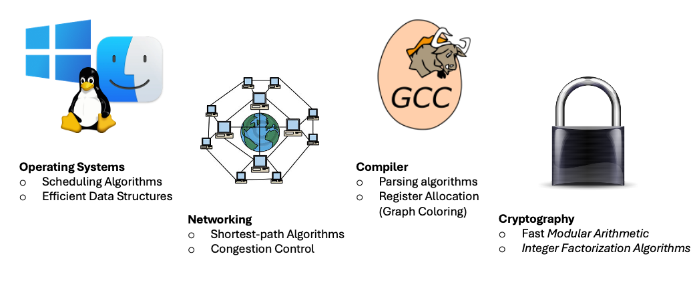
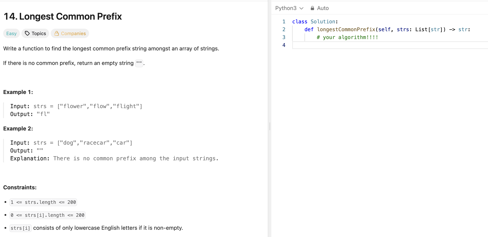
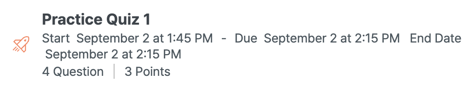

# Welcome to COSE214 - Algorithms!

_Fall 2025, Korea University_

Instructor: Gabin An ([gabin_an@korea.ac.kr](mailto:gabin_an@korea.ac.kr))


---

# I. Introduction

---

## Who Am I?

- Instructor: Gabin An (gabin_an@korea.ac.kr)
  - Assistant Professor, Department of Computer Science and Engineering
  - Ph.D. in Computer Science, KAIST (Major: Software Engineering)
  - Published in top **Software Engineering / Software Testing** venues, including FSE’24, ICSE’23, ASE’23, ICSE’22, ISSTA’21, and others
  - Served on program and organizing committees of major SE conferences (e.g., ICSE’25 PC, ASE’25 PC & OC, ICST’26 OC, …)
- Websites:
  - 🌱 Personal: [https://agb94.github.io](https://agb94.github.io)
  - 🧪 Lab: [https://ku-selene.github.io](https://ku-selene.github.io)

---

### Industry Experience 

- Software Engineer in Test, Roku (Jun 2024 – Jul 2025)


---

### **S**oftware **E**ngineering **L**aboratory for next-g**EN** **E**cosystems 

>  Our new research group, [SELENE🌙]((https://ku-selene.github.io/)), launches this semester!

Mission: Conduct research that leads to **BETTER software**

📣 We are looking for **undergraduate research assistants** who are interested in:

- Automated Software Testing and Debugging
- Applications of Large Language Models (LLMs) to Software Engineering
- Log Parsing & Analysis Algorithms

> E.g., Using LLMs to discover and resolve software bugs
> Detecting mismatches between code and documentation
> Designing efficient algorithms that can extract patterns from messy system logs


---

## Who are you?




---

# Why are you here?

---

Because...
- Algorithms are **fundamental**, **useful**, and **fun**! 😊


---

Now, let’s be real... 🤓
- COSE214 is a **required course** for Computer Science majors.


---

Okay, why is COSE214 required then?

Because...
- Algorithms are **fundamental**.
- Algorithms are **useful**.
- Algorithms are **fun**.


---

### 1. Algorithms are fundamental.

- Algorithms are the **backbone of computer science**.  
- Wherever CS goes, algorithms are there:




---

### 2. Algorithms are useful.

- Two major drivers of technological progress:
	1. **Hardware improvements** (e.g., Moore’s Law)
	2. **Algorithmic breakthroughs**

> **Hardware alone isn’t enough.**  
> Smarter algorithms can outperform brute force hardware gains.


---

### 3. Algorithms are fun.

- Algorithm design is where **logic meets creativity**.
- Some problems still lack efficient algorithms. We’re still searching.
- Unexpected solutions and counterintuitive insights abound.

> Algorithms aren't just about coding. They’re really about how we think 🧠.


---

## 🧐 What _is_ an Algorithm?

Let’s build this up step by step:

1. **What is a Problem?**  
    A _problem_ is a binary relation between inputs and correct outputs.
2. **What is an Algorithm?**  
    An _algorithm_ is a finite, well-defined procedure that maps inputs to outputs.
	> Think of an algorithm as a function.
3. An algorithm **solves** a problem if:  
    It produces the **correct output for every input** in the problem’s domain.


---




---

## Course Goals

- Get to know a variety of **interesting and classic problems**
	- e.g., sorting, shortest paths, scheduling, etc.
- Learn to **think analytically** about algorithms
- Build your own **algorithmic toolkit**
- Learn to **communicate clearly and precisely** about algorithms


---

## Course Outline (Before Midterm) - _subject to change_

- Part 1: Basics
   - Divide and Conquer (w/ Integer Multiplication)
   - Basic Sorting Algorithms (Insertion Sort & Merge Sort)
   - Asymptotic Analysis (Big-O, Big-Theta, Big-Omega)
   - Solving Recurrences Using Master Method
- Part 2: Advanced Selection and Sorting
   - Median and Selection Algorithm
   - Solving Recurrences Using Substitution Method
   - Quick Sort, Counting Sort, Radix Sort
- Part 3: Data Structures
   - Heaps, Binary Search Trees, Balanced BSTs


---

## Course Outline (Before Midterm) - Main Problems to Cover (1/2)

- Integer Multiplication
  $$
  9 \cdot 8 = 72
  $$

  $$
  5678 \cdot 1234 = 7006652
  $$

  $$
  3141592653589793238462643383279502884197 \cdot 2718281828459045235360287471352662497757 = ?
  $$


---

## Course Outline (Before Midterm) - Main Problems to Cover (2/2)

- Sorting
	```python
	sort([3, 6, 4, 8, 1])
	# Expected: [1, 3, 4, 6, 8]
	```
	> There are many sorting algorithms. How can we formally prove their _correctness_ and demonstrate that one is more efficient than another?

- Selecting the k-th smallest element
	```python
	select([3, 6, 4, 8, 1], 2)
	# Expected: 3

	select([3, 6, 4, 8, 1], 5)
	# Expected: 8
	```


---

## Course Outline (Before Midterm) - Data Structure Examples

- Heap (Min-Heap): The parent is always less than or equal to its children.

```
        2
      /   \
     4     7
    / \   /
   8  10  9
```

- Binary Search Tree: left child < parent < right child
```
        6
      /   \
     3     9
    / \   / \
   1  5  7  11
```


---

## Course Outline (After Midterm)  - _subject to change_

- Part 3: Data Structures - Continued
   - Graphs, Graph Search and Applications
- Part 4: Dynamic Programming
   - Shortest-Path: Dijkstra, Bellman-Ford, Floyd-Warshall Algorithms
   - More Dynamic Programming: Longest Common Subsequence, Knapsack Problem
- Part 5: Greedy Algorithms
   - Scheduling Problem, Optimal Codes
   - Minimum Spanning Trees
   - Max Flow, Min Cut and Ford-Fulkerson Algorithms
   - Stable Matching, Gale-Shapley Algorithm


---

# II. Logistics


---

## Offline Lectures

- Time: 1:30-2:45pm, Tuesdays & Thursdays
- Place: Room #610, Jung Woonoh IT & General Education Center
	- 정운오IT교양관 610호


---

## Course Resources

- Course website: [KULMS (https://mylms.korea.ac.kr/courses/73181)](https://mylms.korea.ac.kr/courses/73181)
	- Announcements, lecture notes, assignments, and all other resources will be posted here!


---

## Office Hours

- Time
	- 3:00-5:00pm, Thursdays
- Place
	- Room #204, Woo Jung Informatics Building (우정정보관)
    	- Tentative for September — location may change later in the semester
- Details
  - **September only**: Appointment required - *please email me to schedule*. ‼️
  - **From October onward**: No appointment needed — feel free to drop by with questions!
    - The new office location will be announced later.
  - You're also welcome to ask questions right after the lecture.


---

## Grading

- Attendance: 5%
- Quizzes & Assignments: 15%
- Midterm Exam: 40%
- Final Exam: 40%


---

### Attendance Check


- Hybrid Use of Manual & Smart Attendance
- Each student will receive **two** tokens:
   - 1 token → Covers one absence
   - 0.5 token → Excuses one late arrival


---

### Quizzes & Assignments

- Quizzes will be conducted in class through the LMS system.
- The **lowest quiz score will be dropped**. For example, if there were four quizzes, and you scored `[10, 8, 9, 0]`, the `0` would be excluded.
- Assignments will be either “problem-solving” or “programming” (Python) assignments (TBD).
- Quizzes and assignments carry equal weight. For instance, if there are 3 quizzes and 2 assignments, the lowest quiz score will be dropped, and the remaining 4 items will be equally weighted in the final grade.


---

### Practice Quiz!


- Check out at https://mylms.korea.ac.kr/courses/73181! 📝
- passwd: `algorithmisfun!`

---

### Exams

We will have **offline, in-person exams**:
- **Midterm Exam**
    - 1:30–2:45 PM, Thursday, October 23
- **Final Exam**
    - 1:30–2:45 PM, Thursday, December 18
- **Format:** Closed book, with **one A4 cheat sheet (both sides)** allowed

- **Alternate exams** will be provided **only** for students with a documented scheduling conflict. Please notify the instructor in advance if this applies to you.


---

## Collaboration and Academic Dishonesty


- Plagiarism is strongly prohibited. Do not copy other students' work. If this happens, that will be reported to the department.
- I can’t stop you from using LLMs (e.g., ChatGPT or Gemini), but keep in mind that _algorithms are a fundamental part of computer science_. You’ll retain much more if you take the time to study and work through the material yourself.


---

# Credits & Resources

Lecture materials adapted from:
- Stanford CS161 slides and lecture notes
  - https://stanford-cs161.github.io/winter2025/
- _Algorithms Illuminated_ by Tim Roughgarden
  - https://algorithmsilluminated.com/


<style>
  img[alt~='center'] {
    display: block;
    margin-left: auto;
    margin-right: auto;
  }
</style>