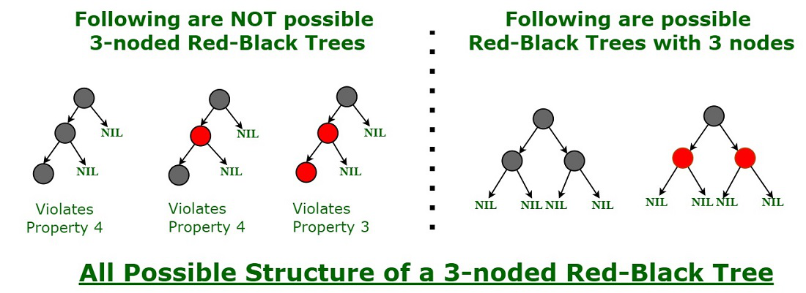
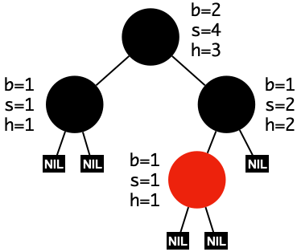
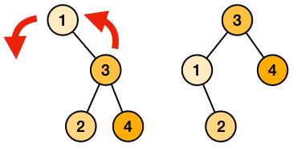
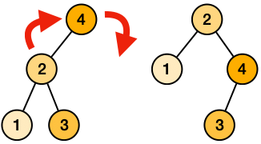
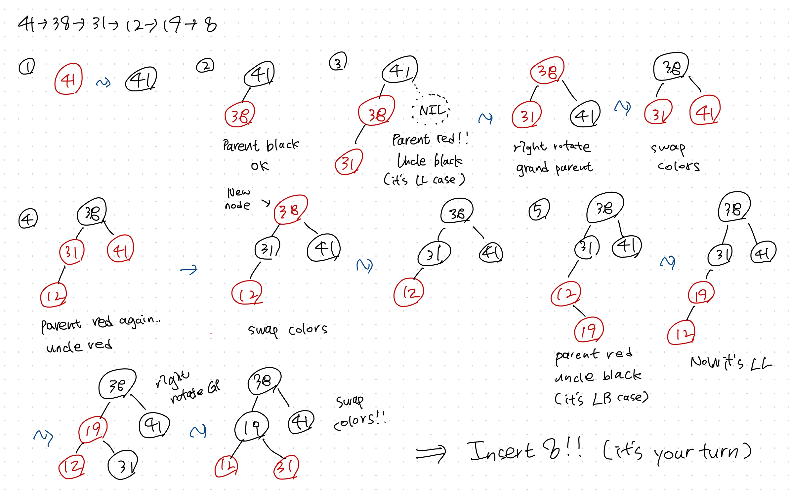
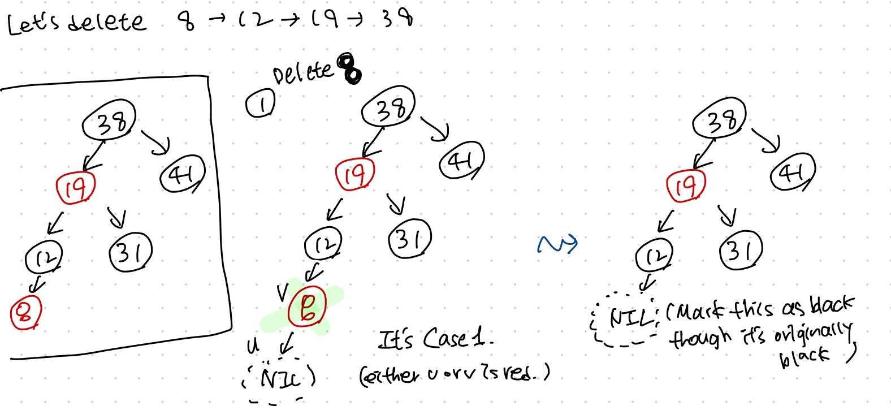

# Lecture 11a - Balanced Binary Search Tree (Red Black Tree) - Part A

_Fall 2025, Korea University_

Instructor: Gabin An ([gabin_an@korea.ac.kr](mailto:gabin_an@korea.ac.kr))

---

# Hope you had a great **Chuseok**! 🌾


---

# In today’s class, we’ll

- Take a Quiz#2
- Review Binary Search Tree (BST)
- Learn Self-Balancing BSTs
- Learn Red-Black Trees
  - Definition & Properties
  - Operations:
    - Tree Rotation (Left / Right)
    - Insertion (with Rotation & Recoloring) - *next class*
    - Deletion (with Rotation & Recoloring) - *next class*


---

# Quiz #2 ⭐️

- Time limit: 15 minutes
- Start time: 13:40
- Materials: Lecture slides/notes may be used (open notes, not open internet)


---

# **Binary Search Tree (BST)** 🌲

A binary search tree is a binary tree where all keys in a node’s left subtree are less than the node’s key, and all keys in its right subtree are greater.

```
       4                4                9                1         
     /   \            /   \            /   \            /   \       
    2     5          2     6          2     6          2     6      
   / \     \        / \   / \        / \   / \        / \          
  1   3     6      1   3 5   7      1   4 7   8      3   4      

      BST              BST           Not a BST        Not a BST
```


---

### `search(i)`

```
       4        
     /   \       search(3)
    2     5      -> 4 (large! search in the left tree)
   / \     \     -> 2 (small! search in the right tree)
  1   3     6    -> 3 (found!!)
```

- **What if the element does not exist in our BST?**: We simply return the node that would be the parent of this node if we inserted it into our tree.

```
       4        
     /   \      search(3.5)
    2     5     -> 4 (large! search in the left tree)
   / \     \    -> 2 (small! search in the right tree)
  1   3     6   -> 3 (small! but the right child is NIL; return node 3)
       \
      (3.5) <- does not exist
```

---

### `insert(i)`

- Find the parent node `x` where `i` should be inserted using `search(i)`.
- Create a new node `y` with `key(y)=i` and no children and attach `y` to `x`.

Example: `insert(3)`
```
       4         
     /   \       -> search(3)
    2     5      -> 4 (large! search in the left tree)
   /       \     -> 2 (small! search in the right tree)
  1         6    -> NIL (parent node found)
```

```
       4         
     /   \       
    2     5      
   / \     \     
  1   3     6   
```


---

### `delete(i)`

- Delection is a bit more complicated.
- To delete a node `x` that exists in our tree, we consider several cases:
  - Case 1: `x` has no childeren
    - We simply remove it.
  - Case 2: `x` has only one child `c`
    - We **elevate** `c` to take `x`’s position in the tree.
  - Case 3: `x` has two childern, a left child `c1` and right child `c2`
    - We find `x`'s **immediate successor** `z` and have `z` take `x`'s position in the tree. Then, we remove the original succesor (Case 1 or Case 2).

---


```
         4                                 4       
       /   \      --- delete(5) --->     /       
      2     5                           2     
```

```
         4                                 4       
       /   \                             /   \      
      2     5     --- delete(5) --->    2     6
     / \     \                         / \         
    1   3     6                       1   3        
```

```
       2                                             3               3  
     /   \                                         /   \           /   \ 
    1     5  -- delete(2) --> successor = 3 -->   1     5   -->   1     5
         /                                             /               /    
        3                                             3*              4    
         \                                             \                  
          4                                             4               
```

---

### Time Complexity of `search(i)`, `insert(i)`, and `delete(i)`

- **Search** runs in $O(\text{height of tree})$ in the worst case.
- **Insert** and **delete** call `search` a constant number of times and do $O(1)$ extra work, so their runtimes are also $O(\text{height of tree})$.
- Height of tree:
  - **Best case** (completely balanced): $O(\log n)$, **Worst case** (long chain): $O(n)$
    ```
       2                    3                       1
      / \                  /                         \
     1   3                2                           2
                         /                             \
                        1                               3
    Balanced        Long Lefttward Path    Long Rightward Path
    ```


---

# It's Time to Learn Self-Balancing BSTs.

| Operation  | Sorted Array     |  BST (height $h$) | Balanced BST     |
|------------|------------------|-------------------|------------------|
| Search     | $\Theta(\log n)$ | $\Theta(h)$       | $\Theta(\log n)$ |
| Insert     | $\Theta(n)$ 🤔   | $\Theta(h)$       | $\Theta(\log n)$ |
| Delete     | $\Theta(n)$ 🤔   | $\Theta(h)$       | $\Theta(\log n)$ |

- Sorted arrays: fast search, slow updates.
- Unbalanced BST: updates are fast **only if** $h (\text{height of tree}) = O(\log n)$.
  - Worst case: $h = O(n)$ → linked-list-like performance.
- Solution: **Self-balancing BSTs** (AVL tree, red–black tree, etc.).


---

## Idea of Balancing ⚖️

- Keep tree height close to $\log n$ after every insertion/deletion.
- **Self-balancing BSTs**:
  - Detect when the tree is becoming too tall or skewed.
  - Apply **rotations** and **recoloring/restructuring** to restore balance.
- Many variants exist such as AVL trees (strict height balance) and Red–Black trees (color-based, less strict, easier insert/delete), Splay trees, Treaps, etc.
  
- In this class, we focus on **Red–Black Trees**. 
  - Widely used in libraries (`std::map`, `TreeMap`).


---

# 🔴⚫️ Red–Black Tree: Definition

A Red–Black Tree is a BST with an extra bit of storage (color) per node.

**Properties:**

1. Every node is red or black.
2. The root is black.
3. NILs are black.
4. The children of a red node are black.
5. For every node x, all x to NIL paths have the same number of black nodes on them.


---

## Examples


1. Every node is red or black.
2. The root is black.
3. NILs are black.
4. The children of a red node are black.
5. For every node x, all x to NIL paths have the same number of black nodes on them.

---

## Why These Properties Work

- Property 4 limits consecutive reds → **prevents skewed long chains of red nodes**.
- Property 5 forces black nodes to be evenly distributed → **keeps height small**.

> A chain of 3 nodes is not possible in the Red-Black tree.

  


---

### Claim: A red–black tree with $n$ nodes has height $\le 2 \log_2(n+1) = O(\log n)$

**Proof.** For a node $x$,
- let $b(x)$ be its *black height* (i.e., # black nodes on any $x \to \text{NIL}$ path excluding $x$)
- let $s(x)$ be the subtree size (including $x$).



- Notice that the black height is at least half of the height because there are **no two consecutive red nodes** on any root-to-NIL path.
  - $b(x) \ge \frac{h(x)}{2}$ (where $h(x)$ is the height of $x$)


---

### Claim: A red–black tree with $n$ nodes has height $\le 2 \log_2(n+1) = O(\log n)$

**Proof (Continued).**

Let's show $s(x) \ge 2^{b(x)} − 1$  via induction on the height of $x$:

**Base case ($h=0$)**: NIL node has $b(x) = 0$ and $2^0 − 1 = 0$ non-NIL descendants. ✅

**Inductive step:** Using the *IH* $s(y) \ge 2^{b(y)} - 1$ for children $y$ of $x$, i.e., $b(y) \ge b(x) - 1$

$$
\begin{aligned}
s(x) &= 1 + s(\text{left}(x)) + s(\text{right}(x)) \ge 1 + \left( 2^{b(x)-1} - 1 \right) + \left( 2^{b(x)-1} - 1 \right) = 2^{b(x)} - 1
\end{aligned}
$$

Therefore, $s(x) \ge 2^{b(x)} - 1$ for every $x$ in a red-black tree. ✅

Finally, when $r$ is a root,
$$
n = s(r) \ge 2^{b(r)} - 1 \ge 2^{h(r)/2} - 1 \quad \rightarrow \quad h = h(r) \le 2 \log_2(n+1)\quad \blacksquare
$$

---

# Live Visualization: Red–Black Tree

🕹️ **Try it:** https://www.cs.usfca.edu/~galles/visualization/RedBlack.html

What to observe as you insert/delete:
- **No two reds in a row** (Property 4)
- **Uniform black-height** on all root→leaf paths (Property 5)
- **Rotations** (left/right) and **recoloring** after each update

**Suggested demo sequence**
- Insert: `41, 38, 31, 12, 19, 8`
- Delete: `8, 12, 19, 38`

---

# Basic Operations on a Red-Black Tree

1. **Search**: Same as in a normal BST (binary search based on key ordering).
2. **Insertion**: Insert as in a normal BST, then fix any violations of red-black properties via **rotations and recoloring**.
3. **Deletion**: Delete as in a normal BST, then restore red-black properties through **rotations and recoloring.**


---

## **Rotation**

- **Purpose**: Maintain balance after insertion/deletion
  - Tree rotations can be performed in O(1) time.
- **Types**:
  1. Left Rotation
  2. Right Rotation


---


## Recall: BST's Subtree Property

```
1)        x            2)      x            
        /   \                /   \          
       y    ...            ...    y         
      / \                        / \           
    ...  z                      z  ...
        / \                    / \
```

1) If `left(x)` is `y` and `right(y)` is `z` , then all keys in `z`’s subtree satisfy:
   - `y` < keys < `x`
2) If `right(x)` is `y` and `left(y)` is `z` , then all keys in `z`’s subtree satisfy:
   - `x` < keys < `y`


---

### Left Rotation



- **Goal**: Move a node down to the left, bring its right child up.
    ```
    Before Rotation | After Rotation
         x          |        y  
          \         |       / \ 
           y        |      x   b  
          / \       |       \  
         a   b      |        a  
    ```
    - x < a < y < b


---

### Right Rotation



- **Goal**: Move a node down to the left, bring its right child up.
    ```
    Before Rotation | After Rotation
            x       |        y  
           /        |       / \ 
          y         |      a   x  
         / \        |         / 
        a   b       |        b  
    ```
    - a < y < b < x


---

# Next Class: Red-Black Tree Insertion / Deletion




---



---

# Credits & Resources

Lecture materials adapted from:
- Stanford CS161 slides and lecture notes
  - https://stanford-cs161.github.io/winter2025/
- _Algorithms Illuminated_ by Tim Roughgarden
  - https://algorithmsilluminated.com/

**Reference**:
- https://www.geeksforgeeks.org/dsa/introduction-to-red-black-tree
- https://www.geeksforgeeks.org/dsa/c-program-red-black-tree-insertion/
- https://studyglance.in/ds/display.php?tno=27&topic=Red-Black-Tree

<style>
  img[alt~='center'] {
    display: block;
    margin-left: auto;
    margin-right: auto;
  }
</style>