# Lecture 11b - Balanced Binary Search Tree (Red Black Tree) - Part 2

_Fall 2025, Korea University_

Instructor: Gabin An ([gabin_an@korea.ac.kr](mailto:gabin_an@korea.ac.kr))


---

#### Course Outline (Before Midterm) - Recap

- Part 1: Basics
   - ~~Divide and Conquer~~
   - ~~Basic Sorting Algorithms (Insertion Sort & Merge Sort)~~
   - ~~Asymptotic Analysis (Big-O, Big-Theta, Big-Omega)~~
   - ~~Solving Recurrences Using Master Method~~
- Part 2: Advanced Selection and Sorting
   - ~~Median and Selection Algorithm~~
   - ~~Solving Recurrences Using Substitution Method~~
   - ~~Quicksort, Counting Sort, Radix Sort~~
- Part 3: Data Structures 
   - ~~Heaps, Binary Search Trees~~, **Balanced BSTs** - *Now we are here!📍*


---

# Today's Agenda

- Learn Red-Black Trees
  - Quick Review: Definition & Properties
  - Operations:
    - Tree Rotation (Left / Right)
    - Insertion (with Rotation & Recoloring)
    - Deletion (with Rotation & Recoloring)


---

# Midterm Exam Information (Offline & In-Person)

- Date & Time:
  - Thursday, October 23
  - 1:30 – 2:45 PM

- Location:
  - Room 610 – Students with odd student IDs (33 students)
  - Room 616 – Students with even student IDs (32 students)

> ⚠️ Please sit with one empty seat between each student.
> 📚 Format: Closed book — but one A4 cheat sheet (both sides) is allowed.


---

# 🔴⚫️ Red–Black Tree: Definition

A Red–Black Tree is a BST with an extra bit of storage (color) per node.

**Properties:**

1. Every node is red or black.
2. The root is black.
3. NILs are black.
4. The children of a red node are black.
5. For every node x, all x to NIL paths have the same number of black nodes on them.


---

## Examples


1. Every node is red or black.
2. The root is black.
3. NILs are black.
4. The children of a red node are black.
5. For every node x, all x to NIL paths have the same number of black nodes on them.


---

## Why These Properties Work

- Property 4 limits consecutive reds → **prevents skewed long chains of red nodes**.
- Property 5 forces black nodes to be evenly distributed → **keeps height small**.

> A chain of 3 nodes is not possible in the Red-Black tree.

  


---

### Claim: A red–black tree with $n$ nodes has height $\le 2 \log_2(n+1) = O(\log n)$


**Let's show $s(x) \ge 2^{b(x)} − 1$  via induction on the height of $x$** (Base case: NIL node ✅)
Using the *IH* $s(y) \ge 2^{b(y)} - 1$ for children $y$ of $x$, i.e., $b(y) \ge b(x) - 1$
$$
\begin{aligned}
s(x) &= 1 + s(\text{left}(x)) + s(\text{right}(x)) \ge 1 + \left( 2^{b(x)-1} - 1 \right) + \left( 2^{b(x)-1} - 1 \right) = 2^{b(x)} - 1\quad
\end{aligned}
$$
Finally, when $r$ is a root,
$$
n = s(r) \ge 2^{b(r)} - 1 \ge 2^{h(r)/2} - 1 \quad \rightarrow \quad h = h(r) \le 2 \log_2(n+1)\quad \blacksquare
$$


---

# Basic Operations on a Red-Black Tree

1. **Search**: Same as in a normal BST (binary search based on key ordering).
2. **Insertion**: Insert as in a normal BST, then fix any violations of red-black properties via **rotations and recoloring**.
3. **Deletion**: Delete as in a normal BST, then restore red-black properties through **rotations and recoloring.**


---

## **Rotation**

- **Purpose**: Maintain balance after insertion/deletion
  - Tree rotations can be performed in O(1) time.
- **Types**:
  1. Left Rotation
  2. Right Rotation


---

##### Left Rotation

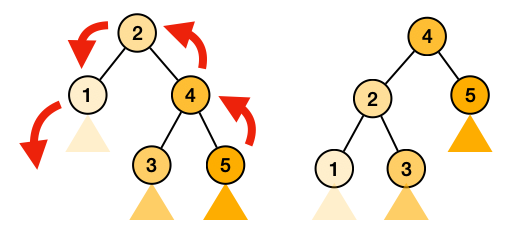

##### Right Rotation

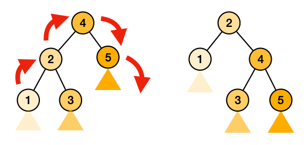


---

## **Insertion**

- Inserting a new node in a Red-Black Tree involves a two-step process:
  1. Performing a standard BST insertion
  2. Fixing any violations of Red-Black properties

- Rule: **A newly inserted node is always **RED** 🔴** !!
  - If new node is root, change color of new node as black.
  - If the parent of the new node is black, no properties are violated.
  - **If the parent is red, the tree might violate the Red Property, requiring fixes.**


---

### Fixing Violations During Insertion


When inserting a **red** node under a **red** parent, we must fix violations of the Red-Black properties. We handle cases based on the color of the **uncle** (parent’s sibling).

#### Case 1: Uncle is Red (Fix via Only Recoloring)
> Recolor the parent and uncle to black, and the grandparent to red. Then move up the tree to check for further violations.

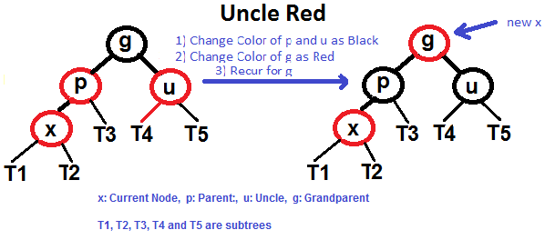


---

#### Case 2: Uncle is Black (Fix via Rotation Followed by Recoloring)

> Note that grandparent must have been black since parent is red.

- There are four cases:
  - Left-Left (LL), Right-Right (RR), Left-Right (LR), and Right-Left (RL)


##### Sub-Case 2.1: Left-Left Case (`g.left == p` and `p.left == x`)
> Right rotate `g` and swap colors of `p` and `g`


---

##### Sub-Case 2.2: Right-Right Case (`g.right == p` and `p.right == x`)
> Left rotate `g` and swap colors of `p` and `g`


---

##### Sub-Case 2.3: Left-Right Case (`g.left == p` and `p.right == x`)
> Left rotate `p` and apply left-left case!


---

##### Sub-Case 2.4: Right-Left Case (`g.right == p` and `p.left == x`)
> Right rotate `p` and apply right-right case!


---


---

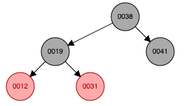
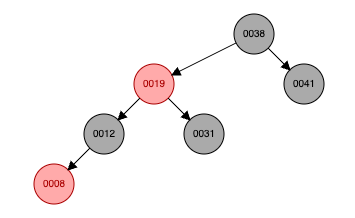

Recoloring the grandparent to black helps preserve the black-height property.


---

## **Deletion**

- Deletion operations in a Red-Black Tree (RBT) can be quite complex due to the balancing rules that need to be maintained. 
- Deleting a new node in a Red-Black Tree involves a two-step process:
  1. Performing a standard BST deletion
  2. Fixing any violations of Red-Black properties

        > The main property that violates after insertion is two consecutive reds (i.e., Property 4). In delete, the main violated property is, **change of black height in subtrees (i.e., Property 5**) as deletion of a black node may cause reduced black height in one root to leaf path.


---

### Recall: Standard BST Deletion
- When we perform standard delete operation in BST, we always end up deleting a node which is an either leaf or has only one child.
- For an internal node, we copy the successor and then recursively call delete for successor, successor is always a leaf node or a node with one child. 

```
       2                                             3               3  
     /   \                                         /   \           /   \ 
    1     5  -- delete(2) --> successor = 3 -->   1     5   -->   1     5
         /                                             /               /    
        3                                             3*              4    
         \                                             \                  
          4                                             4               
```


---

### Fixing Violations During Deletion

- We only need to handle cases **where a node is leaf or has one child**. 
- Let `v` be the node to be deleted and `u` be the child that replaces `v`.
  - Note that `u` is NIL (black) when `v` is a leaf.
  - Note that both `u` and `v` cannot be red as `v` is parent of `u` (due to Property 4).
  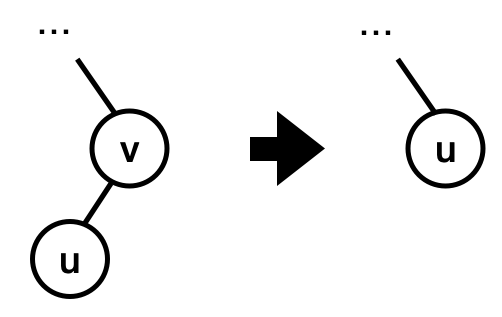
- There are two cases:
  - Case 1: Either `u` or `v` is red.
  - Case 2: Both `u` and `v` are black.


---

#### Case 1: Either `u` or `v` is Red (Simple!!)

> Mark the replaced child as black (no change in black height).

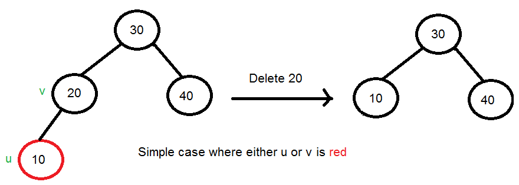


---

#### Case 2: Both `u` and `v` are black.

Step 1. Color `u` as double black. Now our task reduces to **convert this double black to single black**.
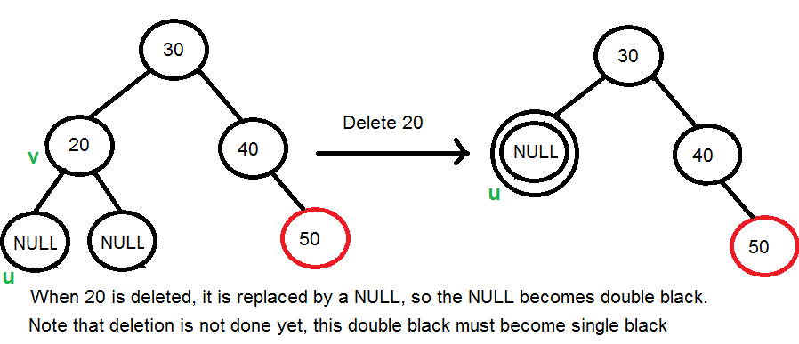


---

Step 2. Do following while the current node `u` is double black, and it is not the root.
Let sibling of node be `s`. There are three cases:
   - 2(a) **Black Sibling + Red Nibling Case** ⬅️
     - `s` is black, and *at least* one of `s`'s children is red.
     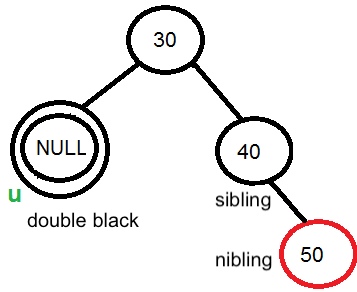
   - 2(b) Black Sibling + Black Niblings Case
     - `s` is black, and both children of `s` are black.
   - 2(c) Red Sibling Case
     - `s` is red.


---

- **2(a) Black Sibling + Red Nibling Case**

  - If `s` is black and at least one of `s`'s children is red, let the red child of `s` be `r`. There are four cases depending upon positions of `s` and `r`: Left-Left, Right-Right, Left-Right, Right-Left.

🔺 Black Sibling + Red Nibling + **Right-Right Case** (`p.right == s`, and `s.right` red)
> Left rotate `p` and change the color of `r` to black.

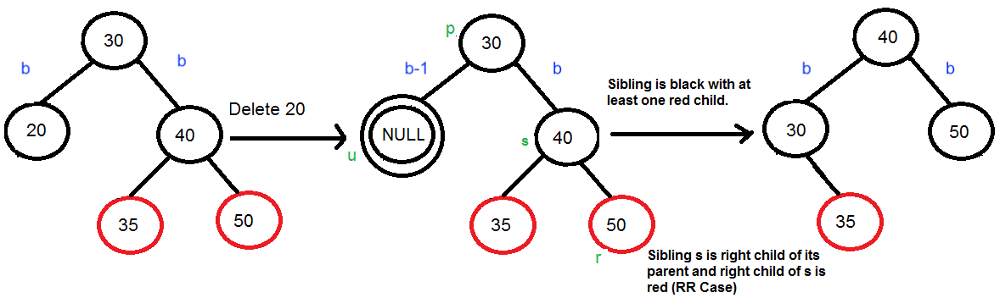

---

🔺 Black Sibling + Red Nibling + **Right-Left Case** (`p.right == s`, and `s.right` not red)
> Right rotate `s`, and swap colors and `s` and `r`. Now it's Right-Right Case!

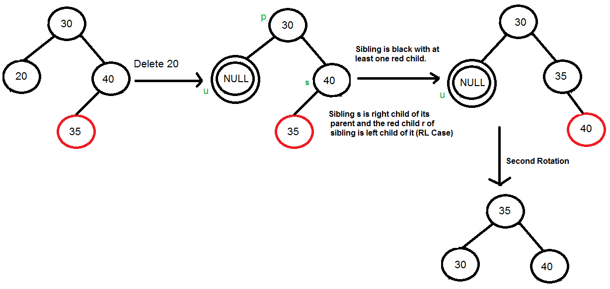

---

Step 2. Do following while the current node `u` is double black, and it is not the root.
Let sibling of node be `s`. There are three cases:
   - 2(a) ~~Black Sibling + Red Nibling Case~~
     - `s` is black, and *at least* one of `s`'s children is red.
   - 2(b) **Black Sibling + Black Niblings Case** ⬅️
     - `s` is black, and both children of `s` are black.
     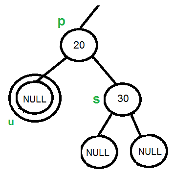
   - 2(c) Red Sibling Case
     - `s` is red.

---

- **2(b) Black Sibling + Black Niblings Case**

  - If `s` is black and `s`'s both children is black,
      > Recolor `s` red. If `p` (the parent) is red, recolor `p` black and stop. If `p` is black, the “double black” moves up to `p`; recurse at `p`.
      
      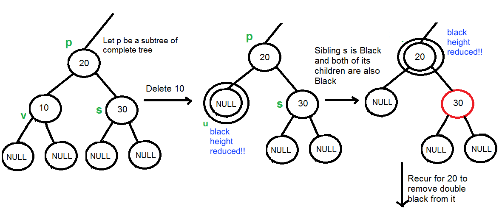

---

Step 2. Do following while the current node `u` is double black, and it is not the root.
Let sibling of node be `s`. There are three cases:
   - 2(a) ~~Black Sibling + Red Nibling Case~~
     - `s` is black, and *at least* one of `s`'s children is red.
   - 2(b) ~~Black Sibling + Black Niblings Case~~ 
     - `s` is black, and both children of `s` are black.
   - 2(c) **Red Sibling Case** ⬅️
     - `s` is red.
     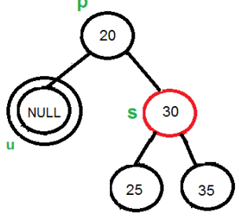

---

- **2(c) Red Sibling Case**

    If `s` is red, the childrens of `s` are black. 
    > Perform a rotation to move old sibling up, and recolor the old sibling and parent. 
    > Now it's Black Sibling Case.

    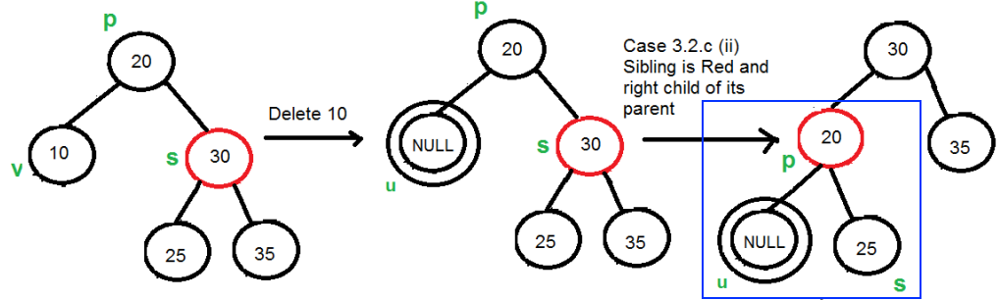

---

Step 3. If the current double black `u` is root, make it single black and return.


---

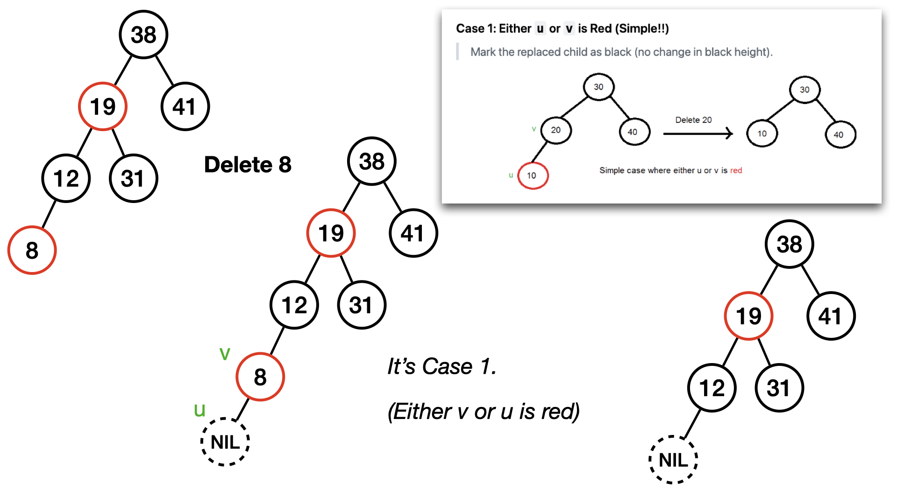

---

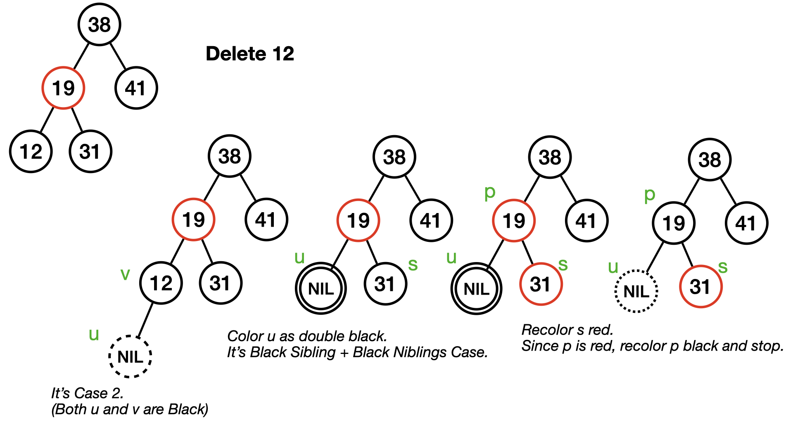

---

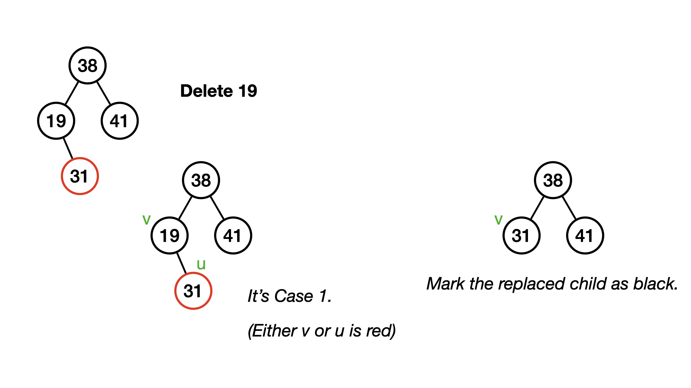

---

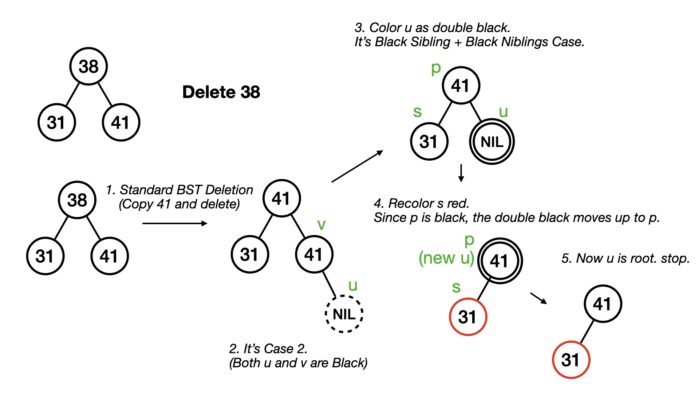

---

## Visualizer Results

https://www.cs.usfca.edu/~galles/visualization/RedBlack.html
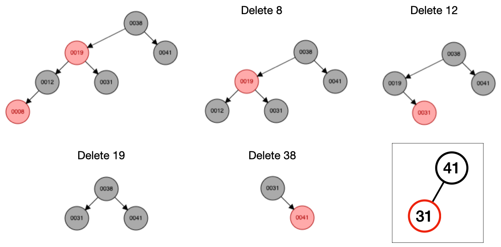
Compare this result with the the previous example. Think about why they are different.


---

# Comparison with AVL Tree

- AVL trees are more strictly balanced than Red–Black trees.
  - This strict balance means **faster searches** in worst case.
  - However, AVL trees often require more rotations during insertions and deletions.
- Red–Black trees are less strictly balanced, so searches can be slightly slower.
  - But Red–Black trees typically require fewer rotations, making them better for frequent updates.
- Choose Red–Black if your application involves **frequent insertions/deletions**.
- Choose AVL if **searches are frequent** and updates are rare.


---

# Credits & Resources

Lecture materials adapted from:
- Stanford CS161 slides and lecture notes
  - https://stanford-cs161.github.io/winter2025/
- _Algorithms Illuminated_ by Tim Roughgarden
  - https://algorithmsilluminated.com/

**Reference**:
- https://www.geeksforgeeks.org/dsa/introduction-to-red-black-tree
- https://www.geeksforgeeks.org/dsa/c-program-red-black-tree-insertion/
- https://studyglance.in/ds/display.php?tno=27&topic=Red-Black-Tree

<style>
  img[alt~='center'] {
    display: block;
    margin-left: auto;
    margin-right: auto;
  }
</style>