# Lecture 13 - Strongly Connected Components

_Fall 2025, Korea University_

Instructor: Gabin An ([gabin_an@korea.ac.kr](mailto:gabin_an@korea.ac.kr))


---

# Recap: Graphs, DFS, and BFS


---

# Connected Components (Undirected Graphs)

- A **connected component** of an undirected graph $G=(V,E)$ is:  
  A **maximal** set $S \subseteq V$ such that 
  **$\forall u,v \in S$, there exists a path from $u$ to $v$**.  
  - Maximal: If $S'$ is connected and $S \subset S'$, then $S = S'$


---

## Example

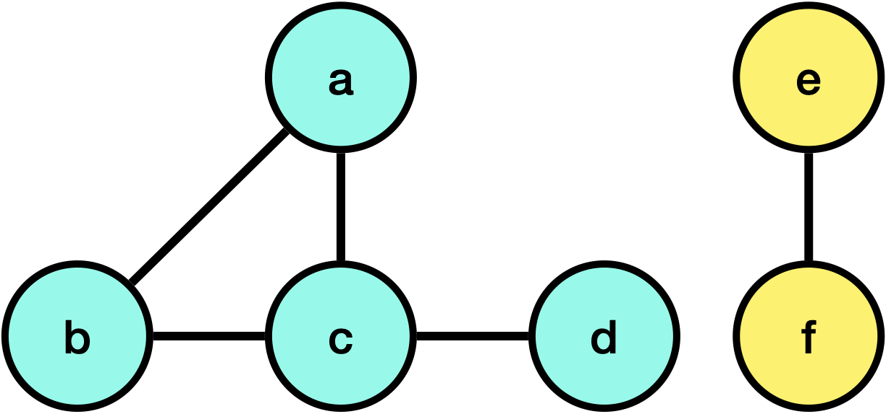
- $\{a, b, c\}$ is connected but expandable → ❌ not maximal.
- $\{a, b, c, d\}$ is connected and not expandable → ✅ maximal → connected component.
- $\{e, f\}$ is connected & maximal → ✅ connected component.

---

## Formal Definition  
- Define a relation $u \sim v$ if $G$ has a path $u \to v$.  
- This is an **equivalence relation** (symmetric, reflexive, transitive).
  1. **Reflexive:** $\forall u \in V, u \sim u$
  2. **Symmetric:** $u \sim v \implies v \sim u$
  3. **Transitive:** $u \sim v \land v \sim w \implies u \sim w$
- Each **equivalence class** under $\sim$ is a **connected component** — that is, a maximal set of vertices all connected to each other.


---

## Finding Connected Components in Undirected Graphs

**Algorithm**  
- Pick a vertex, run **BFS/DFS** → all reached vertices = one component.  
- Repeat until all vertices are visited.  

**Runtime:**  
- Each vertex/edge is explored once.  
- Total = $O(|V| + |E|)$.


---

# Directed Graphs: Connectivity

- Undirected connectivity is straightforward.  
- In **directed graphs**, Connectivity is **no longer symmetric**.
- We distinguish two notions:  

  ### **Weak** Connectivity
  - Ignore edge directions → compute undirected components.  

  ### **Strong** Connectivity
  - $u$ and $v$ are in the same **Strongly Connected Component (SCC)** if:  
    $u \to v$ AND $v \to u$ (*mutual reachability*).  


---

## Example from Assignment #2


- $\{0, 3, 4, 5\}$ is a strongly connected component.
- $\{0, 1, 2, 3, 4, 5\}$ is a weakly connected component.


---

## Example: Strongly Connected Components of a Directed Graph

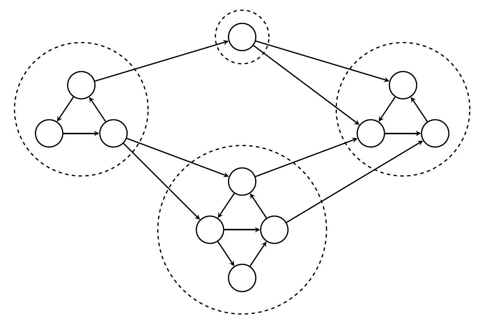

---

## **Strongly Connected Components (SCCs)** - Today's Topic ✨

<div class="one-one-columns">

<div>


**Definition:**  
A **strongly connected component (SCC)** is a maximal set $S \subseteq V$ such that  every vertex has a path to every other vertex in $S$.  

- SCCs partition the vertex set: Each vertex belongs to exactly one SCC.
- Within SCC: cycles possible.  
- Between SCCs: no cycles — forms a **DAG** (Directed Acylic Graph).

</div>

<div>


</div>

</div>


---

# Algorithm to Find SCCs

**Kosaraju’s Algorithm**: A linear time algorithm to find the strongly connected components of a directed graph.

**Step 1.** Reverse the graph $G \to G^{rev}$.
**Step 2.** Run DFS on $G^{rev}$ (any order), compute finishing times $f(v)$.  
**Step 3.** Run DFS on $G$, processing vertices in **decreasing order of $f(v)$** and assigning a "leader" to each vertex (i.e., the source vertex that the DFS started from).


---

**Step 1.** Reverse the graph $G \to G^{rev}$.

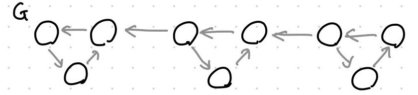

$G^{rev}$
```


```

---

**Step 2.** Run DFS on $G^{rev}$ (any order), compute finishing times $f(v)$.  
```
Algorithm DFS(s, t):
    foreach v in N(s) do
        if vis(v) == false then
            t ← DFS(v, t)
            t ← t + 1
    f(s) ← t
    return f(s)
```

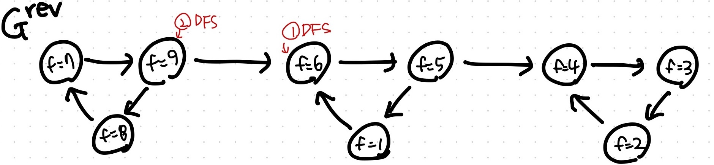

> Different DFS choices → different $f(v)$ assignments, but correctness still holds.


---

**Step 3.** Run DFS on $G$, processing vertices in **decreasing order of $f(v)$** and assigning a "leader" to each vertex (i.e., the source vertex that the DFS started from).


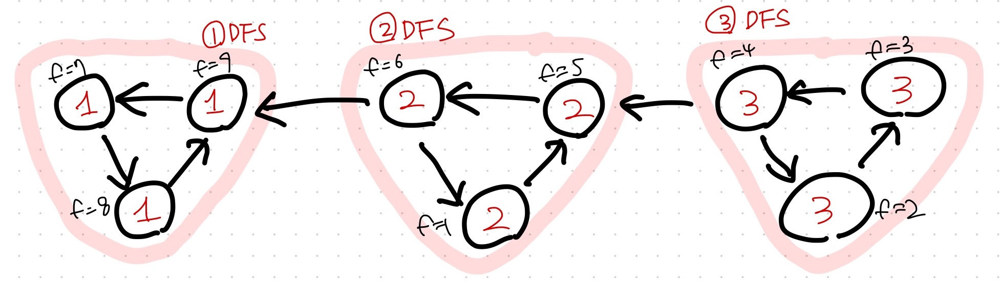

- Each DFS call discovers one SCC.


---

# The Meta-Graph of SCCs

- Contract each SCC into a “meta-node.”  
- Add edges between SCCs if original graph has them.  

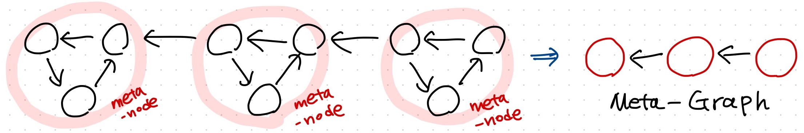

**Fact:** The SCC meta-graph is always a **Directed Acyclic Graph (DAG)**.  
- Cycles within SCCs collapse into single nodes.  
- No cycle can exist across SCCs.


---

# The Key Lemma

**Key Lemma**  
If there is an edge $C_1 \to C_2$ (between SCCs), then $\max_{v \in C_1}f(v) < \max_{v \in C_2}f(v)$.

**Example**
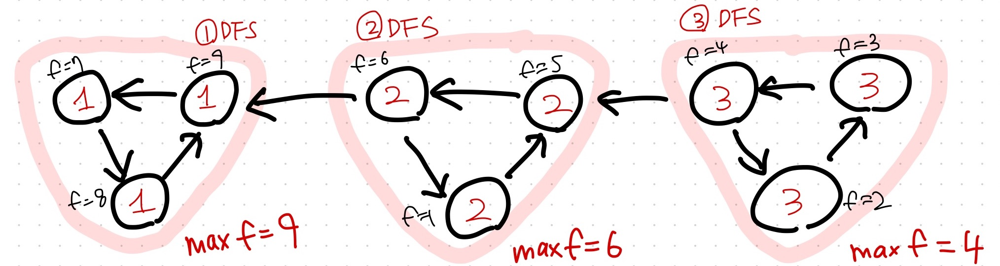


---

**Proof**
> If there is an edge $C_1 \to C_2$ (between SCCs), then $\max_{v \in C_1}f(v) < \max_{v \in C_2}f(v)$  


Let $v$ denote the first vertex of $C_1 \cup C_2$ visited by DFS.

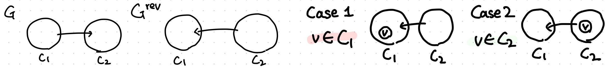

Then, there are two cases:
1. Case 1: $v \in C_1$
2. Case 2: $v \in C_2$

---

> If there is an edge $C_1 \to C_2$ (between SCCs), then $\max_{v \in C_1}f(v) < \max_{v \in C_2}f(v)$  

1. Case 1: $v \in C_1$

<div class="one-one-columns">

<div>

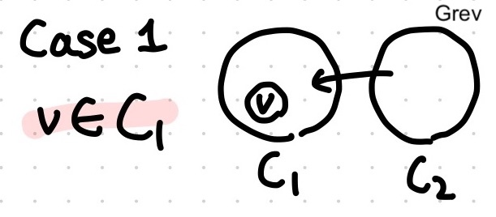

</div>

<div>

DFS will finish exploring all vertices in $C_1$ without reaching any vertices in $C_2$.
$$
\forall v_1 \in C_1, \forall v_2 \in C_2, f(v_1) < f(v_2)
$$
$$
\rightarrow \quad \max_{v \in C_1}f(v) < \max_{v \in C_2}f(v)
$$

</div>

</div>

2. Case 2: $v \in C_2$

<div class="one-one-columns">

<div>

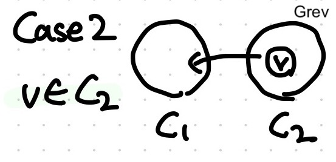

</div>

<div>

DFS will finish exploring all the vertices in $C_1$ and $C_2$ before ending (at $v$). Therefore, the fishing time of $v$ is the largest among the vertices in $C_1 \cup C_2$.


</div>

</div>

---


**Key Lemma**  
If there is an edge $C_1 \to C_2$ (between SCCs), then $\max_{v \in C_1}f(v) < \max_{v \in C_2}f(v)$.


**Consequence**
Processing vertices in **decreasing order of finishing times** ensures that each DFS call discovers **exactly one SCC**. 


---

## Correctness of Kosaraju’s Algorithm (Intuition: "Onion Layers" 🧅!)


- Intuitively, DFS peels off the graph **one SCC at a time**, like removing successive **layers of an onion**.

- All outgoing edges from the current SCC lead to SCCs that have **already been explored** (e.g., when exploring $C_3 \to C_2$, $C_2$ is guaranteed to be finished).


---


---

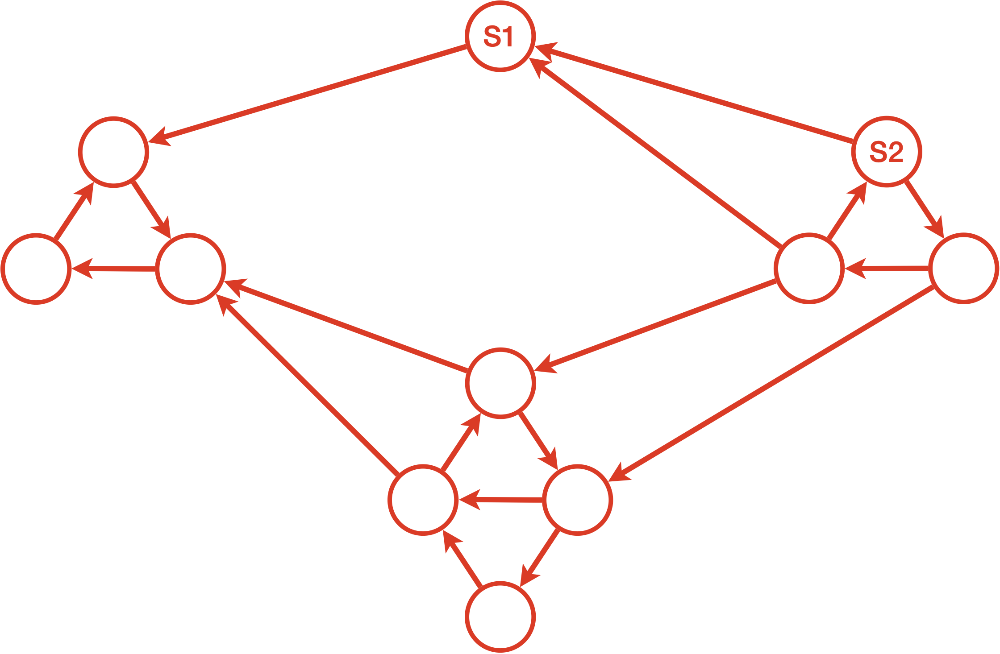

---

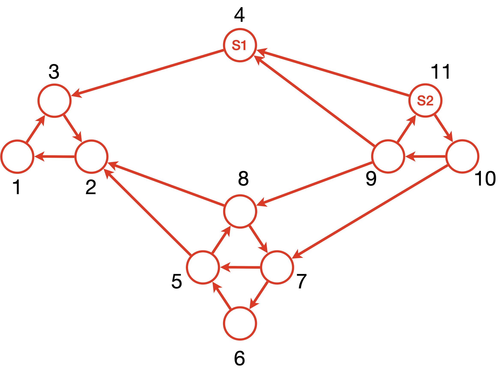

---


---

# Credits & Resources

Lecture materials adapted from:
- Stanford CS161 slides and lecture notes
  - https://stanford-cs161.github.io/winter2025/
- _Algorithms Illuminated_ by Tim Roughgarden
  - https://algorithmsilluminated.com/

<style>
  img[alt~='center'] {
    display: block;
    margin-left: auto;
    margin-right: auto;
  }

  .one-one-columns {
    display: grid;
    grid-template-columns: repeat(2, minmax(0, 1fr));
    gap: 0.5rem;
  }

  .two-one-columns {
    display: grid;
    grid-template-columns: 2fr 1fr;
    gap: 0.5rem;
  }

  .three-one-columns {
    display: grid;
    grid-template-columns: 3fr 1fr;
    gap: 0.5rem;
  }

  .five-one-columns {
    display: grid;
    grid-template-columns: 5fr 1fr;
    gap: 0.5rem;
  }

</style>

