# Lecture 14 - Single Source Shortest Path Problem and Dijkstra's Algorithm

_Fall 2025, Korea University_

Instructor: Gabin An ([gabin_an@korea.ac.kr](mailto:gabin_an@korea.ac.kr))

---

## Course Outline (After Midterm)

- Part 3: Data Structures
   - Graphs, Graph Search (DFS, BFS) and Applications (**Finding SSCs w/ DFS**) 👈
- Part 4: Dynamic Programming
   - **Shortest-Path: Dijkstra** 👈, Bellman-Ford, Floyd-Warshall Algorithms 
   - More General DP: Longest Common Subsequence, Knapsack Problem
- Part 5: Greedy Algorithms and Others
   - Scheduling Problem, Optimal Codes
   - Minimum Spanning Trees
   - Max Flow, Min Cut and Ford-Fulkerson Algorithms
   - Stable Matching, Gale-Shapley Algorithm

--- 

# Review: Algorithm to Find **SCCs**

**Kosaraju’s Algorithm**: A linear time algorithm to find the strongly connected components of a directed graph.

**Step 1.** Reverse the graph $G \to G^{rev}$.

**Step 2.** Run DFS on $G^{rev}$ (any order), compute finishing times $f(v)$.
  - If there is an edge $C_1 \to C_2$ (between SCCs), then $\max_{v \in C_1}f(v) < \max_{v \in C_2}f(v)$.

**Step 3.** Run DFS on $G$, processing vertices in **decreasing order of $f(v)$** and assigning a "leader" to each vertex (i.e., the source vertex that the DFS started from).

---

### After Step 1 and 2...

> If there is an edge $C_1 \to C_2$ (between SCCs), then $\max_{v \in C_1}f(v) < \max_{v \in C_2}f(v)$

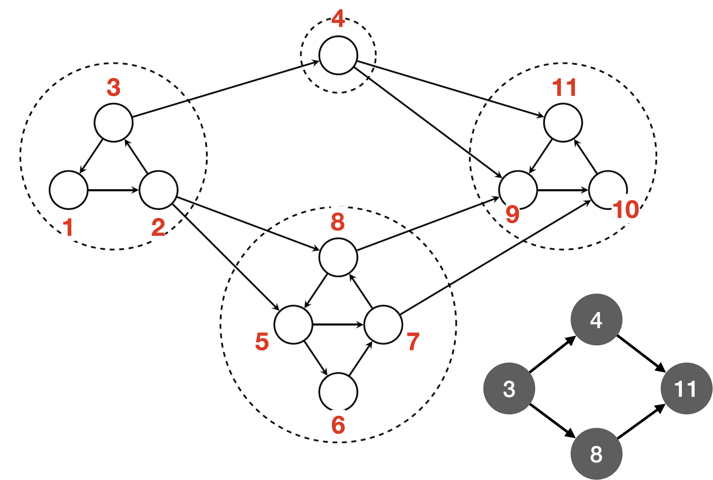

---

# Applications of SCCs

### 🧑‍🤝‍🧑 Social Network Analysis
- Identify *communities* where users are mutually reachable  

### 🔒 Deadlock Detection
- Represent processes/resources as a directed graph  
- Cyclic SCCs indicate potential *deadlocks*

### 🧮 Simplifying Graph Problems
- Collapse SCCs into single nodes → *condensed DAG*  
- Enables efficient algorithms (e.g., topological sort, reachability)

---

## Today's Problem: **How to Find the Shortest Path from `a` to every other node?**

---

# Use BFS!

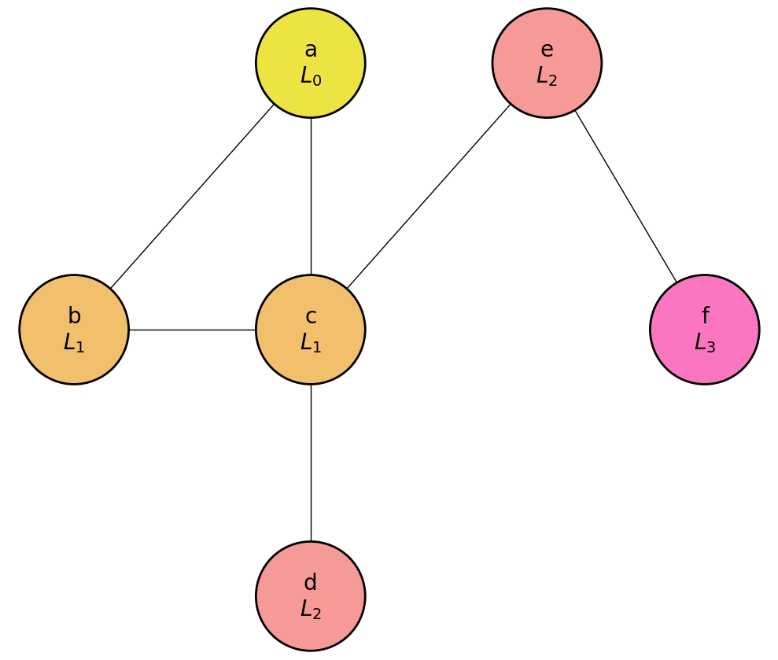

- In an **unweighted graph**, BFS can find the shortest path between two vertices.
- But what happens when the graph has **edge weights**? 

---

# The **Single-Source Shortest Paths (SSSP)** Problem

- **Input**: a graph $G=(V,E)$ with **nonnegative edge weights**, and a source vertex $s$
- **Task**: Compute the minimum-weight (shortest) path from $s$ to every other vertex in $G$

---

## Example

- Starting from source node `a`, the goal is to find the shortest path from `a` to every other node (`b`, `c`, `d`, `e`, `f`, `g`, `h`, and `i`)

- For instance, the shortest path from `a` to `h` is not `a → h` (cost=18), but `a → i → g → h` (cost=6).

---

## Example: Shortest Paths from `a`

| target      | shortest path    | total cost |
|:------------|------------------|-----------:|
|         `b` | `a → b`          | 5          |
|         `c` | `a → i → c`      | 7          |
|         `d` | `a → i → c → d`  | 15         |
|         `e` | `a → i → e`      | 3          |
|         `f` | `a → i → g → f`  | 5          |
|         `g` | `a → i → g`      | 4          |
|         `h` | `a → i → g → h`  | 6          |
|         `i` | `a → i`          | 1          |

---

## Applications of SSSP

Finding the shortest path from a source vertex to every other vertex has countless real-world applications, including:

- 🕸️ **Networking**: sending a message from one computer to all others as quickly as possible
- 🚛 **Logistics**: routing shipments from a central distribution center along the most efficient paths
- 🦠 **Epidemiology**: modeling how infectious diseases spread through social networks

And these are only a few examples! 

---

# Solving SSSP: **Dijkstra’s Algorithm** ✨

**Key Idea:**  
Maintain distance estimates $d[t]$ for all nodes $t \in V$.

**Initialization**:
- $d[s] \gets 0$, and $d[t] \gets \infty$ for all $t \ne s$
- $F \gets V$ (unfinalized nodes; white)
- $D \gets \emptyset$ (finalized nodes; black)

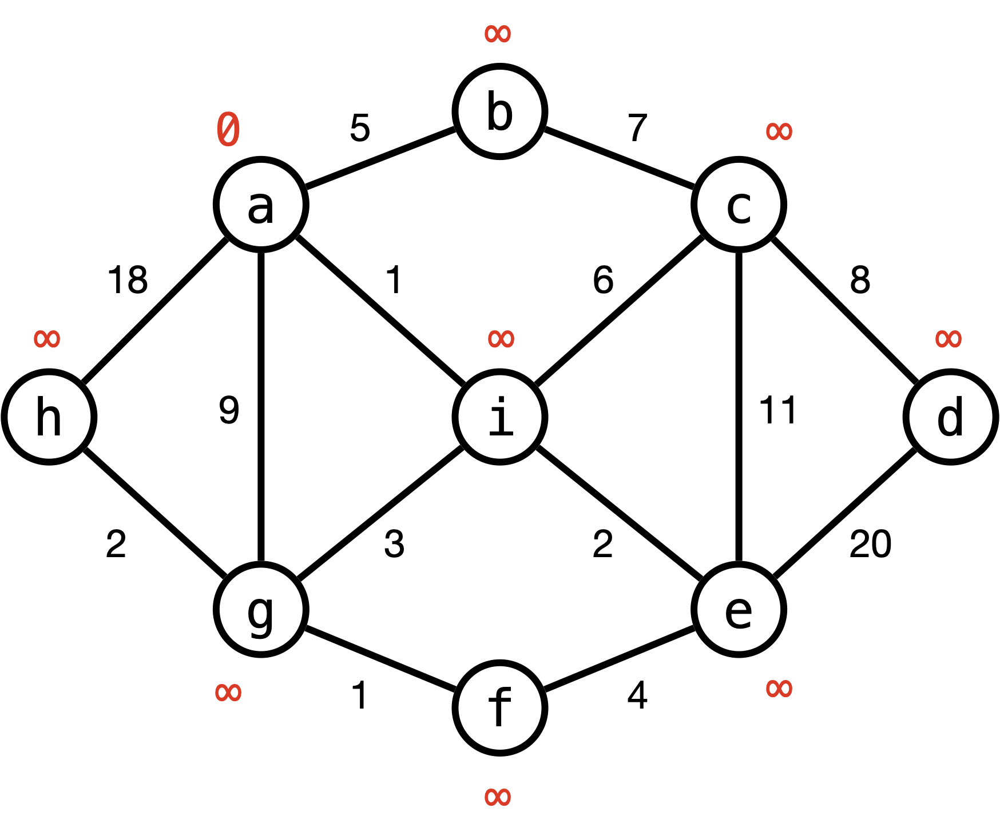

---

**Main Loop (while $F \ne \emptyset$)**:
1. Select $x \in F$ with the smallest $d[x]$
2. Relax every edge $(x,y)$: $d[y] \gets \min(d[y], d[x] + w(x,y))$
3. Move $x$ from $F$ to $D$ (finalized set)

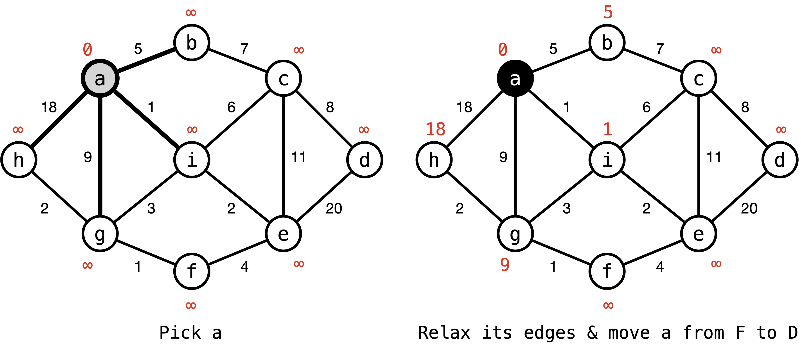

---

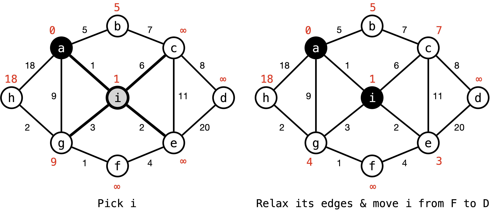

---

### Let's Practice Together!

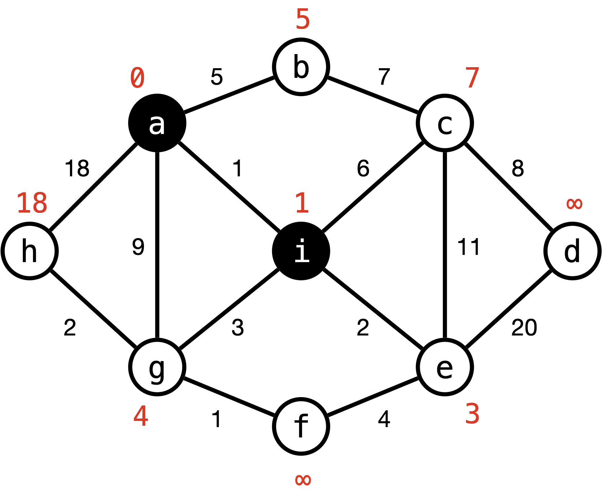

---

### Fast Forward...

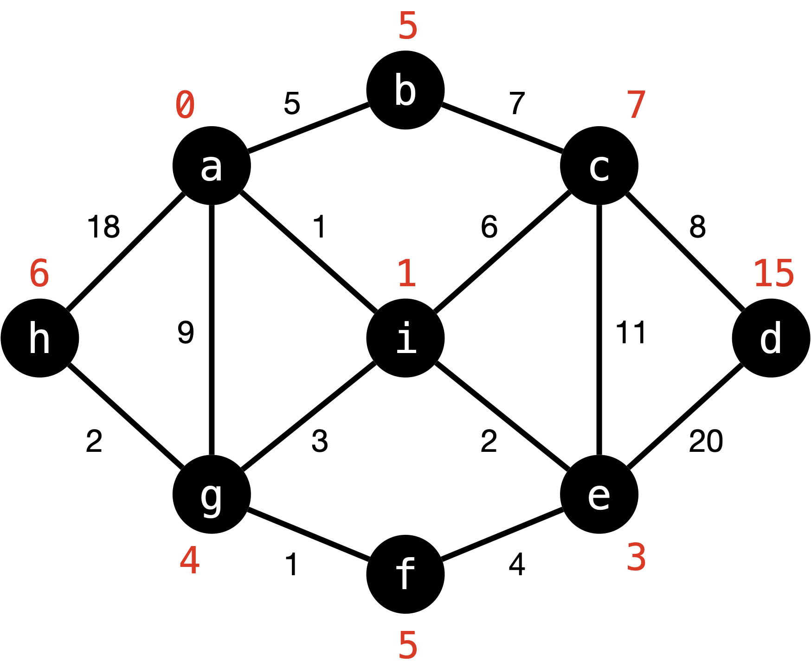

---

### For Path Recovery, Keep Track of the Parents

 

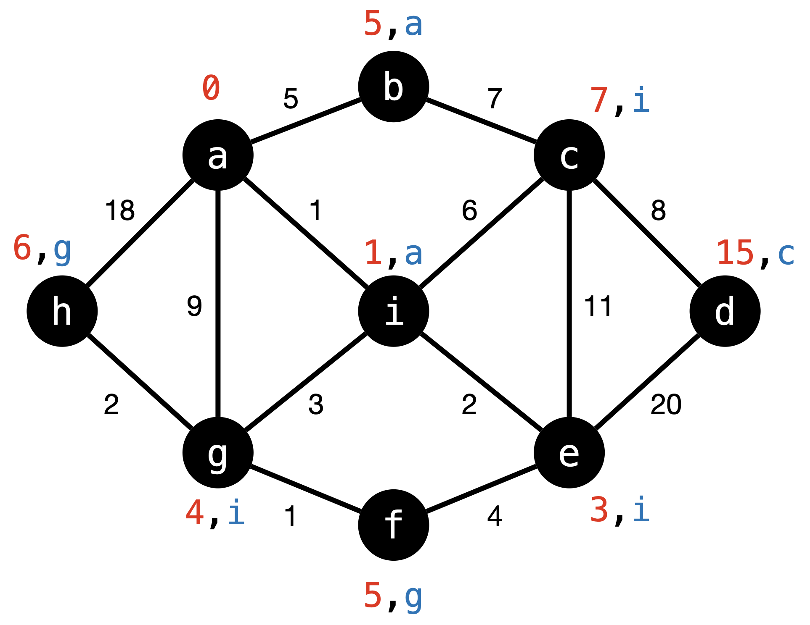

| target      | shortest path    | total cost |
|:------------|------------------|-----------:|
|         `b` | `a → b`          | 5          |
|         `c` | `a → i → c`      | 7          |
|         `d` | `a → i → c → d`  | 15         |
|         `e` | `a → i → e`      | 3          |
|         `f` | `a → i → g → f`  | 5          |
|         `g` | `a → i → g`      | 4          |
|         `h` | `a → i → g → h`  | 6          |
|         `i` | `a → i`          | 1          |

---

---

## Invariant of Dijkstra’s Algorithm

- **Claim 1**. At any point in time, for every node $t$:
  $$d[t] \ge d(s,t)$$
  > Distance estimates, $d[t]$, never fall below the actual shortest path length.

- **Claim 2**. Once $t$ is finalized (added to $D$),
  $$d[t] = d(s,t)$$
  > A finalized node always has the correct shortest distance.

---

### Proof of Claim 1: **For every node $t$, at any point in time $d[t] \ge d(s,t)$**

**Inductive Hypothesis**: At any point in time, if $d[t] < \infty$, then $d[t]$ is the weight of some path from $s$ to $t$.
**Base Case:** At the start, $d[s] = 0 = d(s,s)$, and $d[t] = \infty$ for all $t \neq s$. Clearly the hypothesis holds. ✅

---

**Inductive Step:**
- Suppose $d[t]$ is updated via relaxation: $d[t] \gets d[x] + w(x,t)$.
- This means that (by the induction hypothesis) there is a path from $s$ to $x$ of weight $d[x]$ and an edge $(x, t)$ of weight $w(x, t)$.
➡️ There is a path from $s$ to $t$ of weight $d[x] + w(x,t)$!
- $d[t]$ is at least the weight of the shortest path, i.e., $d[t] \ge d(s, t)$. ✅

**Example**:

$d[d] \gets d[e] + w(e, d) = 3 + 20 = 23$
- There is a path from `a` to `e` of weight 3 and an edge (`e`, `d`) of weight 20.
- Therefore, there is a path from `a` to `d` of weight 23.

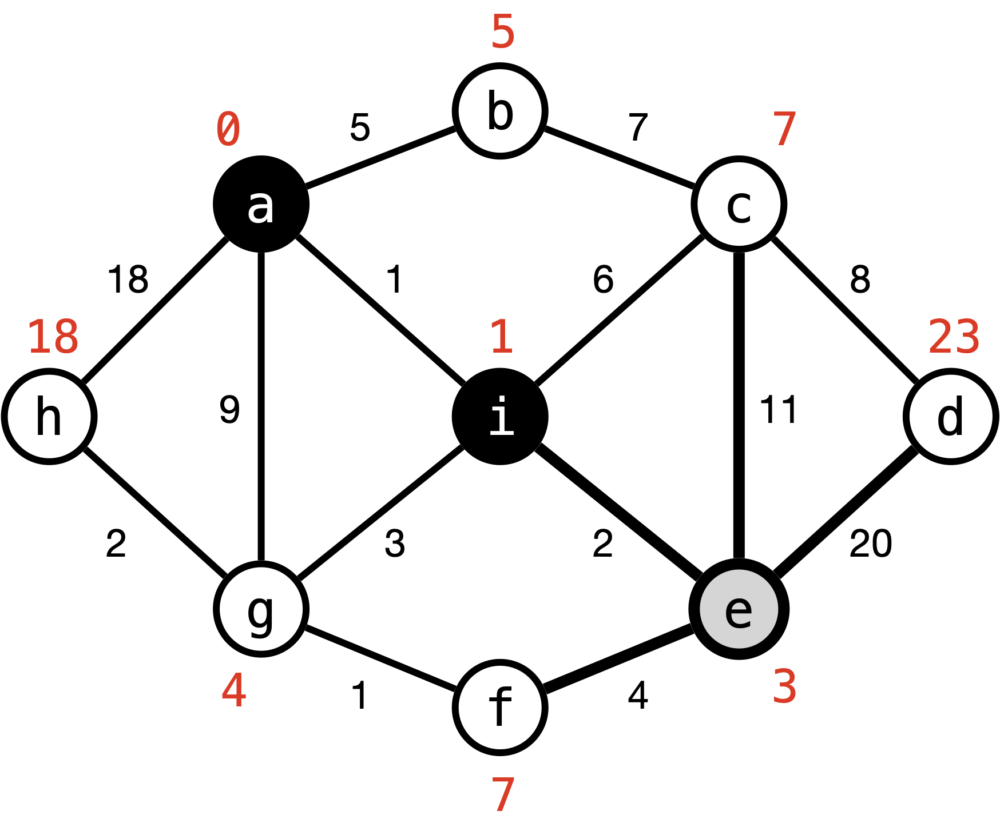

  

---

## Invariant of Dijkstra’s Algorithm

- ✅ **Claim 1**. At any point in time, for every node $t$:
  $$d[t] \ge d(s,t)$$
  > Distance estimates, $d[t]$, never fall below the actual shortest path length.

- 👉 **Claim 2**. Once $t$ is finalized (added to $D$),
  $$d[t] = d(s,t)$$
  > **A finalized node always has the correct shortest distance.**

Here, $d(s,t)$ is the weight of the shortest path from source $s$ to node $t$.

---

### Proof of Claim 2: **Once $t$ is finalized (added to $D$), $d[t] = d(s,t)$**

We prove this claim by induction on *the order of placement of nodes into $D$*.

**Base Case:** At the start, $s$ is placed into $D$ where $d[s]=d(s,s)=0$. ✅

---

**Inductive Step:** We assume that for all nodes $y$ currently in $D$, $d[y] = d(s, y)$.

- Suppose $x$ is the node chosen (with minimum $d[x]$ in $F$).  
- Let $p$ be a shortest path from $s$ to $x$, and $z$ be the *last node on $p$* (closest to $x$) for which $d[z] = d(s, z)$. $z$ always exists since there is at least one such node, namely $s$.
- By the choice of $z$, for every node $y$ on $p$ between $z$ (not inclusive) to $x$ (inclusive), $d[y] > d(s, y)$.

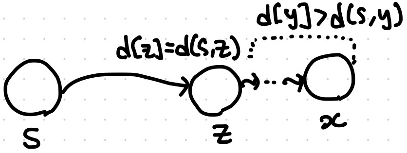

---

**Case 1. $z=x$**: On the shortest path, $x$ is the last node for which $d[z] = d(s, z)$

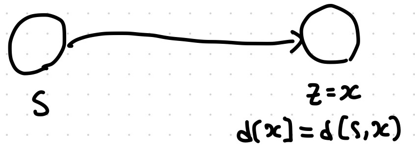

**Case 2. $z \ne x$**: There exists a node $z'$ after $z$ on the shortest path $p$ (possibly $z' = x$). 

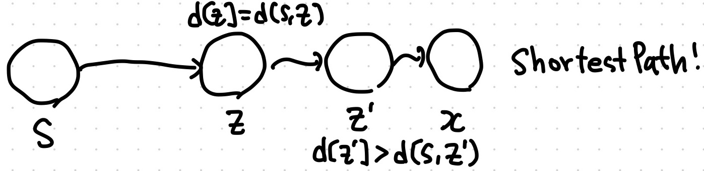

---

**Case 1. $z=x$**: Clearly $d[x] = d(s, x)$ (by the choice of $z$), and we are done.

**Reasoning:**  
- After $x$ is chosen, $d[x]$ never changes again (no relaxation can reduce it).
- Hence, when $x$ is finalized (moved to $D$), its estimate is exact:  
  $$
  d[x] = d(s,x)
  $$

---

- `e` is the node chosen (with minimum $d[x]$ in $F$).
- Let $p$ be a shortest path from `a` to `e`: `a → i → e`
- `e` is the *last node on $p$* for which $d[z] = d(s, z)$.
- Therefore, when `e` is added to $D$ after relaxing its edges, $d[e] = d(a, e)$.

---

**Case 2. $z \ne x$**: There exists a node $z'$ after $z$ on the shortest path $p$ (possibly $z' = x$). 

We know: $d[z] = d(s,z) \le d(s,x) \le d[x]$

**Why?**
- $d(s,z) \le d(s,x)$ since prefixes of shortest paths are shortest paths.  
- $d(s,x) \le d[x]$ by Claim 1
  - Distance estimates never fall below the actual shortest path length.

---

**Case 2. $z \ne x$**: There exists a node $z'$ after $z$ on the shortest path $p$ (possibly $z' = x$). 

We know: $d[z] = d(s,z) \le d(s,x) \le d[x]$

- If $d[z] = d[x]$, then $d[x] = d(s,x)$, contradicting the choice of $z$ 🚫.
-  If $d[z] < d[x]$. Then $z$ must already be in $D$ (since $x$ is the minimum in $F$), and $(z,z')$ would have been relaxed earlier. So $d[z'] = d(s,z')$, contradicting the choice of $z$ 🚫. 
-  Therefore, $z \ne x$ is false, $z = x \implies$ $d[x] = d(s, x)$ ✅

---

### Proof of Claim 2: **Once $t$ is finalized (added to $D$), $d[t] = d(s,t)$**

**Inductive Step:** We assume that for all nodes $y$ currently in $D$, $d[y] = d(s, y)$.

- Suppose $x$ is the node chosen (with minimum $d[x]$ in $F$).  
- Let $p$ be a shortest path from $s$ to $x$, and $z$ be the *last node on $p$* (closest to $x$) for which $d[z] = d(s, z)$.
  - $z$ is always $x$. 👉 $d[x] = d(s, x)$.
- Therefore, when $x$ is added to $D$, $d[x] = d(s, x)$.

---

## Runtime of Dijkstra's Algorithm

Consider implementing Dijkstra’s algorithm using a **priority queue** to store the set $F$, with distance estimates as the keys. The priority queue needs to support three operations:

- **FindMin**: return the vertex in $F$ with the smallest distance estimate
- **DecreaseKey**: update a vertex’s key (distance estimate) when a shorter path is found during relaxation
- **DeleteMin**: remove the vertex with the smallest distance estimate from $F$

Suppose $n = |V|$, $m = |E|$, then the total runtime of the algorithm is:
$$
n \cdot (T_{FindMin}(n) + T_{DeleteMin}(n)) + m \cdot T_{DecreaseKey}(n)
$$

---

### Runtime of Dijkstra's Algorithm Depends on **Priority Queue Choice**! (1/2)

$$
n \cdot (T_{FindMin}(n) + T_{DeleteMin}(n)) + m \cdot T_{DecreaseKey}(n)
$$

Using an **array**:  
  - FindMin = $O(n)$, DeleteMin = $O(n)$, DecreaseKey = $O(1)$
  - Total runtime = $O(n^2 + m) = O(n^2)$

Using a **balanced BST** (e.g., Red-Black Tree):  
  - All operations: $O(\log n)$ (DecreaseKey = Delete + Insert)
  - Total runtime = $O((n+m)\log n)$
  - Note: efficient for sparse graphs, but slower on dense graphs ($m = \Theta(n^2)$)

---

### Runtime of Dijkstra's Algorithm Depends on **Priority Queue Choice**! (2/2)

$$
n \cdot (T_{FindMin}(n) + T_{DeleteMin}(n)) + m \cdot T_{DecreaseKey}(n)
$$

Using a **Fibonacci Heap**:  

Fibonacci Heaps are a complex data strcuture which is able to support the operations:
  - FindMin = $O(1)$, DecreaseKey = $O(1)$, DeleteMin = $O(\log n)$ *amortized*
  - Total runtime = $O(m + n\log n)$ 👍

> See the Stanford Lecture 11 notes for details on the meaning of amortized time.

---

# A new breakthrough!

This year, a single-source shortest path (SSSP) algorithm has been introduced that asymptotically outperforms Dijkstra’s algorithm: [Breaking the Sorting Barrier for Directed Single-Source Shortest Paths](https://arxiv.org/abs/2504.17033)

> We give a deterministic $O(m \log^{2/3}n)$-time algorithm for single-source shortest paths (SSSP) on directed graphs with real non-negative edge weights in the comparison-addition model. This is the first result to break the $O(m + n \log n)$ time bound of Dijkstra's algorithm on sparse graphs, showing that Dijkstra's algorithm is not optimal for SSSP.

---

# Dijkstra's Algorithm

- Finds the shortest paths from a single source node to all other nodes in $O(m + n \log n)$ time.
- Does not work with negative edge weights.
- Not robust to graph updates (e.g., when edge weights change).

Next time: we’ll look at the **Bellman–Ford** algorithm, which can handle negative edges.

---

# Credits & Resources

Lecture materials adapted from:
- Stanford CS161 slides and lecture notes
  - https://stanford-cs161.github.io/winter2025/
- _Algorithms Illuminated_ by Tim Roughgarden
  - https://algorithmsilluminated.com/
- Stanford CS106B slides
  - https://web.stanford.edu/class/archive/cs/cs106b/cs106b.1258/lectures/26-graph-algorithms/

