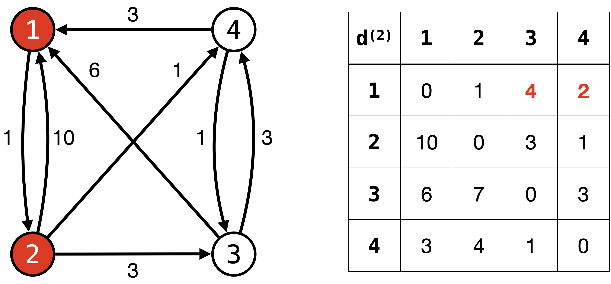
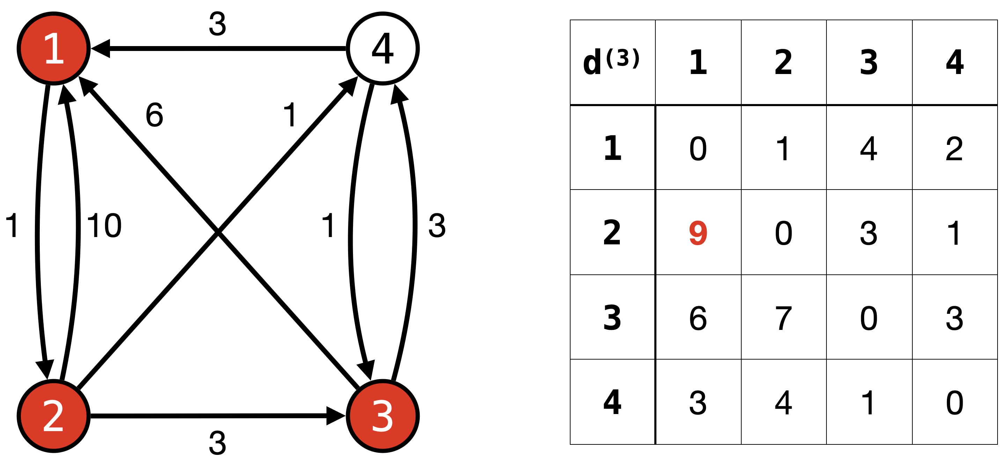
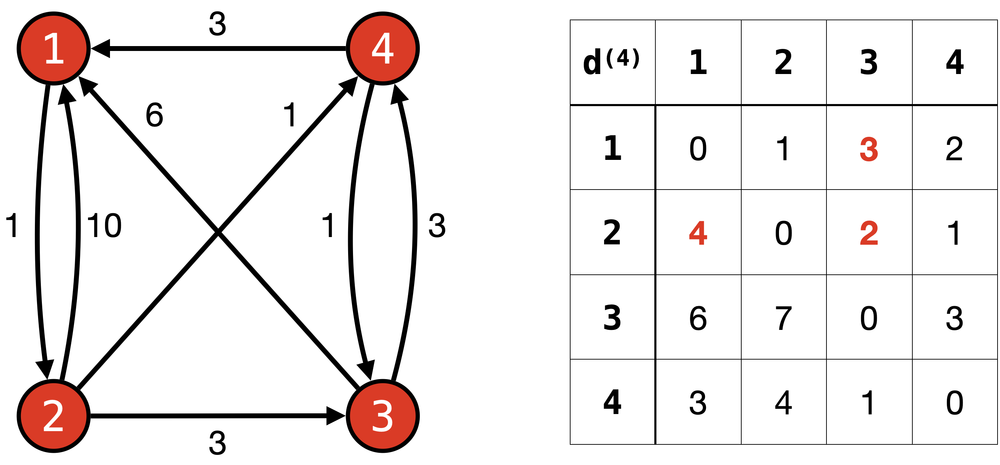
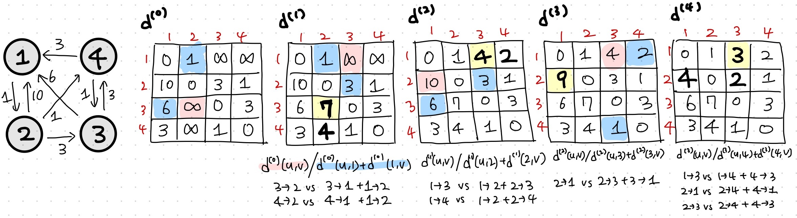
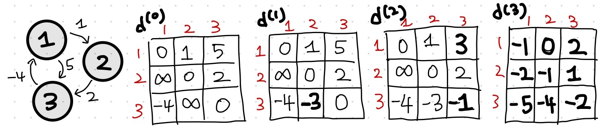

# Lecture 16 - Dynamic Programming, All Pairs Shortest Path Problem and Floyd-Warshall Algorithm

_Fall 2025, Korea University_

Instructor: Gabin An ([gabin_an@korea.ac.kr](mailto:gabin_an@korea.ac.kr))

---

## Course Outline (After Midterm)

- Part 3: Data Structures
   - Graphs, Graph Search (DFS, BFS) and Applications (Finding SSCs w/ DFS)
- Part 4: Dynamic Programming
   - Shortest-Path: Dijkstra, **Bellman-Ford, Floyd-Warshall Algorithms** 👈
   - More General DP: Longest Common Subsequence, Knapsack Problem
- Part 5: Greedy Algorithms and Others
   - Scheduling Problem, Optimal Codes
   - Minimum Spanning Trees
   - Max Flow, Min Cut and Ford-Fulkerson Algorithms
   - Stable Matching, Gale-Shapley Algorithm

---

## Recap: Bellman-Ford Algorithm

1. Initialize $d[s]=0$, others $\infty$.  
2. **Repeat $|V|-1$ times:**
   Relax **every edge** $(u,v) \in E$: $d[v] \gets \min(d[v], d[u]+w(u,v))$
3. Extra pass:
   If any edge $(u,v)$ can still be relaxed, i.e., $d[v] > d[u] + w(u, v)$
   → **negative cycle detected** 🔁.

---

## Bellman-Ford as Dynamic Programming

**Recall:**  
$d_{k}(v) = d_{k}[v] =$ shortest distance from $s$ to $v$ using at most $k$ edges.

**Recurrence:**  
$$
d_{k}[v] = \min \Big\{ d_{k-1}[v], \; \min_{(u,v) \in E}\big( d_{k-1}[u] + w(u,v) \big) \Big\}
$$

- Build solutions iteratively: from paths with ≤ $k-1$ edges → paths with ≤ $k$ edges.  
- **Runtime**: $O(mn)$; for $n$ iterations, we loop through all the edges.
- **Space**: can reuse arrays (only keep last iteration).
  - To compute $d_k$, we only need $d_{k-1}$ (not all of $d_{k-1}, \dots, d_0$).

---

## What's Really Happening?

- Shortest path with ≤ $k$ edges can be built from a shortest path with ≤ $k-1$ edges.  
- **DP Principle:** ⭐️**Store and reuse intermediate results**⭐️ instead of recomputing.  
- Similar to divide-and-conquer, but with **memoization / tabulation** to avoid repeated work.

---

## Dynamic Programming Recipe

When to use DP:  
- **Optimal Substructure** → problem can be broken into smaller independent subproblems.  
- **Overlapping Subproblems** → subproblems repeat, so store solutions in a table.

---

### Optimal Substructure (Bellman-Ford Example)

> The optimal solution to the problem is composed of optimal solutions to smaller *independent* subproblems.
> 
- For shortest paths:  
  $$
  d(s,t) = \min_{k \in V}\{ d(s,k) + d(k,t) \}
  $$

- Any shortest $s \to t$ path is composed of:  
  - A shortest $s \to k$ path, and  
  - A shortest $k \to t$ path.  

✅ Optimal solution is built from optimal solutions to subproblems.

---

### Overlapping Subproblems (Bellman-Ford Example)

> The optimal solutions of subproblems can be reused multiple times to compute the optimal solutions of larger problems.

- $d(s, k)$ can be used to compute **$d(s, t)$ for any $t$** where the shortest $s-t$ path contains $k$.
- If $(u, v)$ and $(u, v')$ are both in $E$, relaxing $(u,v)$ and $(u,v')$ both need $d_{k-1}[u]$.
- Instead of recomputing many times, **store the computed value** and reuse.  

---

## DP Implementations

Two common styles:  

1. **Bottom-Up (Tabulation)**  
   - Start with smallest subproblems.  
   - Iteratively fill table → build up to full problem.  
   - Example: Bellman-Ford.  

2. **Top-Down (Memoization)**  
   - Write recursion for the problem.  
   - Store results of subproblems in a table and reuse stored results when needed.  

💡 Both approaches are equivalent in power.

---

# Today's Main Topic

So far, we solved the **Single-Source Shortest Paths (SSSP)** problem.  
- Input: one source $s$, find shortest paths to all $v \in V$.  

But what if we want the **shortest path between *every pair* of vertices**?  

This leads us to the **All-Pairs Shortest Paths (APSP)** 🕸️ problem.  

- We’ll learn the **Floyd–Warshall** algorithm, a dynamic programming approach to solving APSP.

---

# APSP: All-Pairs Shortest Paths

- **Input**: Graph $G=(V,E)$ with edge weights $w(u,v)$.  
- **Goal**: Find shortest path distances $d(u,v)$ for **all pairs** $u,v \in V$.  
 

Examples of applications:  

- Routing in communication networks  
- Social network analysis
- Circuit design

---

## First Attempt 🤔

- Run **Dijkstra** from each node $u \in V$.  
  - Runtime: $O(n \cdot (m + n \log n)) = O(mn + n^2 \log n)$  
- Or run **Bellman–Ford** from each node.
  - Runtime: $O(n \cdot mn) = O(mn^2)$  

Instead of running SSSP $n$ times, **can we leverage Dynamic Programming to solve APSP directly?**

---

## DP Perspective

Recall: DP works when we have  
- **Optimal Substructure**  
- **Overlapping Subproblems**  

For shortest paths:
- If $k$ is an intermediate vertex on a shortest path $u \to v$:  
  $$
  d(u,v) = d(u,k) + d(k,v)
  $$

---

## Key Idea: **Intermediate Nodes**

- Label vertices as $1,2,\dots,n$.  
- Define $d^{(k)}(u,v)$ = shortest path distance from $u$ to $v$ using **only** nodes from $\{1,\dots,k\}$ as possible **intermediates** nodes

- Recurrence:
  $$
  d^{(k)}(u,v) = \min\Big( d^{(k-1)}(u,v), \; d^{(k-1)}(u,k) + d^{(k-1)}(k,v) \Big)
  $$
- If $P$ is a shortest path from $u$ to $v$ using nodes $\{1, \dots, k\}$ internally, there are two cases:
  - 1️⃣ **P does not pass through $k$**: $d^{(k-1)}(u,v)$
  - 2️⃣ **P passes through $k$**: $d^{(k-1)}(u,k) + d^{(k-1)}(k,v)$

---

## Key Idea: **Intermediate Nodes**

So:
- $d^{(0)}(u,v)$: shortest path using no intermediate nodes (i.e., just direct edges).
- $d^{(1)}(u,v)$: shortest path possibly passing through vertex 1.
- $d^{(2)}(u,v)$: shortest path possibly passing through vertics $\{1, 2\}$.
- $d^{(3)}(u,v)$: shortest path possibly passing through vertics $\{1, 2, 3\}$.

…and so on, until 
- $d^{(n)}(u,v)$: shortest path possibly passing through vertics $\{1, 2, 3, \dots, n\}$.
  - This gives the shortest path over all vertices.

---

# Solving APSP: **Floyd–Warshall Algorithm**

**Initialization**  
- $d^{(0)}(u,v) = w(u,v)$ if $(u,v) \in E$, else $\infty$.  
- $d^{(0)}(u,u) = 0$.  

**Update Rule** (for $k=1 \to n$):  
$$
d^{(k)}(u,v) = \min\Big( d^{(k-1)}(u,v), \; d^{(k-1)}(u,k) + d^{(k-1)}(k,v) \Big)
$$  

**Final Output**: $d^{(n)}(u,v)$ = shortest distance from $u$ to $v$.  

---

## Example Walkthrough

---

## Example Walkthrough: $d^{(0)}$

---

## Example Walkthrough: $d^{(1)}$

---

## Example Walkthrough: $d^{(2)}$

---

## Example Walkthrough: $d^{(3)}$

---

## Example Walkthrough: $d^{(4)}$

---

## Example Walkthrough: Summary

---

## Correctness of Floyd–Warshall (Induction Proof)

**Inductive Claim:** For every $k=0,1,\dots,n$ and all $u,v$, the table entry $d^{(k)}(u,v)$ equals the shortest path distance from $u$ to $v$ whose **intermediate vertices** (if any) are drawn only from $\{1,\dots,k\}$.

Thus, after $n$ iterations:  
$$
d^{(n)}(u,v) = d(u,v)
$$  

---

**Base Case ($k=0$)**:

- Allowed intermediates: none  
- Paths are either the  $u\!=\!v$ path (cost $0$) or **single edge** $(u,v)$ (cost $w(u,v)$), else $\infty$.  
- This is exactly $d^{(0)}$ by initialization. ✅

---

**Inductive Step ($k-1 \to k$):**

Inductive Hypothesis: $d^{(k-1)}(u,v)$ equals the shortest path distance from $u$ to $v$ whose **intermediate vertices** are drawn only from $\{1,\dots,k-1\}$.

Consider any shortest $u \to v$ path $P$ whose intermediates lie in $\{1,\dots,k\}$.

**Case 1️⃣. $P$ does not pass through $k$**

Then $P$’s intermediates lie in $\{1,\dots,k-1\}$, so by inductive hypothesis, $d^{(k)}(u,v)= d^{(k-1)}(u,v)=\text{cost}(P)$.

**Case 2️⃣. $P$ passes through $k$:**
Let $P = (u \to k) \circ (k \to v)$.   Each subpath’s intermediates are in $\{1,\dots,k-1\}$, so by inductive hypothesis, $d^{(k-1)}(u,k)$ and $d^{(k-1)}(k,v)$ equal their true costs, hence
$$
d^{(k)}(u,v) = d^{(k-1)}(u,k)+d^{(k-1)}(k,v)=\text{cost}(P).
$$

---

## Handling Negative Cycles

- Floyd–Warshall can also **detect negative cycles**.
- Check the diagonal:  
  - If $d^{(n)}(u,u) < 0$ for some $u$, then there is a negative cycle reachable from $u$.  
- Why?
  - If there is a simple path $P$ from $u$ to $u$ of negative weight (i.e., a negative cycle containing $u$), then $d^{(n)}(u, u)$ will be at most its weight, and hence, will be negative.

---

### Example: Nagative Cycle Detection

- There is a negative cycle reachable from all vertices!

---

## Runtime and Space Complexity

- **Runtime**: Filling an $n^2$ table across $n$ iterations, i.e., $O(n^3)$
- **Space**: $O(n^2)$ (store distance matrix).  
  - Note: can optimize to use only 2 layers (current + previous $k$).  

👉 Simple to implement, practical for dense graphs.  

---

## APSP: Dijkstra vs. Floyd–Warshall

| Algorithm            | Runtime                | Works with Negative Weights? | When to Use                                    |
| -------------------- | ---------------------- | ---------------------------- | ---------------------------------------------- |
| **Floyd-Warshall**   | $O(n^3)$             | ✅ Yes   | Good for **dense graphs**, simple to implement |
| **Dijkstra $\times n$** | $O(nm + n^2 \log n)$ | ❌ No   | Best for **sparse graphs**, more efficient     |

* **Sparse graphs** ($m = O(n)$): Dijkstra $n$ times $\approx O(n^2 \log n)$ → **much faster**
* **Dense graphs** ($m = \Theta(n^2)$): Both $\approx O(n^3)$ → Floyd–Warshall may be simpler and practical

---

# Summary

- **APSP Problem**: compute shortest paths between every pair of vertices.  
- **Naïve approach**: run SSSP $n$ times.
- **Floyd–Warshall Algorithm**:  
  - Elegant **DP formulation**  
  - Works with negative edge weights
  - Detects negative cycles  
  - Runtime: $O(n^3)$  

---

# Announcement

- The bonus assignment details will be uploaded to LMS today.
- The next quizzes will be on November 18 (Tuesday) and December 4 (Thursday).

---

# Appendix: Why is it called Dynamic Programming?

### Historical Context

* The term was coined by **Richard Bellman** in the 1950s.
* At the time, he was working at the RAND Corporation on mathematical optimization problems for the U.S. Air Force.
* The U.S. Secretary of Defense (Charles Wilson) had a strong dislike of the words **“research”** and **“mathematics.”** 

  * If Bellman called his work “mathematical research,” it would not get funded. 💸😰
  * So he needed a safer, more appealing name.

---

### Why “Programming”?

* “Programming” here means a **plan** or **schedule of actions** (like in “linear programming” or “planning a program of events”), not computer programming.
* DP is about constructing an optimal plan by combining solutions of smaller subproblems.

### Why “Dynamic”?

* “Dynamic” emphasized that the method involved **multistage decision-making** and **updating over time**.
* Bellman also noted that “dynamic” has a positive, action-oriented connotation — it’s hard to use it negatively.
* This made it **politically safe** and even attractive to sponsors.

---

### So... It’s called **Dynamic Programming** because:

* **Programming** = planning/optimization, not coding.
* **Dynamic** = problems solved stage by stage, with decisions unfolding over time.
* Bellman chose the term partly for **political reasons** so his work could be supported, while secretly he was doing deep mathematics 😛.

---

# Credits & Resources

Lecture materials adapted from:
- Stanford CS161 slides and lecture notes
  - https://stanford-cs161.github.io/winter2025/
- _Algorithms Illuminated_ by Tim Roughgarden
  - https://algorithmsilluminated.com/
- Example: https://favtutor.com/blogs/floyd-warshall-algorithm

