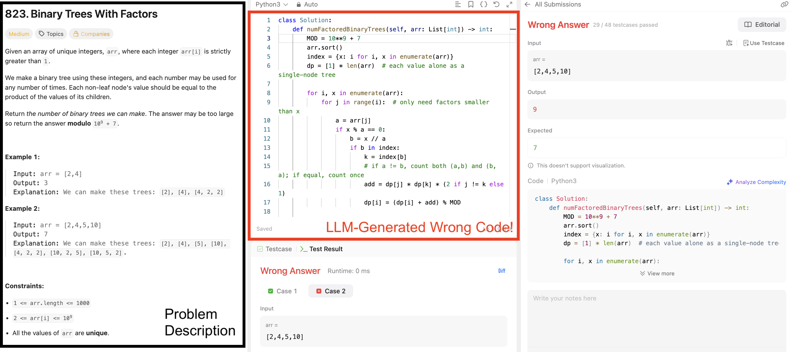
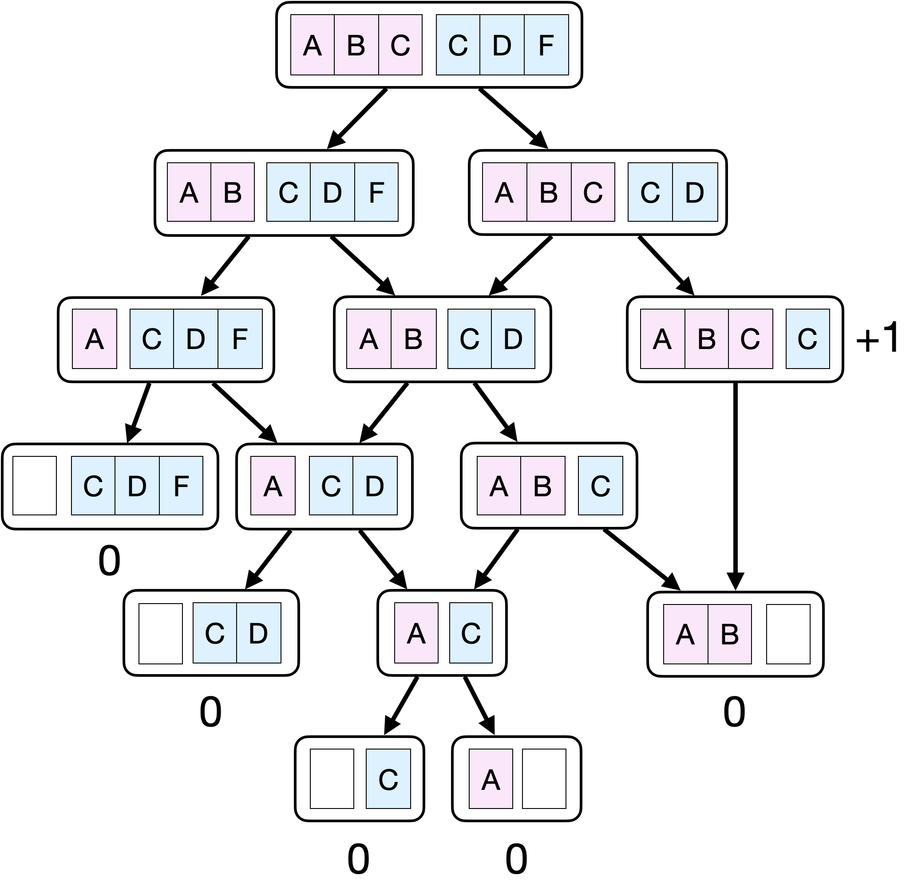
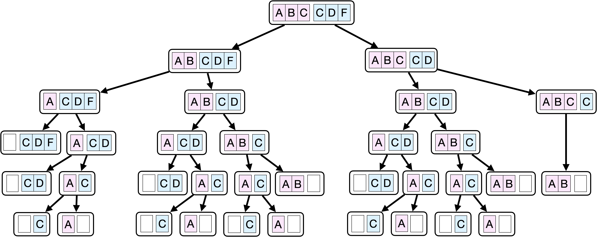
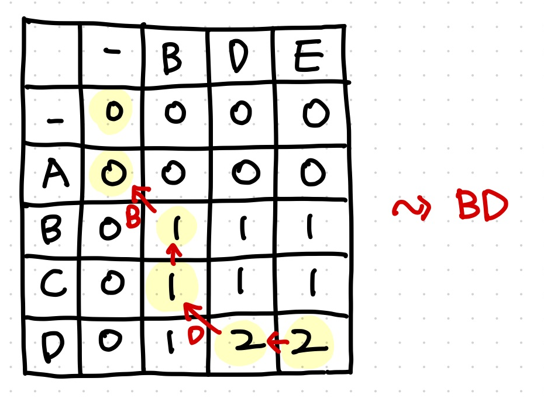

# Lecture 17 -  More Dynamic Programming (Longest Common Subsequence)

_Fall 2025, Korea University_

Instructor: Gabin An ([gabin_an@korea.ac.kr](mailto:gabin_an@korea.ac.kr))


---

## Bonus Assignment: You Code, I Fix (Due: Dec 8, 11:59 PM, KST)

*Are you using LLMs when coding?*

They are fast and convenient—but [LLMs don’t always produce correct code](https://chatgpt.com/share/68ff3061-2074-800c-9fa1-8d0cf645d150) when you actually test it. In this assignment, you’ll probe, catch, and correct LLM mistakes on real algorithm problems.


---




---

## Task Overview 

Find **Two** LeetCode problems (pick at most 1 from each list):
- Divide and Conquer – https://leetcode.com/problem-list/divide-and-conquer/
- Sorting – https://leetcode.com/problem-list/sorting/
- Tree – https://leetcode.com/problem-list/tree/
- Dynamic Programming – https://leetcode.com/problem-list/dynamic-programming/


---

### What You Must Do (Per Problem)

1. Copy & Paste the official problem description into an LLM chat (ChatGPT, Gemini, Claude, etc) and ask the LLM: “*Write a correct and efficient solution in Python*”
2. Evaluate the generated code by submitting it directly to LeetCode
3. If the LLM’s solution does not pass all tests, **debug and fix the code yourself until it passes all tests**.
4. Create **Hallucination Reports!** (The template will be uploaded to LMS)
   - Submit a `zip` file containing two `pdf` files:
      - `COSE214_HallucinationReport_[YourStudentID]_[ProblemID_1].pdf`
      - `COSE214_HallucinationReport_[YourStudentID]_[ProblemID_2].pdf`


---

### Purpose of This Activity
1. To Understand LLMs’ Limitations
2. To Build Critical Thinking & Debugging Skills
3. To Learn How to Collaborate with AI
4. To Observe Hallucination Patterns


---

### Grading Rubric (5 points per problem, total 10 points)

| Criteria                             | Description                                                                                                                                        | Points |
| ------------------------------------ | -------------------------------------------------------------------------------------------------------------------------------------------------- | ------ |
| **Problem Selection**             | Selected from the specified lists (max 1 per category).                                                                                          | 0.5    |
| **LLM-Generated Code & Evidence** | Clearly shows the LLM’s original code and submission result (**failed test cases, screenshots**).                                   | 1.0    |
| **Bug Diagnosis**                 | Provides a logical and insightful explanation of **why the LLM’s code failed**. | 1.5    |
| **Corrected Solution**            | Presents a working, fully accepted version written and debugged by the student (not copied).                                                       | 1.0    |
| **Comparison & Reflection**       | Clearly explains what was changed, how it fixes the issue, and what this reveals about LLM limitations.                                            | 1.0    |


---

### Additional Notes about the Grading

* **Insight Bonus (+0.5 pts):**
  Exceptional observation about LLM behavior (e.g., overgeneralization, recursive depth misjudgment, complexity hallucination).

* **Penalty (0 pts):**
  Submitting others’ accepted code or no debugging evidence.


### Academic Integrity & Tool Policy

- You must not copy someone else’s accepted solution from LeetCode, GitHub, or online forums. The “fixed” solution must be your own debugging and reasoning work, not another model’s or person’s answer.


---

# Overview

- Last time:
  - Bellman-Ford (SSSP)  
  - Floyd-Warshall (APSP)

- More **Dynamic Programming** for other problems!
  - **Today:** Longest Common Subsequence (LCS) 🧬
  - **Next time:** Knapsack 🎒


---

# Motivation

How do we measure **similarity between sequences**?  

- DNA sequence alignment 🧬  
- Spell checking / autocorrect ✍️  
- `git diff` / file comparison 💻  

**Longest Common Subsequence (LCS) is a core building block** for these applications.  


---

# Subsequence vs Substring

- **Substring** = contiguous block  
  - "**abc**" is a substring of "z**abc**t"

- **Subsequence** = not necessarily contiguous  
  - "**abt**" is a subsequence of "z**ab**c**t**"  

💡 Subsequence = delete some characters, keep order.  


---

# LCS Definition

- Given two sequences **X** (length = $m$) and **Y** (length = $n$)  
- Find the **longest sequence Z** such that:  
  - Z is a subsequence of X  
  - Z is a subsequence of Y  

Example:  
- X = `abracadabra`  
- Y = `bxqrabry`
- LCS = `brabr` (length = 5)


---

## Brute Force Idea 

- Generate **all subsequences** of X → $2^{m}$ possibilities 😱
- Check which ones are also subsequences of Y  
- Keep the longest  


---

## Brute Force Idea - Example

- X = `abc`
- Y = `bxyeksc`

1. Generate **all subsequences** of X
   `['', 'a', 'b', 'c', 'ab', 'bc', 'ac', 'abc']` ($2^3 = 8$ possibilities)
2. Check which ones are also subsequences of Y  
   `['', 'b', 'c', 'bc']` 
3. Keep the longest
   Answer: `bc`

👉 Exponential time (**Too Slow!**) → impossible for large inputs.


---

## Can We Apply **Dynamic Programming**?


---

### **Optimal Substructure**: The optimal LCS is built from optimal LCS of prefixes
Look at the **last characters** of X and Y.

**Case 1:** $x_m = y_n$  
- Then this character **must** be part of LCS.  
- Problem reduces to LCS of prefixes $\text{LCS}(X[1:m-1]$, $Y[1:n-1])$.
- Example: `LCS('ABC', 'ADC') = LCS('AB', 'AD') + 'C'`

**Case 2:** $x_m \neq y_n$  
- Drop one character and try both options:  
  - $\text{LCS}(X[1:m-1], Y)$ and $\text{LCS}(X, Y[1:n-1])$  
- Take the longer one.
- Example: `LCS('AB', 'AD') = longer(LCS('A', 'AD'), LCS('AB', 'A'))`


---

### **Overlapping Subproblems**: Subproblems recur many times




---

#### If you don’t reuse the previously stored results and instead recompute everything from scratch...




---

### Step 1: Recursive Formula

Define a table:
$$
C[i,j] = \text{length of LCS}(X[1:i], Y[1:j])
$$

Recurrence:  
$$
C[i,j] =
\begin{cases}
0, & i=0 \text{ or } j=0 \\[6pt]
C[i-1,j-1] + 1, & X[i] = Y[j] \\[6pt]
\max(C[i-1,j],\, C[i,j-1]), & X[i] \neq Y[j]
\end{cases}
$$


---

<div class="two-one-columns">

<div>

### Step 2: DP Algorithm

We build table $C$ ($(m+1)\times(n+1)$) **bottom-up**:
1. **Initialize** first row/column with 0  
2. **Fill row by row**, left → right  
3. Answer stored at $C[m][n]$

```python
def lenLCS(X, Y):
    m, n = len(X), len(Y)
    C = [[0] * (n+1) for _ in range(m+1)]
    for i in range(1, m+1):
        for j in range(1, n+1):
            if X[i-1] == Y[j-1]:
                C[i][j] = C[i-1][j-1] + 1
            else:
                C[i][j] = max(C[i-1][j], C[i][j-1])
    return C[m][n]
```

</div>

<div>

### Example Table

- X = `ABCD` (length = 4)
- Y = `BDE` (length = 3)
- $C$ = $5 \times 4$ matrix
  
  |       | -  | B | D | E |
  | ----- | -- | - | - | - |
  | -     |  0 | 0 | 0 | 0 |
  | **A** |  0 |   |   |   |
  | **B** |  0 |   |   |   |
  | **C** |  0 |   |   |   |
  | **D** |  0 |   |   |   |


</div>

</div>


---

<div class="two-one-columns">

<div>

### Step 2: DP Algorithm

We build table $C$ ($(m+1)\times(n+1)$) **bottom-up**:
1. **Initialize** first row/column with 0  
2. **Fill row by row**, left → right  
3. Answer stored at $C[m][n]$

```python
def lenLCS(X, Y):
    m, n = len(X), len(Y)
    C = [[0] * (n+1) for _ in range(m+1)]
    for i in range(1, m+1):
        for j in range(1, n+1):
            if X[i-1] == Y[j-1]:
                C[i][j] = C[i-1][j-1] + 1
            else:
                C[i][j] = max(C[i-1][j], C[i][j-1])
    return C[m][n]
```

</div>

<div>

### Example Table

- X = `ABCD` (length = 4)
- Y = `BDE` (length = 3)
- $C$ = $5 \times 4$ matrix
  
  |       | -  | B | D | E |
  | ----- | -- | - | - | - |
  | -     |  0 | 0 | 0 | 0 |
  | **A** |  0 | 0 | 0 | 0 |
  | **B** |  0 |   |   |   |
  | **C** |  0 |   |   |   |
  | **D** |  0 |   |   |   |


</div>

</div>

---

<div class="two-one-columns">

<div>

### Step 2: DP Algorithm

We build table $C$ ($(m+1)\times(n+1)$) **bottom-up**:
1. **Initialize** first row/column with 0  
2. **Fill row by row**, left → right  
3. Answer stored at $C[m][n]$

```python
def lenLCS(X, Y):
    m, n = len(X), len(Y)
    C = [[0] * (n+1) for _ in range(m+1)]
    for i in range(1, m+1):
        for j in range(1, n+1):
            if X[i-1] == Y[j-1]:
                C[i][j] = C[i-1][j-1] + 1
            else:
                C[i][j] = max(C[i-1][j], C[i][j-1])
    return C[m][n]
```

</div>

<div>

### Example Table

- X = `ABCD` (length = 4)
- Y = `BDE` (length = 3)
- $C$ = $5 \times 4$ matrix
  
  |       | -  | B | D | E |
  | ----- | -- | - | - | - |
  | -     |  0 | 0 | 0 | 0 |
  | **A** |  0 | 0 | 0 | 0 |
  | **B** |  0 | 1 | 1 | 1 |
  | **C** |  0 |   |   |   |
  | **D** |  0 |   |   |   |

</div>

</div>

---


<div class="two-one-columns">

<div>

### Step 2: DP Algorithm

We build table $C$ ($(m+1)\times(n+1)$) **bottom-up**:
1. **Initialize** first row/column with 0  
2. **Fill row by row**, left → right  
3. Answer stored at $C[m][n]$

```python
def lenLCS(X, Y):
    m, n = len(X), len(Y)
    C = [[0] * (n+1) for _ in range(m+1)]
    for i in range(1, m+1):
        for j in range(1, n+1):
            if X[i-1] == Y[j-1]:
                C[i][j] = C[i-1][j-1] + 1
            else:
                C[i][j] = max(C[i-1][j], C[i][j-1])
    return C[m][n]
```

</div>

<div>

### Example Table

- X = `ABCD` (length = 4)
- Y = `BDE` (length = 3)
- $C$ = $5 \times 4$ matrix
  
  |       | -  | B | D | E |
  | ----- | -- | - | - | - |
  | -     |  0 | 0 | 0 | 0 |
  | **A** |  0 | 0 | 0 | 0 |
  | **B** |  0 | 1 | 1 | 1 |
  | **C** |  0 | 1 | 1 | 1 |
  | **D** |  0 |   |   |   |

</div>

</div>

---


<div class="two-one-columns">

<div>

### Step 2: DP Algorithm

We build table $C$ ($(m+1)\times(n+1)$) **bottom-up**:
1. **Initialize** first row/column with 0  
2. **Fill row by row**, left → right  
3. Answer stored at $C[m][n]$

```python
def lenLCS(X, Y):
    m, n = len(X), len(Y)
    C = [[0] * (n+1) for _ in range(m+1)]
    for i in range(1, m+1):
        for j in range(1, n+1):
            if X[i-1] == Y[j-1]:
                C[i][j] = C[i-1][j-1] + 1
            else:
                C[i][j] = max(C[i-1][j], C[i][j-1])
    return C[m][n]
```

</div>

<div>

### Example Table

- X = `ABCD` (length = 4)
- Y = `BDE` (length = 3)
- $C$ = $5 \times 4$ matrix
  
  |       | -  | B | D | E |
  | ----- | -- | - | - | - |
  | -     |  0 | 0 | 0 | 0 |
  | **A** |  0 | 0 | 0 | 0 |
  | **B** |  0 | 1 | 1 | 1 |
  | **C** |  0 | 1 | 1 | 1 |
  | **D** |  0 | 1 | 2 | 2 |

</div>

</div>

---

### Step 3: Recovering Actual LCS

- Start at bottom-right cell $(m, n)$
- While $i>0, j>0$:
  - If $X[i] = Y[j]$: Add to LCS, move diagonally ↖️
  - Else: move to the neighbor with larger value (⬅️ or ⬆️)




---

## Complexity & Remarks

- Time: $O(mn)$
- Space: $O(mn)$

- LCS is a classic Dynamic Programming problem.
- LCS has no known faster (polynomial) algorithm.
- Steps: substructure → recursion → DP table → recover solution


---

# Next Time: The Knapsack Problem 🎒


---

# Credits & Resources

Lecture materials adapted from:
- Stanford CS161 slides and lecture notes
  - https://stanford-cs161.github.io/winter2025/
- _Algorithms Illuminated_ by Tim Roughgarden
  - https://algorithmsilluminated.com/

<style>
  img[alt~='center'] {
    display: block;
    margin-left: auto;
    margin-right: auto;
  }

  .one-one-columns {
    display: grid;
    grid-template-columns: repeat(2, minmax(0, 1fr));
    gap: 0.5rem;
  }

  .two-one-columns {
    display: grid;
    grid-template-columns: 2fr 1fr;
    gap: 0.5rem;
  }

  .three-one-columns {
    display: grid;
    grid-template-columns: 3fr 1fr;
    gap: 0.5rem;
  }

  .five-one-columns {
    display: grid;
    grid-template-columns: 5fr 1fr;
    gap: 0.5rem;
  }

</style>