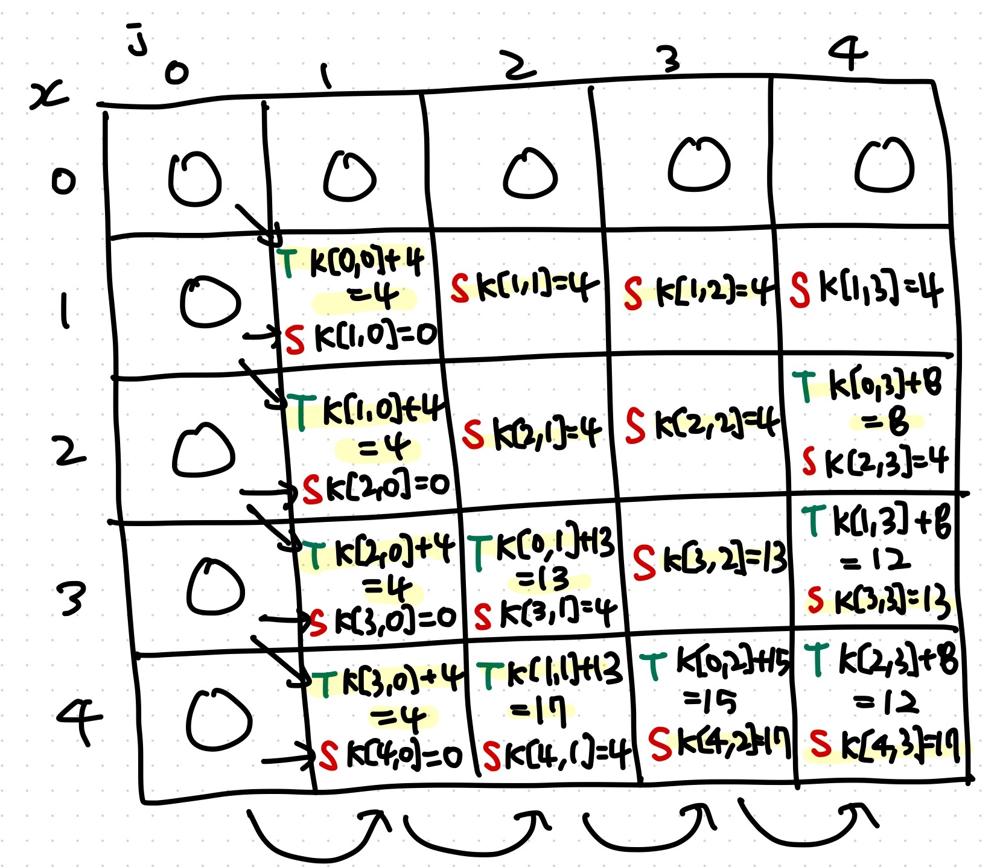

# Lecture 18 - More Dynamic Programming (Knapsack Problem)

_Fall 2025, Korea University_

Instructor: Gabin An ([gabin_an@korea.ac.kr](mailto:gabin_an@korea.ac.kr))


---

# Quiz #3 ⭐️

- Time limit: 15 minutes
- Start time: 13:40
- Materials: Lecture slides/notes may be used (open notes, not open internet)
- Access code: `           `


---

## Course Outline (After Midterm)

- Part 3: Data Structures
   - Graphs, Graph Search (DFS, BFS) and Applications (Finding SSCs w/ DFS)
- Part 4: Dynamic Programming
   - Shortest-Path: Dijkstra, Bellman-Ford, Floyd-Warshall Algorithms
   - More General DP: Longest Common Subsequence, **Knapsack Problem** 👈
- Part 5: Greedy Algorithms and Others
   - Scheduling Problem, Optimal Codes
   - Minimum Spanning Trees
   - Max Flow, Min Cut and Ford-Fulkerson Algorithms
   - Stable Matching, Gale-Shapley Algorithm


---

# Overview

- **Last time:** Longest Common Subsequence (LCS)  
- **Today:** Knapsack 🎒
  - Problem Variants:  
    - **Unbounded Knapsack** (infinite copies)  
    - **0-1 Knapsack** (at most one copy)


---

# Problem Definition 

- You have **$n$ items**, each with:
  - weight $w_i > 0$
  - value $v_i$

- 🎒 Knapsack capacity = $W$ (max weight it can hold)

- **Goal:** Choose items so that  
  - total weight $\le W$
  - total value is **maximized**


---

## Example (Capacity $W=10$)


| Item | Weight | Value |
|------|--------|-------|
| A    | 6      | 25    |
| B    | 3      | 13    |
| C    | 4      | 15    |
| D    | 2      | 8     |

❓ Which items to pick?
- A, C (weight = 10) -> value: 40 👈
- B, C, D (weight = 9) -> value: 36
- ...


---

## Brute Force Idea

- Try **all subsets of items**  
- For $n$ items → $2^n$ possibilities 😱  

👉 Exponential time (**Too Slow!**) → impossible for large inputs.

## We need **Dynamic Programming**!


---

### Subproblems

- Natural smaller problems:
  1. Knapsack with **smaller capacity**  
  2. Knapsack with **fewer items**  

- Combine these to build the full solution.  


---

## Knapsack Variant #1: **Unbounded Knapsack** ♾️

- You can take an **infinite number of copies** of each item.  
- Example ($W=10$):

  | Item | Weight | Value |
  |------|--------|-------|
  | A    | 6      | 25    |
  | B    | 3      | 13    |
  | C    | 4      | 15    |
  | D    | 2      | 8     |
  - Each item can be chosen **multiple times**  
  - E.g. **two B’s + two D’s** (weight = 10, value = 42 ✅)


---

### Problem Definition


Define:
$$
K(x) = \text{max value achievable with capacity } x
$$

Recurrence:
$$
K(x) = \max_{i: w_i \leq x} \big( K(x - w_i) + v_i \big)
$$

- At each capacity $x$, we “*try putting in one more item,*” and the recurrence checks which choice leads to the best outcome.
- Because items are unlimited, we don’t worry about running out of a particular item.
- The only constraint is **capacity**!

---

### Algorithm

```python
def unbounded_knapsack(W, items):
    """    
    W (int): Maximum capacity
    items (list of tuples): Each tuple is (weight, value)
    """
    n = len(items)
    K = [0] * (W + 1)
    for x in range(1, W + 1):
        for i in range(n):
            w, v = items[i]
            if w <= x: # If the item’s weight ≤ current capacity:
                candidate = K[x - w] + v
                if candidate > K[x]:
                    K[x] = candidate
    return K[W]
```


---

#### Example 1 (`W=4`, `items=[(1, 4), (3, 13), (4, 15), (2, 8)]`)

| item | weight | value |
|------|--------|-------|
| 0    |      **1** |     **4** |
| 1    |      3 |     13 |
| 2    |      4 |     15 |
| 3    |      2 |     8 |

```
Capacity = 1
  Try item 0 (w=1, v=4): K[1-1] + 4 = K[0] + 4 = 4
👉 K[1] = 4
```


---

#### Example 1 (`W=4`, `items=[(1, 4), (3, 13), (4, 15), (2, 8)]`)

```
👉 K[1] = 4 (item 0)
---
Capacity = 2
  Try item 0 (w=1, v=4): K[2-1] + 4 = K[1] + 4 = 8
  Try item 3 (w=2, v=8): K[2-2] + 8 = K[0] + 8 = 8
👉 K[2] = 8 (item 0 x 2)
```

---

#### Example 1 (`W=4`, `items=[(1, 4), (3, 13), (4, 15), (2, 8)]`)

```
👉 K[1] = 4 (item 0)
👉 K[2] = 8 (item 0 x 2)
---
Capacity = 3
  Try item 0 (w=1, v=4): K[3-1] + 4 = K[2] + 4 = 12
  Try item 1 (w=3, v=13): K[3-3] + 13 = K[0] + 13 = 13
  Try item 3 (w=2, v=8): K[3-2] + 8 = K[1] + 8 = 12
👉 K[3] = 13 (item 1)
```

---

#### Example 1 (`W=4`, `items=[(1, 4), (3, 13), (4, 15), (2, 8)]`)

```
👉 K[1] = 4 (item 0)
👉 K[2] = 8 (item 0 x 2)
👉 K[3] = 13 (item 1)
---
Capacity = 4
  Try item 0 (w=1, v=4): K[4-1] + 4 = K[3] + 4 = 17
  Try item 1 (w=3, v=13): K[4-3] + 13 = K[1] + 13 = 17
  Try item 2 (w=4, v=15): K[4-4] + 15 = K[0] + 15 = 15
  Try item 3 (w=2, v=8): K[4-2] + 8 = K[2] + 8 = 16
👉 K[4] = 17 (item 1 + item 0)
```

---

#### Example 1 (`W=4`, `items=[(1, 4), (3, 13), (4, 15), (2, 8)]`)

```
👉 K[1] = 4 (item 0)
👉 K[2] = 8 (item 0 x 2)
👉 K[3] = 13 (item 1)
---
Capacity = 4
  Try item 0 (w=1, v=4): K[4-1] + 4 = K[3] + 4 = 17
  Try item 1 (w=3, v=13): K[4-3] + 13 = K[1] + 13 = 17
  Try item 2 (w=4, v=15): K[4-4] + 15 = K[0] + 15 = 15
  Try item 3 (w=2, v=8): K[4-2] + 8 = K[2] + 8 = 16
👉 K[4] = 17 (item 1 + item 0)
```

`unbounded_knapsack(W, items)` returns `17`!
- `item 0` + `item 1` (total weight: 4, total value: 17)

---

#### Example 2 (`W=10`, `items=[(6, 25), (3, 13), (4, 15), (2, 8)]`)

```
Capacity = 1
Capacity = 2
  Try item 3 (w=2, v=8): K[2-2] + 8 = K[0] + 8 = 8 (* K[0]'s items + item 3)
...
Capacity = 9
  Try item 0 (w=6, v=25): K[9-6] + 25 = K[3] + 25 = 38
  Try item 1 (w=3, v=13): K[9-3] + 13 = K[6] + 13 = 39 (* K[6]'s items + item 1)
  Try item 2 (w=4, v=15): K[9-4] + 15 = K[5] + 15 = 36
  Try item 3 (w=2, v=8): K[9-2] + 8 = K[7] + 8 = 37
Capacity = 10
  Try item 0 (w=6, v=25): K[10-6] + 25 = K[4] + 25 = 41
  Try item 1 (w=3, v=13): K[10-3] + 13 = K[7] + 13 = 42  (* K[7]'s items + item 1)
  Try item 2 (w=4, v=15): K[10-4] + 15 = K[6] + 15 = 41
  Try item 3 (w=2, v=8): K[10-2] + 8 = K[8] + 8 = 42
```
`unbounded_knapsack(W, items)` returns `42`!
- `item 1`**x2** + `item 3`**x2** (total weight: 10, total value: 42)
  
---

## Knapsack Variant #2: **0-1 Knapsack** 🫙

- Now: at most **one copy** of each item.
- Example:

  | Item | Weight | Value |
  |------|--------|-------|
  | A    | 6      | 25    |
  | B    | 3      | 13    |
  | C    | 4      | 15    |
  | D    | 2      | 8     |

  - Each item can be chosen **only once**  
  - E.g. **A + C** (weight = 10, value = 40 ✅)


---

### Problem Definition

Define:
$$
K(x, j) = \text{max value achievable with capacity } x\text{ considering only items at indices from }1, \dots, j
$$

Recurrence:

- If we **take item j**: $K(x, j) = K(x - w_j, j - 1) + v_j$
- If we **skip item j**: $K(x, j) = K(x, j - 1)$
- Therefore:
  $$
  K(x, j) = \max \{ K(x - w_j, j-1) + v_j, \, K(x, j-1) \}
  $$


---

### Algorithm

```python
def zero_one_knapsack(W, items):
    """
    W (int): Maximum capacity
    items (list of tuples): Each tuple is (weight, value)
    """
    n = len(items)
    
    K = [[0] * (n + 1) for _ in range(W + 1)] # DP table: (W+1) x (n+1)
    
    for j in range(1, n + 1):  # items
        w, v = items[j-1]
        for x in range(1, W + 1):  # capacity
            K[x][j] = K[x][j-1]  # skip item j
            if w <= x:
                K[x][j] = max(K[x][j], K[x-w][j-1] + v)  # take item j
    
    return K[W][n]
```


---

#### Example 1 (`W=4`, `items=[(1, 4), (3, 13), (4, 15), (2, 8)]`)




$$
K(x, j) = \max \{ K(x - w_j, j-1) + v_j, \, K(x, j-1) \}
$$


---

#### Example (`W=10`, `items=[(6, 25), (3, 13), (4, 15), (2, 8)]`)

<div class="one-one-columns">

<div>

```
|  0 |  0 |  0 |  0 |  0 |
|  0 |  0 |  0 |  0 |  0 |
|  0 |  0 |  0 |  0 |  8 |
|  0 |  0 | 13 | 13 | 13 |
|  0 |  0 | 13 | 15 | 15 |
|  0 |  0 | 13 | 15 | 21 |
|  0 | 25 | 25 | 25 | 25 |
|  0 | 25 | 25 | 28 | 28 |
|  0 | 25 | 25 | 28 | 33 |
|  0 | 25 | 38 | 38 | 38 |
|  0 | 25 | 38 | 40 | 40 |
```

</div>

<div>

  | Item | Weight | Value |
  |------|--------|-------|
  | 0    | 6      | 25    |
  | 1    | 3      | 13    |
  | 2    | 4      | 15    |
  | 3    | 2      | 8     |

</div>
</div>


---

### Time Complexity

* Both can be solved in **$O(nW)$** time

  * $n$ = number of items
  * $W$ = knapsack capacity


---

### Space Optimization

* Naïve DP table:

  * **0-1 Knapsack** uses a **$(n+1) \times (W+1)$** table.
  * **Unbounded Knapsack** often uses a **1D array of length $W+1$**.

* Optimization:
  * **0-1 Knapsack** → we only need the **previous column** to compute the current column.
    * Space reduces to $O(W)$.


---

# Summary

* **Knapsack** = another DP classic
* Variants:
  * **Unbounded** (infinite items)
  * **0-1** (each item at most once)
* Both solved in $O(nW)$ time
* Can optimize space → $O(W)$


---

# Credits & Resources

Lecture materials adapted from:
- Stanford CS161 slides and lecture notes
  - https://stanford-cs161.github.io/winter2025/
- _Algorithms Illuminated_ by Tim Roughgarden
  - https://algorithmsilluminated.com/

<style>
  img[alt~='center'] {
    display: block;
    margin-left: auto;
    margin-right: auto;
  }

  .one-one-columns {
    display: grid;
    grid-template-columns: repeat(2, minmax(0, 1fr));
    gap: 0.5rem;
  }

  .two-one-columns {
    display: grid;
    grid-template-columns: 2fr 1fr;
    gap: 0.5rem;
  }

  .three-one-columns {
    display: grid;
    grid-template-columns: 3fr 1fr;
    gap: 0.5rem;
  }

  .five-one-columns {
    display: grid;
    grid-template-columns: 5fr 1fr;
    gap: 0.5rem;
  }

</style>