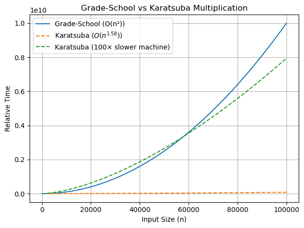

# Lecture 2 - Divide and Conquer (Karatsuba Integer Multiplication)

_Fall 2025, Korea University_

Instructor: Gabin An ([gabin_an@korea.ac.kr](mailto:gabin_an@korea.ac.kr))

---

# Welcome Back!

In today's class, we will learn
- the **Integer Multiplication** problem
- the **Karatsuba Multiplication** method (or algorithm)
  - An _optimized_ recursive approach to multiplying two numbers
  - A great example of **Divide-and-Conquer** algorithms


---

# What's the **Integer Multiplication** Problem?

> Input: Two $n$-digit nonnegative integers, $x$ and $y$.
> Output: The product $x \cdot y$.

- Examples:
  1. 1-digit integers
  $$
  9 \cdot 8 = 72
  $$

  2. 4-digit integers
  $$
  5678 \cdot 1234 = 7006652
  $$

  1. $n$-digit integers
  $$
  3141592653589793238462643383279502884197 \cdot 2718281828459045235360287471352662497757 = ?
  $$


---

## The Grade-School Algorithms

Suppose you want to multiply two numbers $x = 5678$ and $y = 1234$ (so $n=4$).

You already know a way to do this — the **grade-school algorithm** — which involves multiplying every digit of the first number with every digit of the second.

```python
     5678
x    1234
---------
    22712 (= 5678 * 4)
   17034- (= 5678 * 3)
  11356-- (= 5678 * 2)
  5678--- (= 5678 * 1)
---------
  7006652
```


---

### Analysis of the Number of the Operations

For now, let's think of a primitive operation as any of the following:
1. multipying two single-digit numbers
2. adding two single-digit numbers

For the first partial product, `5678 * 4`
- multiplying `4` times each of the digits `5`, `6`, `7`, and `8`
    - one per digit = $n$
- handling carries (add a single-digit number to double-digit one), e.g., `3` + `28` 
    - at most two per carry = $2n$
  
Because there are $n$ partial products, the computation requires at most $3n^2$ operations.


---

### Analysis of the Number of the Operations - Continued

- We still have to add up the partial products to compute the final answer (at most another $3n^2$).
```python
     5678
x    1234
---------
    22712 (= 5678 * 4) # partial product: roughly 3n operations ------|
   17034- (= 5678 * 3) # partial product: roughly 3n operations       n
  11356-- (= 5678 * 2) # partial product: roughly 3n operations    rows
  5678--- (= 5678 * 1) # partial product: roughly 3n operations ------|
---------
  7006652              #  final addition: roughly constant * n^2 operations
```
- \# of operations overall ~ constant * $n^2$


---

## Tiny Bit of **Asymptotic Analysis**

Instead of measuring a program's running time in seconds (which can vary based on hardware), we count the number of **primitive operations** (like additions or multiplications) it performs. This helps us understand how the **running time grows with the input size** $n$.

This is known as **Asymptotic Analysis**:

- It focuses on the **rate of growth** of an algorithm's running time as $n$ becomes large.
- For example, the **grade-school multiplication algorithm** runs in **$O(n^2)$** time.

We’ll explore this notation in more detail next week!


---

## Can We Do Better?

Have you ever taken the grade-school multiplication algorithm as the one and only—or even optimal—way to multiply numbers?
- But what if there’s a *faster* way?
- What if we can design an algorithm that runs in **less than $O(n^2)$** time?

> *“Perhaps the most important principle for the good algorithm designer is to refuse to be content.”*
> — Aho, Hopcroft, and Ullman, *The Design and Analysis of Computer Algorithms* (1974)

Let’s take that advice and see where it leads.


---

# **Divide and Conquer**

The "Divide and Conquer" algorithm paradigm is a very useful and widely applicable technique. The high-level idea is just to split a given problem into smaller pieces and then solve the smaller ones, often recursively.

- Divide: Break the problem into smaller subproblems (often of equal size).
- Conquer: Solve each subproblem recursively.
- Combine: Merge the subproblem solutions into the final answer.


---

## 💡 A Recursive Algorithm (Divide and Conquer, Take 1)

Break each number into two halves
- Write $x = 10^{n/2}a + b$ and $y = 10^{n/2}c + d$.
- $a$, $b$, $c$, and $d$ are $n/2$-digit numbers. For example,
  - $x = 5678 = 56 * 10^2 + 78$ ($a = 56$, $b = 78$)
  - $y = 1234 = 12 * 10^2 + 34$ ($c = 12$, $d = 34$)

Then,

$$
\begin{aligned}
  x \cdot y &= (10^{n/2}a + b)(10^{n/2}c + d)\\
  &= 10^{n}ac + 10^{n/2}(ad+bc) + bd
\end{aligned}
$$

It's **4 multiplications on numbers of size n/2**.


--- 

## Is this Recursive Algorithm Better?

$$
\begin{aligned}
  x \cdot y &= (10^{n/2}a + b)(10^{n/2}c + d)\\
  &= 10^{n}ac + 10^{n/2}(ad+bc) + bd
\end{aligned}
$$

- Interestingly enough, this algorithm isn't actually better!
- Intuitively, this is because if we expand the recursion, we still have to multiply every pair of digits, i.e., when $x = 5678$ and $y = 1234$, we still need to compute $56 \cdot 12$, $56 \cdot 34$, $78 \cdot 12$, and $78 \cdot 34$.


---

## ✨ Karatsuba’s Insight in 1960 (Divide and Conquer, Take 2) 

An ingenious trick **reduces the number of multiplications from 4 to 3**.

$$
\begin{aligned}
  x \cdot y &= (10^{n/2}a + b)(10^{n/2}c + d)\\
  &= 10^{n}ac + 10^{n/2}(ad+bc) + bd
\end{aligned}
$$
  
- We don't care about $ad$ or $bc$, but their sum $ad + bc$.
- **Gauss' Trick**: Instead of recursively computing $ad$ and $bc$, we compute:
  $$t = (a+b)(c+d) = ac + bd + ad + bc$$
  because $ad + bc = t - ac - bd$ (we have to compute $ac$ and $bd$, anyway.)
- So now we only compute $ac$, $bd$, and $(a+b)(c+d)$ (*just 3 multiplications*)!


---

## Efficiency Analysis of Karatsuba Multiplication

- Upshot: To solve $n$-digit multiplication problem, we only need **three** recursive $n/2$-digit recursive multiplications (and some additions).
  - Saving a recursive call should save on the overall running time, but by how much?
  - Is the Karatsuba algorithm *faster* than the grade-school multiplication algorithm?


---

## Let's Analyze the Runtime using **Recurrence Relations**!

Let $T(n)$ be the runtime of the algorithm, given an input of size $n$.

- The initial recursive algorithm: $T(n) = 4T(\frac{n}{2}) + O(n)$
    $$
    T(n) = 4T(\frac{n}{2}) = 4^2T(\frac{n}{2^2}) = \ldots = 4^tT(\frac{n}{2^t}) = n^2T(1) = O(n^2)
    $$


---

- The Karatsuba Multiplication algorithm: $T(n) = 3T(\frac{n}{2}) + O(n)$
    $$
    T(n) = 3T(\frac{n}{2}) = \ldots = 3^tT(\frac{n}{2^t}) = 3^{\log_{2}n}T(1) = 2^{(\log_{2}3)(\log_{2}n)} = n^{1.58}T(1) = O(n^{1.58})
    $$
    > since $\log_{2}3 \approx 1.58$


--- 

## $O(n^2)$ vs $O(n^{1.58})$

Karatsuba is much faster than the $n^2$ algorithm that we learned in grade school!


---

## Can We Do Better?

|Algorithm|Recursive Calls|Time Complexity|
|---|---|---|
|Karatsuba (1962)|3T(n/2)|$O(n^{1.58})$|
|Toom and Cook (1963)|5T(n/3)|$O(n^{1.465})$|
|...|...|...|
|Harvey–van der Hoeven (2019)|Theoretical best|$O(n \log(n))$|

- It is quite amazing that the seemingly simple question of multiplying two numbers has proved to be so mysterious and has seen new research advances as recently as 2019.
- This is what makes the study of algorithms so exciting!


---

# Bonus: Where Does “Algorithm” Come From?

The word “algorithm” comes from **al-Khwarizmi**, a 9th-century Persian mathematician.

- He wrote about methods for arithmetic using **Arabic-Hindu numerals**.
  - i.e., a set of 10 symbols - 1,2,3,4,5,6,7,8,9,0
- His works were translated into Latin in the 1100s and introduced to Europe which had previously relied on Roman numerals such as I, V, X, L, C, and M.
    > Roman numerals were cumbersome for arithmetic and lacked the concept of zero. The Arabic-Hindu numeral system **revolutionized** computation by introducing place value and zero.
- The old French word "Algorisme" meant "the Arabic numerals system". Over time, the term evolved to mean **any systematic method for solving computational problems**.


---

# Credits & Resources

Lecture materials adapted from:
- Stanford CS161 slides and lecture notes
  - https://stanford-cs161.github.io/winter2025/
- _Algorithms Illuminated_ by Tim Roughgarden
  - https://algorithmsilluminated.com/

- For more on the efficiency analysis of the Karatsuba algorithm, see:
https://en.wikipedia.org/wiki/Karatsuba_algorithm#Efficiency_analysis