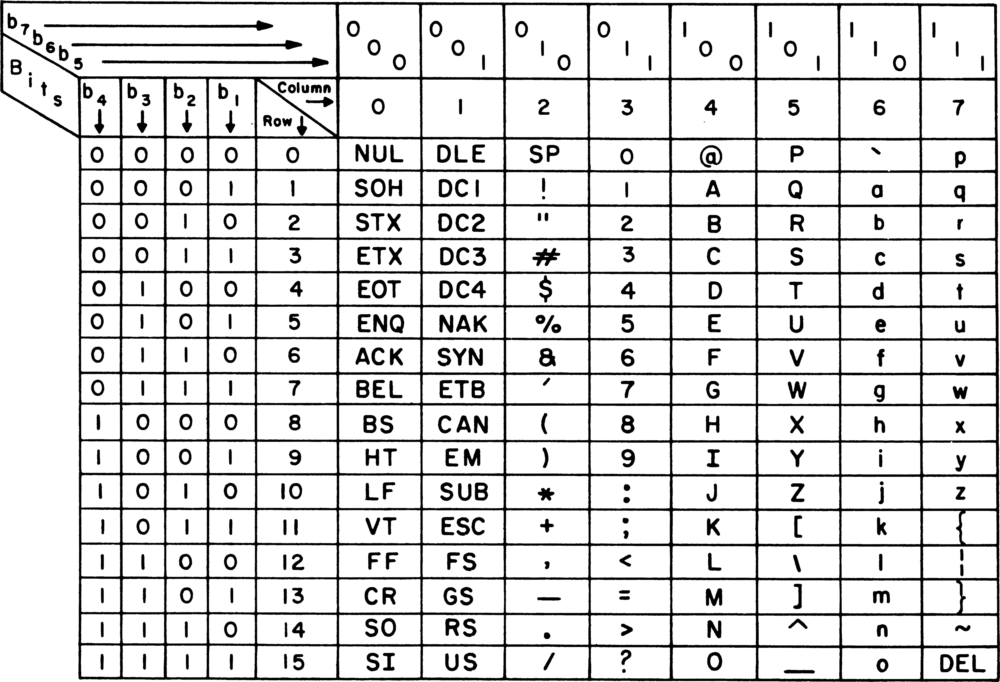
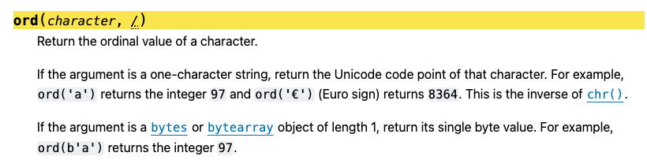
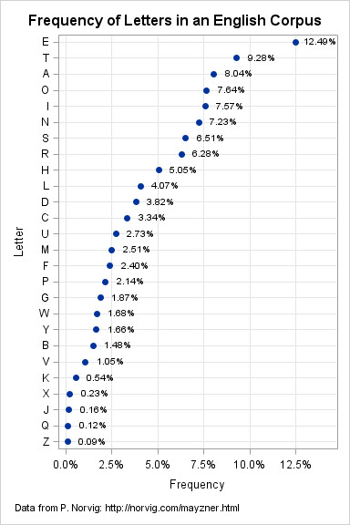
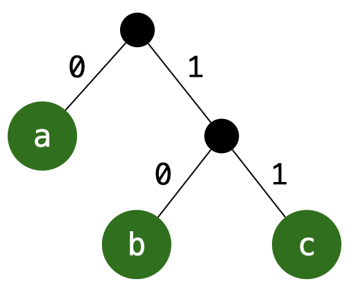
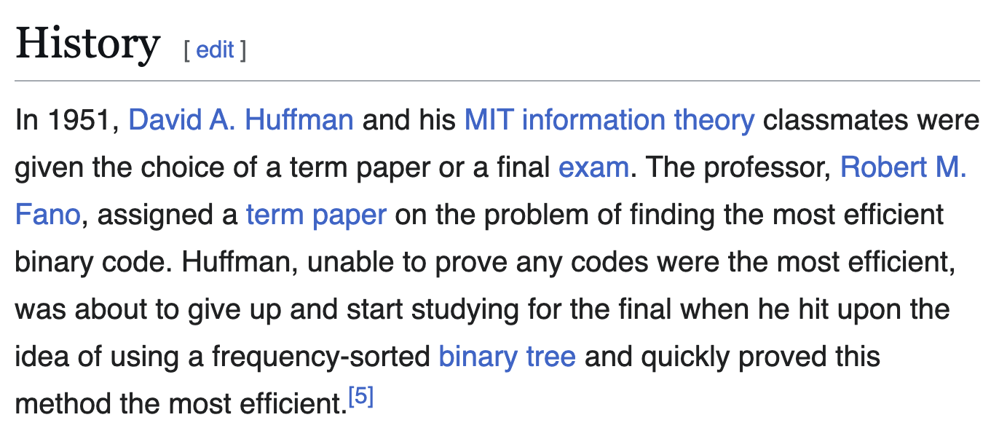
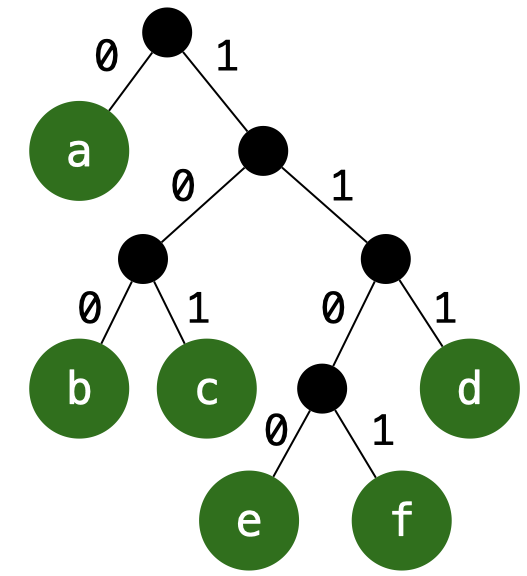

# Lecture 20 - Greedy Algorithms (Optimal Codes)

_Fall 2025, Korea University_

Instructor: Gabin An ([gabin_an@korea.ac.kr](mailto:gabin_an@korea.ac.kr))


---

# Agenda
- Recap: What is a **Greedy Algorithm**?
- New problem: **Optimal Codes**


---

# Recap: What is a Greedy Algorithm?

- A greedy algorithm is an approach for solving a problem by selecting **the best option available at each step**.
- It builds up a solution piece by piece, always choosing the next piece that offers the most obvious and immediate benefit.
- **It assumes that local optimality will lead to global optimality**.


---

## Property of Problems **Suitable for Greedy Algorithms**

- **Greedy Choice Property**
  - Choosing the best local option must be part of some optimal solution.

- **Optimal Substructure**
  - Optimal solutions to the full problem are composed of optimal solutions to subproblems.


---

## Problems with Nice (Correct) Greedy Algorithms

- ~~Activity Selection~~ ✅
- ~~Scheduling~~ ✅
- **Optimal Codes** 👈
- Minimum Spanning Trees
- ...


---

# "*Codes*"? "*Coding*"?

- Codes = binary representations of symbols
- Coding = the process of assigning these representations.


---

# Representing Symbols (ASCII Example)

- **ASCII (American Standard Code for Information Interchange)**
- In ASCII, every character uses fixed 7 bits.


---

Example: `'a' = 1100001`, `'b' = 1100010`




---

# Representing Symbols (Unicode Example)

**ASCII**
* 7-bit character set (128 characters) covering basic English letters, digits, punctuation, and control characters

**Unicode**
- A **much larger** character encoding standard (over 1.1 million code points possible)
- Covers characters for **virtually all languages**, emoji, symbols, etc.
- Designed to unify many old encodings

> 📝 **Unicode includes ASCII as its first 128 code points.** But Unicode is **not** just ASCII + extra characters. Unicode has **different architecture**, multiple planes, multiple encodings (UTF-8 / UTF-16 / UTF-32), and normalization rules.


---

In python, you can use `ord()` to see the Unicode representations of a character.
> 

```python
# character -> code (decimal)
ord('a'), ord('b')   # 97, 98

# character -> 8-bit binary representation
format(ord('a'), '08b'), format(ord('b'), '08b')  
# '01100001', '01100010'
```


---

# Problem: **Fixed-length Encoding is Wasteful**

<div class="two-one-columns">

<div>

- Not all characters appear equally often!
  - In English: `'e'` ≈ 13%, `'z'` ≈ 0.07%
  
- If frequencies of characters are very skewed, fixed bits wastes bandwidth.


## Idea: Creating **Optimal Codes**
- Use *variable-length* codes so the expected bits per symbol is minimized.
- By assigning **shorter codes for frequent symbols, longer for rare**, we can save space on average.

</div>

<div>



</div>

</div>


---

## Example: Compressing characters with different frequencies


<div class="one-two-columns">
<div>

Suppose you want to encode four symbols with the following frequencies:

| Symbol | Frequency |
| ------ | --------- |
| A      | 50        |
| B      | 30        |
| C      | 15        |
| D      | 5         |

</div>

<div>

1️⃣ **Fixed-length code**

<div class="one-two-columns">

<div>

```
A = 00
B = 01
C = 10
D = 11
```

</div>

<div>

**Expected length**
= 2 bits/symbol

</div>

</div>

2️⃣ **Variable-length code**

Assign shorter codes to frequent symbols:

<div class="one-two-columns">

<div>

```
A = 0
B = 10
C = 110
D = 111
```

</div>

<div>

**Expected length** 
= 0.5 * 1 + 0.3 * 2 + 0.15 * 3 + 0.05 * 3
= 1.7 bits/symbol (🔋 savings of **15%**)


</div>

</div>

</div>
</div>


---

## Key Question

- How can we design a coding scheme that is **space-efficient** yet **decodable without ambiguity?**

  > 💡 This is the foundation of **data compression** (e.g., ZIP, MP3, JPEG)


---

# **Prefix-Free** Codes

- To decode correctly, we need to avoid ambiguity
  - Example: `a`←`0`, `b`←`1`, `c`←`01`  
    - Stream `01` could mean `ab` or `c` (❌ ambiguous!)
- Solution: Use ⭐️**prefix-free codes**⭐️
  - No codeword is a prefix of another.
  - Example: `a`←`0`, `b`←`10`, `c`←`11`
    - Stream `010110` → decode uniquely: `abca` ✅
- Prefix-free codes ensure instant (unambiguous) decoding left‑to‑right.
- Non‑prefix codes can be more compact per symbol but break unique decodability.


---

## 🌲 Binary Tree View


- Prefix-free codes are equivalent to placing characters only at **leaves** of a binary tree
- Build a binary tree where:
  - **Left edge = 0**, **Right edge = 1**
  - Leaves = characters (symbols), Codeword = path label
  - `a`←`left`=`0`, `b`←`right&left`=`10`, `c`←`right&right`=`11`


---

## Measuing Code Efficiency

- Suppose we have characters $C$ and use the coding scheme represented by a tree $T$
- For each character $c \in C$,
  - $f(c)$: the frequencies of symbol $c$ (probabilities of occurrence)
  - $d_T(c)$: the code length, i.e., depth of $c$ in the tree $T$
- **Expected (average) code length**:
    $$
    B(T) = \sum_{c \in C} f(c) \cdot d_T(c)
    $$
- Goal: Find a tree $T$ that **minimizes $B(T)$** → Shorter average code length
  
> A tree $T$ is optimal if this expected cost B(T) is minimized among all prefix-free coding trees.


---

# Huffman Coding (1951)

- Invented by **David Huffman** as a student project 👨🏻‍💻
  (instead of taking a final exam!)




---

## Building Huffman Codes

- The basic idea 💡
  - Build subtrees for subsets of characters and merge them from the bottom up, combining the two trees with the characters of minimum total frequency.
- **Greedy algorithm**:
  1. Start with each character as a leaf node (weighted by frequency)
  2. Repeatedly merge the two least frequent nodes into a new parent
  3. Assign left=0, right=1 at each merge
  4. Continue until one tree remains


---

### Example: Huffman Codes

Characters + frequencies:

`a`: `0.45`, `b`: `0.13`, `c`: `0.12`, `d`: `0.16`, `e`: `0.05`, `f`: `0.09`

Step-by-step merges:
1. `e(0.05)` + `f(0.09)` → `node(0.14)`
2. `node(0.14)` + `c(0.12)` → `node(0.26)`
3. `b(0.13)` + `d(0.16)` → `node(0.29)`
4. `node(0.26)` + `node(0.29)` → `node(0.55)`
5. `a(0.45)` + `node(0.55)` → `root(1.00)`


---

### Example: Huffman Codes (Results)

```
- a = 0  
- b = 101  
- c = 100  
- d = 111  
- e = 1100  
- f = 1101
```

- Expected Length
  $$
  E[L] = 0.45 \cdot 1 + 0.13 \cdot 3 + 0.12 \cdot 3 + 0.16 \cdot 3 + 0.05 \cdot 4 + 0.09 \cdot 4 = 2.24\text{ bits/symbol}
  $$
- Compare 8 bits/symbol → > 72% reduction 🔋


---

## Prefix-Free 👉 **Instant Decoding**



Let's decode `110011011111000101`!

- Start at root, consume bits left-to-right
- Whenever you **hit a leaf, output the symbol and reset to root**
- No look‑ahead, no backtracking required

> This is why prefix‑free is the dominant practical constraint.


---

## Quick Quiz

Build Huffman Codes for the following characters + frequencies:

| Symbol | Frequency |
| ------ | ---------:|
| A      | 50        |
| B      | 20        |
| C      | 15        |
| D      | 10        |
| E      |  5        |

Q. What is the expected length per symbol?


---

## Huffman Code: **Correctness Proof**

**Claim**: Huffman’s algorithm always produces a prefix-free code that minimizes the expected codeword length.

**Proof Strategy**:

We use **induction** on the number of symbols $n$.

1. **Base case ($n=2$):**  
   Only one possible prefix code — trivially optimal ✅

2. **Inductive step ($n>2$):**  
   Show that Huffman’s greedy choice and reduction step preserve optimality.


---

Before we finish the induction, we need the two key tools.

### 1️⃣ Greedy step is safe
The two least frequent symbols should be merged — at least, there exists an optimal tree where they are siblings.

### 2️⃣ Reduction step preserves optimality:

If we combine the two least frequent symbols and solve a smaller problem, expanding them back yields an optimal solution for the original problem.

---

### 1️⃣ Greedy step is safe

> The two least frequent symbols should be merged — at least, there exists an optimal tree where they are siblings.

Let $x$ and $y$ be the **two least frequent symbols**.  

The key statement is:
> In at least one optimal code tree, $x$ and $y$ appear as siblings at the maximum depth of the tree.

**Justification**: If not, we can swap them with two deepest siblings without increasing cost.


---

### 2️⃣ Reduction step preserves optimality:

> If we combine the two least frequent symbols and solve a smaller problem, expanding them back yields an optimal solution for the original problem.

Now suppose we merge $x, y$ into a single combined symbol $z$, with: $f(z)=f(x)+f(y)$

This gives us a smaller alphabet of size $n-1$.

The idea:
1. Solve the problem optimally for these $n-1$ symbols.
2. Then expand $z$ back into $x$ and $y$, attaching $0$ and $1$.

Crucially:

- Expanding the tree **adds exactly 1** to the depth of $x$ and $y$: $\Delta \text{Cost}=f(x)+f(y)$
- So optimality for the smaller instance carries over to the larger one.


---

## Inductive Proof

- **Inductive Hypothesis**: For a set of $n-1$ symbols, Huffman produces an optimal code.

- **Inductive Step** (From $n-1$ to $n$):
    1. Apply induction to the reduced problem with $n-1$ symbols (merging $x,y \to z$).  
        - Huffman produces an optimal code $C'$ for the reduced problem.
    2. Expand $z$ into $x,y$ and append `0` and `1` to their codes.
    3. The resulting code $C$ is optimal for $n$ symbols because $x,y$ are the two least frequent symbols. ✅
        - Why? In some optimal prefix code, the two least frequent symbols must be siblings at the deepest level.


---
# Huffman Codes Conclusion

- **Greedy choice** is always safe.  
- **Reduction** preserves optimality.  
- By **induction**, Huffman always yields an **optimal prefix code**.  
- The technique of Huffman coding is the final stage in many compression methods, including JPEG, MP3, and zip.
  

---

# Credits & Resources

Lecture materials adapted from:
- Stanford CS161 slides and lecture notes
  - https://stanford-cs161.github.io/winter2025/
- _Algorithms Illuminated_ by Tim Roughgarden
  - https://algorithmsilluminated.com/

--- 

# Appendix: More Rigorous Proof

---

## Outline

1. Setup & Notation
2. Lemma 0 (Full binary form)
3. Greedy-Choice Lemma (Deepest siblings)
4. Reduction Lemma (Merge two lightest)
5. Inductive Proof of Optimality
6. Remarks

---

## Setup & Notation

* Alphabet (symbols) $C$; frequency/weight $f(c)>0$ for each $c\in C$.
* A **prefix code** corresponds to a **binary tree** $T$ with each symbol at a **leaf**.
* Let $d_T(c)$ be the depth (code length) of leaf $c$ in $T$.
* **Cost (external path length)**:
  $$
  B(T) \overset{\text{def}}{=} \sum_{c\in C} f(c)\, d_T(c).
  $$
  - Equivalently, expected codeword length is $\frac{B(T)}{\sum_{c\in C} f(c)}$.
* **Goal:** find $T$ minimizing $B(T)$.

---

## Lemma 0 (Full Binary Form)

> In some optimal tree $T^*$, every internal node has **exactly two** children ($T^*$ is full).

**Proof sketch.** If an internal node had only one child, **contract** that edge; depths of all leaves do not increase, and at least one decreases, so $B(T)$ does not increase (strictly decreases unless already minimal). Hence we may assume an optimal tree is full. ◻︎

---

## Greedy-Choice Lemma (Deepest Siblings)

Let $x,y\in C$ be the two symbols with **smallest** frequencies (break ties arbitrarily).

> **Claim.** There exists an optimal tree $T^*$ in which $x$ and $y$ are **siblings at the maximum depth** of $T^*$.

**Proof.** Take an optimal full tree $T^*$. Let $a,b$ be two sibling leaves at **maximum depth**; w\.l.o.g. order frequencies so that $f(x) \le f(y),\quad f(a) \le f(b)$

Because $x,y$ are the two lightest symbols, we have $f(x) \le f(a)$ and $f(y) \le f(b)$.
Construct $\tilde T$ by **swapping labels** so that the deepest sibling positions are occupied by $x$ and $y$. Depths at those two positions are the same as before, say $d_a=d_b$. Then

$$
\Delta \equiv B(\tilde T)-B(T^*)
= (f(x)-f(a))\,d_a + (f(y)-f(b))\,d_b \le 0.
$$

Thus $\tilde T$ is **also optimal** and has $x,y$ as deepest siblings. ◻︎

---

## Reduction Lemma (Merge Two Lightest)

Form a reduced alphabet $C'=(C\setminus\{x,y\})\cup\{z\}$ where the new symbol $z$ has
$f(z) = f(x)+f(y).$

> **Claim A.** If $T$ is a tree for $C$ in which $x,y$ are siblings, and $T'$ is obtained by **contracting** their parent into leaf $z$, then $B(T) = B(T') + f(x) + f(y).$

**Reason.** Only $x$ and $y$ change depths when expanding/contracting: each gains/loses exactly 1 in depth; others unchanged. Hence the cost difference is precisely $f(x)+f(y)$.

---

> **Claim B.** If $T'$ is **optimal** for $C'$ and we **expand** $z$ into children $x,y$, the resulting $T$ is optimal for $C$ among trees where $x,y$ are siblings. Moreover, if some optimal $T$ for $C$ has $x,y$ siblings, then the contracted $T'$ must be optimal for $C'$.

**Proof.** Suppose not: if there exists $U'$ for $C'$ with $B(U')<B(T')$, then expanding $U'$ gives $U$ with $B(U) = B(U') + f(x)+f(y) < B(T') + f(x)+f(y) = B(T),$
contradicting optimality of $T$. The converse is analogous. ◻︎

---

## Inductive Proof of Optimality (Huffman)

We prove by **induction on** $n=|C|$ that **Huffman** produces a tree minimizing $B(T)$.

**Base ($n=2$).** There is only one full binary tree; Huffman returns it, trivially optimal.

**Inductive Step.** Assume true for all alphabets of size $n-1$.

1. Let $x,y$ be the two lightest symbols. By the **Greedy-Choice Lemma**, some optimal $T^*$ has $x,y$ as deepest siblings.
2. **Contract** $x,y$ to $z$, obtaining $C'$ and optimal $T'^*$ by Claim B. By the inductive hypothesis, **Huffman** on $C'$ returns an optimal tree $T'_H$ with $B(T'_H)=B(T'^*)$.
3. **Expand** $z$ back to $x,y$. By Claim A,

$$
B(T_H) = B(T'_H) + f(x) + f(y) = B(T'^*) + f(x) + f(y) = B(T^*).
$$

Thus $T_H$ (Huffman’s tree on $C$) is **optimal**. ◻︎

---

## Remarks

* The proof shows **Greedy-Choice** and **Optimal Substructure** explicitly.
* Ties among equal frequencies are harmless; any tie-breaking yields an optimal tree.
* The argument generalizes to **non-integer** positive weights.
* Implementation detail: use a min-heap to repeatedly extract the two lightest symbols; total time $O(n\log n)$.


---

## Summary

* **Lemma 0:** assume an optimal **full** binary tree.
* **Greedy-Choice Lemma:** the two lightest symbols can be placed as **deepest siblings** in an optimal tree.
* **Reduction Lemma:** merging these yields a smaller **optimal** instance.
* **Induction:** applying Huffman recursively produces a globally **optimal** code.

**Therefore, Huffman coding minimizes** $B(T)=\sum_c f(c) d_T(c)$ **over all prefix codes.**


<style>
  img[alt~='center'] {
    display: block;
    margin-left: auto;
    margin-right: auto;
  }

  .one-one-columns {
    display: grid;
    grid-template-columns: repeat(2, minmax(0, 1fr));
    gap: 0.5rem;
  }

  .one-two-columns {
    display: grid;
    grid-template-columns: 1fr 2fr;
    gap: 0.5rem;
  }

  .two-one-columns {
    display: grid;
    grid-template-columns: 2fr 1fr;
    gap: 0.5rem;
  }

  .three-one-columns {
    display: grid;
    grid-template-columns: 3fr 1fr;
    gap: 0.5rem;
  }

  .five-one-columns {
    display: grid;
    grid-template-columns: 5fr 1fr;
    gap: 0.5rem;
  }

</style>