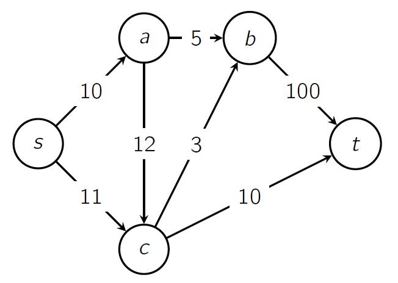
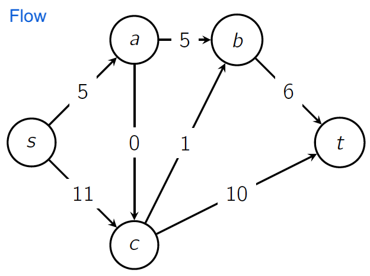

# Lecture 22 - Min Cut, Max Flow and Ford-Fulkerson - Part A 

_Fall 2025, Korea University_

Instructor: Gabin An ([gabin_an@korea.ac.kr](mailto:gabin_an@korea.ac.kr))

---

# Quiz #4

- Time limit: 20 minutes
- Start time: 13:40
- Materials: Lecture slides/notes may be used (open notes, not open internet)
- Access code: `           `

---

# Roadmap of **Min Cut, Max Flow and Ford-Fulkerson**

1. **Minimum Cut Problem** ⭐️
2. **Maximum Flow Problem** ⭐️
3. **Max-Flow = Min-Cut Theorem** ⭐️
4. Ford–Fulkerson Algorithm  
5. Runtime Analysis
6. Applications of Max Flow

---

# Setup

Given a **directed** graph $G = (V,E)$ with:  
- **Source** node $s$ and **target** node $t$  
- Each edge $(u,v)$ has capacity $c(u,v)\ge 0$

---

# Minimum Cut Problem

Partition $V = S ∪ T$ with $s∈S$, $t∈T$, $S∩T=∅$ (disjoint)

The **cost of a cut**: $c(S,T)=\sum_{x∈S,\,y∈T} c(x,y)$ (*does not count the edge from T to S*)

**Minimum cut** = a cut with the minimum cost

$$
S=\{s,a,c\}, T=\{b,t\} \quad \rightarrow \quad c(S,T)=c(a,b)+c(c,b)+c(c,t)=5+3+10=18
$$

---

## How to find the minimum cut?

$2^3$ possibilities

- $S=\{s\}, T=\{a,b,c,t\}$
- $S=\{s,a\}, T=\{b,c,t\}$
- $S=\{s,b\}, T=\{a,c,t\}$
- $S=\{s,c\}, T=\{a,b,t\}$
- $S=\{s,a,b\}, T=\{c,t\}$
- $S=\{s,a,c\}, T=\{b,t\}$
- $S=\{s,b,c\}, T=\{a,t\}$
- $S=\{s,a,b,c\}, T=\{t\}$

---

### Quantifying the Bottleneck using Min-Cut Capacity

- Min-cut capacity precisely quantifies the network's **most critical bottleneck**.
  - If the min-cut capacity is 18, the network cannot, under any circumstances, handle a flow exceeding 18, regardless of the route taken.

---

# How Do We Compute a Min-Cut?

---

# Maximum Flow Problem

Given a **directed** graph $G = (V,E)$ with:  
- **Source** $s$ and **sink** $t$  
- Each edge $(u,v)$ has capacity $c(u,v)\ge 0$

**Max-Flow problem:**
We seek a **flow** $f:E → \mathbb{R}_{\ge0}$ that obeys two constraints (*Capacity constraint* and *Flow conservation*) and **maximizes** the total amount sent from $s$ to $t$.

--- 

## Flow Constraint 1. **Capacity Constraint**

$$0 \le f(u,v) \le c(u,v)$$  

---

## Flow Constraint 2. **Flow Conservation**  
$$\sum_{x\in N_{in}(v)} f(x,v) = \sum_{y\in N_{out}(v)} f(v,y),\quad ∀v ∈ V − \{s,t\}$$  

- $N_{in}(v)$: the set of nodes with an edge that points to $v$
- $N_{out}(v)$: the set of nodes that $v$ points to

---

## Flow Value

If no edges enter $s$ and none leave $t$:

$$|f| = \sum_{x∈N_{out}(s)} f(s,x) = \sum_{y∈N_{in}(t)} f(y,t)$$

Otherwise:

$$|f| = \sum_{x∈N_{out}(s)} f(s,x) − \sum_{y∈N_{in}(s)} f(y,s)$$

## **Maximum Flow Problem**

**Goal:** Find a flow $f$ that **maximizes** $|f|$.

## Example

The current flow value is:
$$
|f| = \sum_{x∈N_{out}(s)} f(s,x) = \sum_{y∈N_{in}(t)} f(y,t) = 16
$$

---

The maximum flow is 18.

- You can still increase the flow of $s \to a$, $a \to c$, $c \to b$, and $b \to t$ by 2.

---

## 💡 Lemma: Max Flow $\le$ Min Cut

For any flow $f$ and cut $(S,T)$, we have $|f| \le c(S,T)$. 

**Intuition:**  
- Flow *out of* $S$ cannot exceed the total **capacity** of edges *leaving* $S$.  
- Every unit of flow from $s$ to $t$ must cross from $S$ to $T$ somewhere.

---

## Lemma: Max Flow $\le$ Min Cut (Proof)

$$
\begin{align}
|f| & = \sum_{x\in N_{out}(s)} f(s,x) - \sum_{y\in N_{in}(s)} f(y,s) + \sum_{v\in S \setminus \{s\}} \left(\sum_{x\in N_{out}(v)} f(v,x) - \sum_{y\in N_{in}(v)} f(y,v)\right)\\
    & = \sum_{v\in S} \left(\sum_{x\in N_{out}(v)} f(v,x) - \sum_{y\in N_{in}(v)} f(y,v)\right)\\
    & = \sum_{v\in S} \left(\sum_{x\in N_{out}(v) \cap S} f(v,x) - \sum_{y\in N_{in}(v) \cap S} f(y,v)\right) + \sum_{v\in S} \left(\sum_{x\in N_{out}(v) \cap T} f(v,x) - \sum_{y\in N_{in}(v) \cap T} f(y,v)\right)\\
    & = \sum_{v\in S} \left(\sum_{x\in N_{out}(v) \cap T} f(v,x) - \sum_{y\in N_{in}(v) \cap T} f(y,v)\right)\\
    & \le \sum_{v\in S, x \in T, x \in N_{out}(v)}f(v,x) \le \sum_{v\in S, x \in T, x \in N_{out}(v)}c(v,x) = c(S, T)
\end{align}
$$

---

### Corollary

If there exists a cut $(S,T)$ such that
$$|f|=c(S,T)$$

then the flow $f$ is a **maximum flow** and $(S,T)$ is a **minimum cut**.

## Theorem (**Max-Flow Min-Cut Theorem**)

For any graph $G$,  

$$\max_f |f| = \min_{(S,T)} c(S,T).$$

that is, the value of the maximum flow equals the capacity of the minimum cut.

---

# Next Time: Ford–Fulkerson Algorithm

---

# Credits & Resources

Lecture materials adapted from:
- Stanford CS161 slides and lecture notes
  - https://stanford-cs161.github.io/winter2025/
- _Algorithms Illuminated_ by Tim Roughgarden
  - https://algorithmsilluminated.com/

