# Lecture 23 - Min Cut, Max Flow and Ford-Fulkerson - Part B

_Fall 2025, Korea University_

Instructor: Gabin An ([gabin_an@korea.ac.kr](mailto:gabin_an@korea.ac.kr))


---

# Final Exam Information (Offline & In-Person)

- Date & Time:
  - Thursday, December 18
  - 1:30 – 2:45 PM

- Location:
  - Room 609 – Students with odd student IDs (33 students)
  - Room 610 – Students with even student IDs (32 students)

> ⚠️ Please sit with one empty seat between each student.
> 📚 Format: Closed book — but one A4 cheat sheet (both sides) is allowed.


---

# Recap: Minimum-Cut

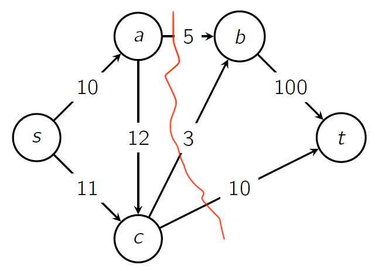

- Min-cut capacity precisely quantifies the network's **most critical bottleneck**.


---

# Recap: What is Flow?

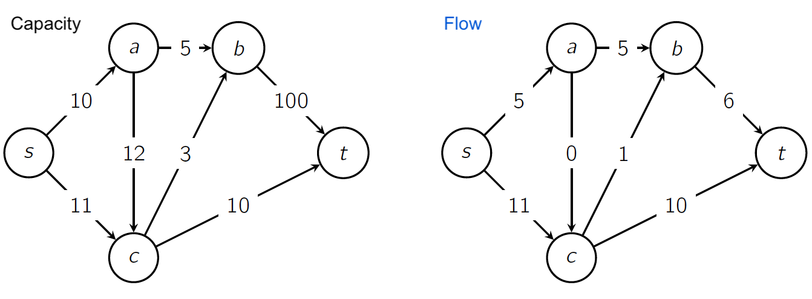

1. Capacity Constraint
2. Flow Conservation


---

# Recap: **Max-Flow Min-Cut Theorem**

For any graph $G$,  

$$\max_f |f| = \min_{(S,T)} c(S,T).$$

that is, the value of the maximum flow equals the capacity of the minimum cut.

<br>

# How to Find the Maximum Flow? 🤔
> # Ford-Fulkerson Algorithm!

---

# Ford–Fulkerson Algorithm - Idea 💡

Given a graph $G$ and some flow $f$, create a new graph that is called the **residual graph**.

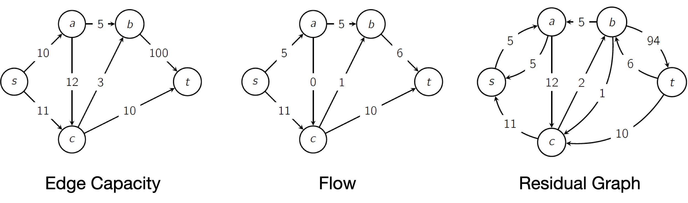

The residual graph gives us two types of edges:
- Forward edges: remaining capacity
- Backward edges: how much flow we could undo


---

# Ford–Fulkerson Algorithm - Idea 💡


In this new graph, the algorithm will try to find a path from $s$ to $t$.
- If no such path exists, the value of $f$ is the value of the maximum flow.
- If not, we can increase the value of our flow by pushing some flow on that path.


---

## Residual Capacity and Residual Graph

> Assume that for all $u,w \in V$, $G$ does not have both edges $(u, w)$ and $(w, u)$ in $E$.

We define the **residual capacity**:  

$$
c_f(u,w)=
\begin{cases}
c(u,w)-f(u,w)&\text{if }(u,w)\in E \quad \texttt{ (remaining capacity)}\\
f(w,u)&\text{if }(w,u)\in E \quad \texttt{ (how much flow we could undo)}\\
0&\text{otherwise}
\end{cases}
$$

Build a **residual graph** $G_f$ with edges where $c_f(u,w)>0$. 


---


## Example: Residual Graph of Maximum Flow

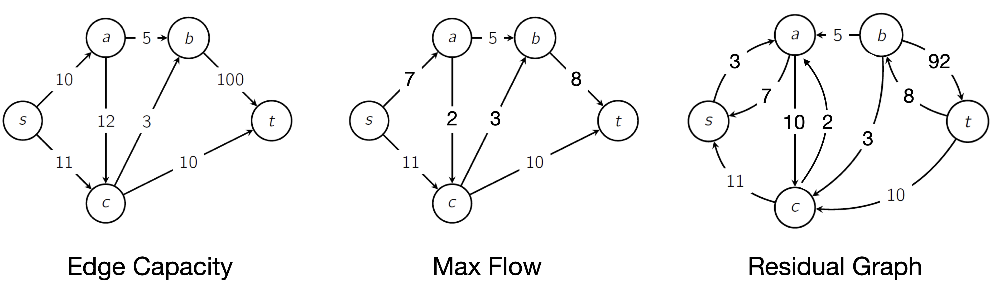

> **There is no path from $s$ to $t$ in $G_f$.**


---

### Lemma: If there is no path from $s$ to $t$ in $G_f$, then $f$ is a maximum flow 

**Idea.**
- Let $S$ be the set of vertices **reachable** from $s$ in the residual graph $G_f$
- Let $T=V\setminus S$. There are no edges in $G_f$ from $S$ to $T$.
- Thus, for any $u\!\in\!S$, $w\!\in\!T$, the residual capacity satisfies $c_f(u,w)=0$.

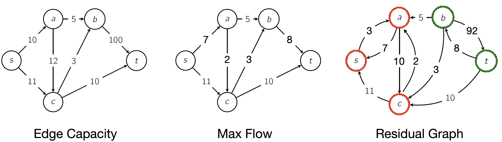


---

<div class="two-one-columns">

<div>

<br>

$$
c_f(u,w)=
\begin{cases}
c(u,w)-f(u,w)&\text{if }(u,w)\in E\\
f(w,u)&\text{if }(w,u)\in E\\
0&\text{otherwise}
\end{cases}
$$

</div>

<div>

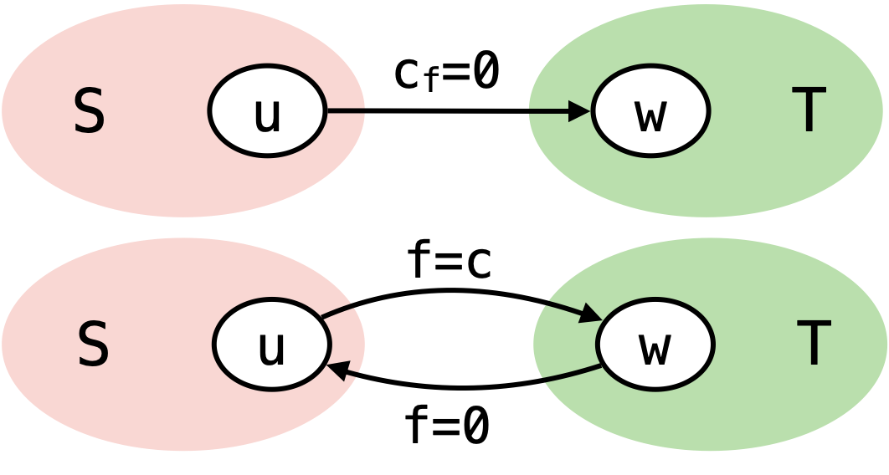

</div>
</div>

### For each $u\!\in\!S$, $w\!\in\!T$, the residual capacity satisfies $c_f(u,w)=0$.

**Case 1.** If $(u,w)\!\in\!E$, then $c_f(u,w)=c(u,w)-f(u,w)=0 \;\Rightarrow\; f(u,w)=c(u,w)$ 
- The edge is **saturated** (flow equals capacity).

**Case 2.** If $(w,u)\!\in\!E$, then $c_f(u,w)=f(w,u)=0$
- No flow returns from $T$ to $S$ across this pair.

**Case 3.** Otherwise, i.e., $(u,w)\!\notin\!E$ and $(w,u)\!\notin\!E$, we can disregard $(u,w)$ and $(w, u)$.


---

### Lemma: If there is no path from $s$ to $t$ in $G_f$, then $f$ is a maximum flow

**Proof.**

<div class="three-one-columns">

<div>

$$
\begin{aligned}
|f|
&=\sum_{u\in S}\Bigg(\sum_{x\in N_{\text{out}}(u)\cap T} f(u,x)\;-\!\!\sum_{y\in N_{\text{in}}(u)\cap T} f(y,u)\Bigg)\\
&=\sum_{u\in S}\sum_{x\in N_{\text{out}}(u)\cap T} \!\!f(u,x) \quad (\text{no return flow from }T\text{ to }S) \\
&=\sum_{u\in S}\sum_{x\in N_{\text{out}}(u)\cap T} \!\!c(u,x) \quad (\text{edges }S\!\to\!T\text{ are saturated}) \\
&=c(S,T).
\end{aligned}
$$

</div>

<div>

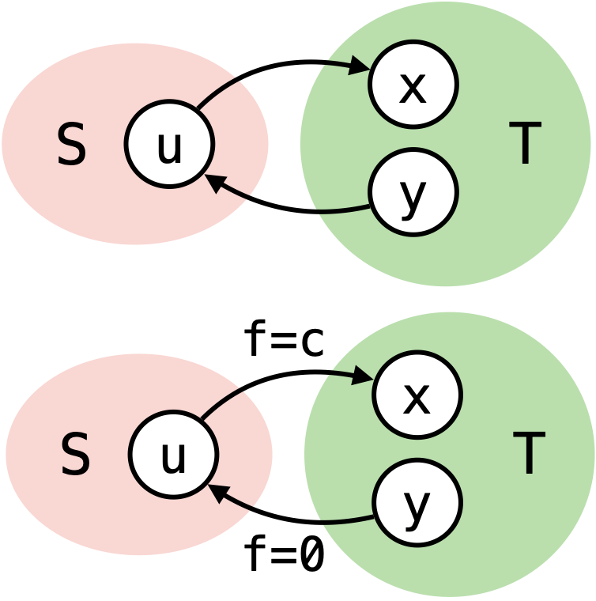

</div>

</div>

Therefore, $|f|=c(S,T)$, and $f$ is a **maximum flow** and $(S,T)$ is a **minimum cut**.

---

## Ford–Fulkerson Algorithm: Augmentation Idea

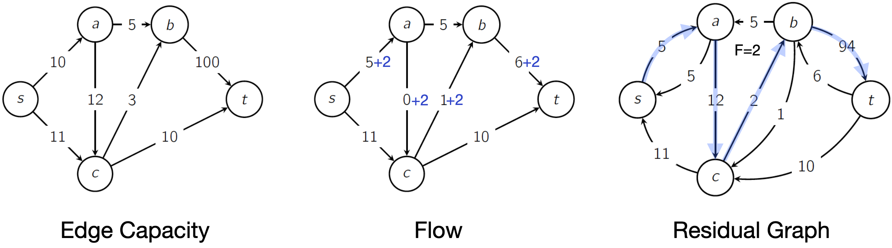
1. Pick a path $P$ from $s$ to $t$ in $G_f$ and let $F$ be a minimum capacity on the path.
2. Define a new flow $f'$
   $$
    f'(u,w)=
    \begin{cases}
    f(u,w)+F&\text{if }(u,w)\in P\\
    f(u,w)-F&\text{if }(w,u)\in P\\
    f(u,w)&\text{otherwise}
    \end{cases}
   $$ 
3. Update $G_f$ and repeat until no augmenting path exists.


---

# Ford–Fulkerson Example

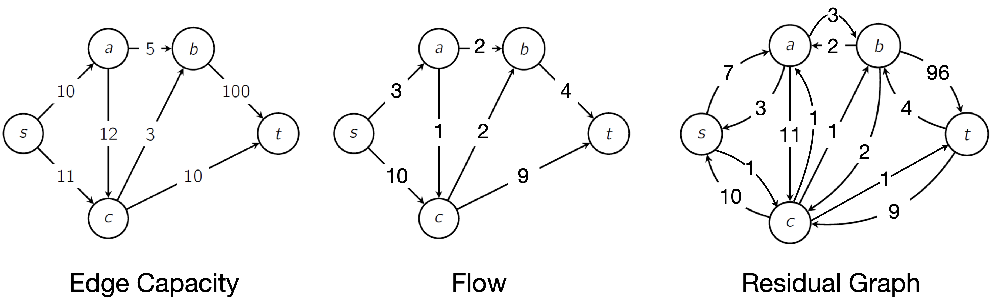

---

# Ford–Fulkerson Example (Possible Path #1)

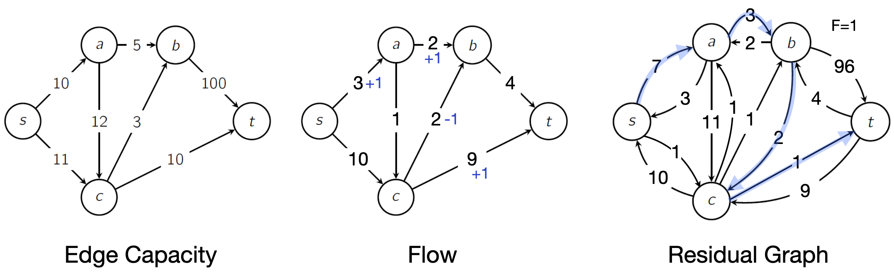

---

# Ford–Fulkerson Example (Possible Path #2)

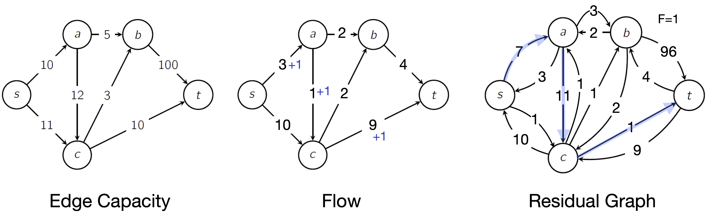

---

# Ford–Fulkerson Example (Possible Path #3)

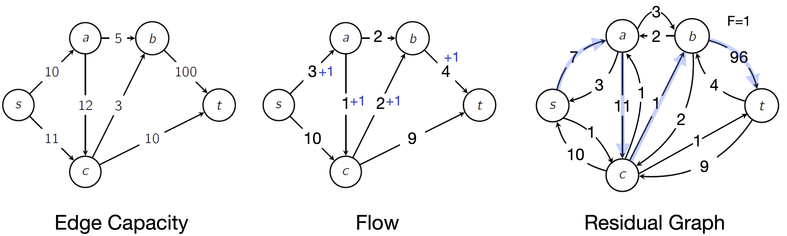

---

## Recap: Augmentation Idea (**Why does it work?** 😯)


1. Pick a path $P$ from $s$ to $t$ in $G_f$ and let $F$ be a minimum capacity on the path.
2. Define a new flow $f'$ ***👈 We want to prove that this is still a flow!***
   $$
    f'(u,w)=
    \begin{cases}
    f(u,w)+F&\text{if }(u,w)\in P\\
    f(u,w)-F&\text{if }(w,u)\in P\\
    f(u,w)&\text{otherwise}
    \end{cases}
   $$ 
3. Update $G_f$ and repeat until no augmenting path exists.


---

### Claim: $f'$ is a **flow** (1/3)

Recall the flow constraints:

1. **Capacity constraint:**  
   $$0 \le f(u,v) \le c(u,v)$$  

2. **Flow conservation:**  
   $$\sum_{x\in N_{in}(v)} f(x,v) = \sum_{y\in N_{out}(v)} f(v,y),\quad ∀v ∈ V − \{s,t\}$$  

    - $N_{in}(v)$: the set of nodes with an edge that points to $v$
    - $N_{out}(v)$: the set of nodes that $v$ points to


---

### Claim: $f'$ is a **flow** (2/3)

$$
f'(u,w)=
\begin{cases}
f(u,w)+F&\text{if }(u,w)\in P\\
f(u,w)-F&\text{if }(w,u)\in P\\
f(u,w)&\text{otherwise}
\end{cases}
$$ 

The **capacity constraints** are satisfied because for every $(u, w) \in E$,

1. If $(u, w) \in P$, then
   $0 \le f(u, w) + F \le f(u, w) + c_f(u, w) = f(u, w) + c(u, w) - f(u, w) = c(u, w)$

2. If $(w, u) \in P$, then
   $f(u, w) - F \le f(u, w) \le c(u, w)$ and $f(u, w) - F \ge f(u, w) - c_f(w, u) = 0$ 

3. Otherwise, $f(u, w)$ is from the original flow $f$.

---

### Claim: $f'$ is a **flow** (3/3)

The **flow conservation** is also preserved.
Since that $P$ is a simple path, for every vertex $v \in P \setminus \{s, t\}$, $v$ appears once, and exactly two edges of $P$, $(x, v)$ and $(v, y)$, are incident to $v$.


---

### Claim: $f'$ is a **flow** (3/3)

The **flow conservation** is also preserved.

Since that $P$ is a simple path, for every vertex $v \in P \setminus \{s, t\}$, $v$ appears once, and exactly two edges of $P$, $(x, v)$ and $(v, y)$, are incident to $v$.

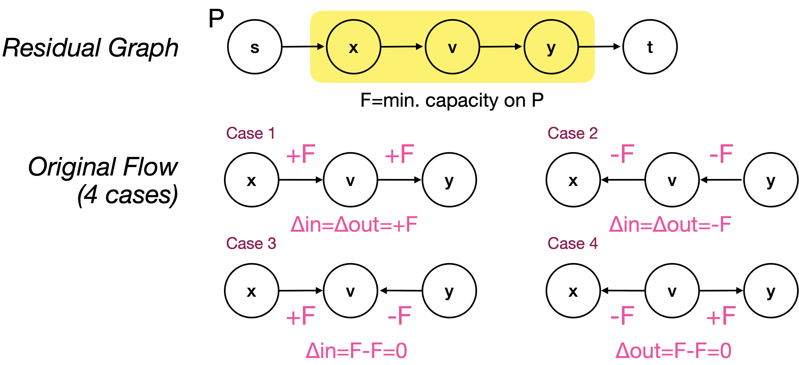

---

### Example: Flow Conservation

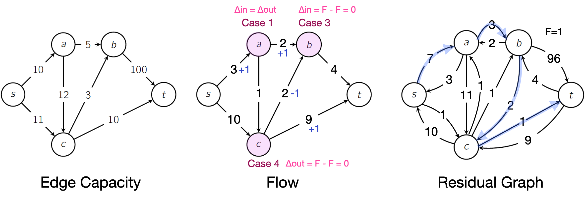


---

## Pseudocode of **Ford-Fulkerson**

```text
Algorithm MaxFlow(G, s, t)
  f ← all zeros flow
  G_f ← G
  while t is reachable from s in G_f (check using, e.g., DFS or BFS):
      P ← path in G_f from s to t
      F ← min capacity on P
      augment flow f along P by F
      update G_f to correspond to new flow
  return f
```
- The run time of this algorithm is bounded by the number of times we update the flow.
- Each augmentation adds $\ge 1$ unit of flow.
- Therefore, the runtime of $O((n + m)\cdot|f|)$ where $|f|$ is the value of the max flow, and $n=|V|, m=|E|$


---

## How Can We Select the **Augmenting Path**?

```text
Algorithm MaxFlow(G, s, t)
  f ← all zeros flow
  G_f ← G
  while t is reachable from s in G_f (check using, e.g., DFS or BFS):
      P ← path in G_f from s to t ⭐️
      F ← min capacity on P
      augment flow f along P by F
      update G_f to correspond to new flow
  return f
```
- It turns out that two methods work particularly well:
  - The **Fattest (Widest) Path** Method
  - The **Shortest Path** Method (the Edmonds-Karp algorithm/Dinic's algorithm)
- *How many iterations does Ford-Fulkerson perform?*


---

## 1️⃣ The Fattest Path Version of Ford-Fulkerson (Runtime)

- We assume that all capacities are integers.
- Finding the fattest path: $O(m+n)$ (mixture of linear time median-finding and DFS)
- After each iteration of the algorithm, the maximum flow value in $G_f$ goes down by a factor of $(1 - \frac{1}{m})$. (See [Section 7.2 of the reference lecture notes]((https://stanford-cs161.github.io/winter2025/assets/files/lecture16-notes.pdf)) for details.)
- After $t$ iterations, the max flow value in $G_f = F \le |f|(1 - \frac{1}{m})^t$.
  If $t=m \ln |f|$,
  $$
  F \le |f|(1 - \frac{1}{m})^t = |f|((1 - \frac{1}{m})^m)^{\ln |f|} < |f|(\frac{1}{e})^{\ln|f|} = |f|\cdot \frac{1}{|f|} = 1.
  $$
  Because the max flow value is an integer, it must be 0.
- Hence after $m \ln |f|$ iterations, the max flow in $G_f$ is zero, $s$ and $t$ are disconnected.
- The runtime is $O((m+n)m\log|f|)$.


---

## 2️⃣ The Shortest Path Version of Ford-Fulkerson (Runtime)

- This method finds a path between $s$ and $t$ using $BFS$, thus picking a path that minimizes the number of edges. =  $O(m+n)$
- Each iteration of the algorithm causes at least one removal of the edges.
  - **The number of times an edge can disappear from $G_f$ is ≤ $n/2$ times**
  - At most $O(mn)$ augmentation iterations
  - Proof omitted. See [Section 7.2 of the reference lecture notes]((https://stanford-cs161.github.io/winter2025/assets/files/lecture16-notes.pdf)) for details.
- The runtime is $O((m+n)mn)$.


---

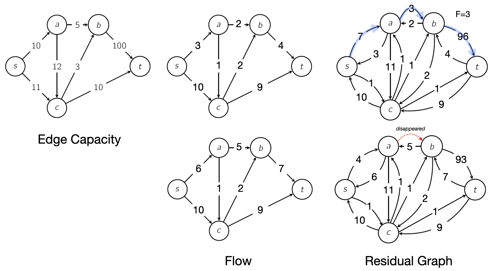

---

## Applications: Bipartite Perfect Matching

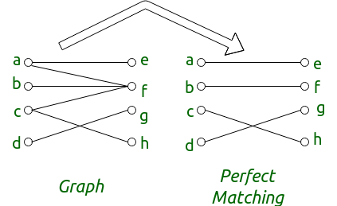

> Given a bipartite graph, does there exist a perfect matching that covers all vertices in both partitions?


---

- Transform bipartite graph $(V_1,V_2,E)$ into flow network

- Add super source $s$ → all $V_1$, super sink $t$ ← all $V_2$, Edge capacities = 1

- Run Ford–Fulkerson → max flow = $|V_1|$ iff perfect matching exists

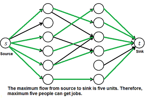


---

# Is Ford-Fulkerson a Greedy Algorithm?

Kind of, yes.

- Path choice is not greedy (not specified).

- Flow augmentation is: it takes **the largest available increase** immediately.

- This greedy local action is what drives the algorithm toward the maximum flow.


---

# Key Takeaways

- Flow networks model resource transport and connectivity
- Max-Flow = Min-Cut bridges optimization and duality
- Ford–Fulkerson = simple but powerful
- Widely used in real-world algorithms 🌎
  - Bipartite perfect matching
  - Network connectivity and bottleneck analysis
  - Task assignment and scheduling
  - Internet traffic optimization

---


# Credits & Resources

Lecture materials adapted from:
- Stanford CS161 slides and lecture notes
  - https://stanford-cs161.github.io/winter2025/
- _Algorithms Illuminated_ by Tim Roughgarden
  - https://algorithmsilluminated.com/

<style>
  img[alt~='center'] {
    display: block;
    margin-left: auto;
    margin-right: auto;
  }

  .one-one-columns {
    display: grid;
    grid-template-columns: repeat(2, minmax(0, 1fr));
    gap: 0.5rem;
  }

  .one-two-columns {
    display: grid;
    grid-template-columns: 1fr 2fr;
    gap: 0.5rem;
  }

  .two-one-columns {
    display: grid;
    grid-template-columns: 2fr 1fr;
    gap: 0.5rem;
  }

  .three-one-columns {
    display: grid;
    grid-template-columns: 3fr 1fr;
    gap: 0.5rem;
  }

  .five-one-columns {
    display: grid;
    grid-template-columns: 5fr 1fr;
    gap: 0.5rem;
  }

</style>

---

# Appendix: Flow conservation after update

1. $(x, v)$ and $(v, y)$ are both in the same direction in the original graph; the flow into $v$ increases by $F$ and the flow out of it also increases by $F$. ($\Delta in = \Delta out = F$)
2. $(x, v)$ and $(v, y)$ are both in the opposite direction ($(v, x), (y, v) \in E$); the flow into $v$ decreases by $F$ and the flow out of it also decreases by $F$. ($\Delta in = \Delta out = -F$)
3. $(x, v)$ is in the same direction and $(v, y)$ is in the opposite direction. Then the flow into $v$ changes by $F - F$ = 0. ($\Delta in = F - F = 0$)
4. $(x, v)$ is in the opposite direction and $(v, y)$ is in the same direction. Then the flow out of $v$ changes by $F - F$ = 0. ($\Delta out = F - F = 0$)


