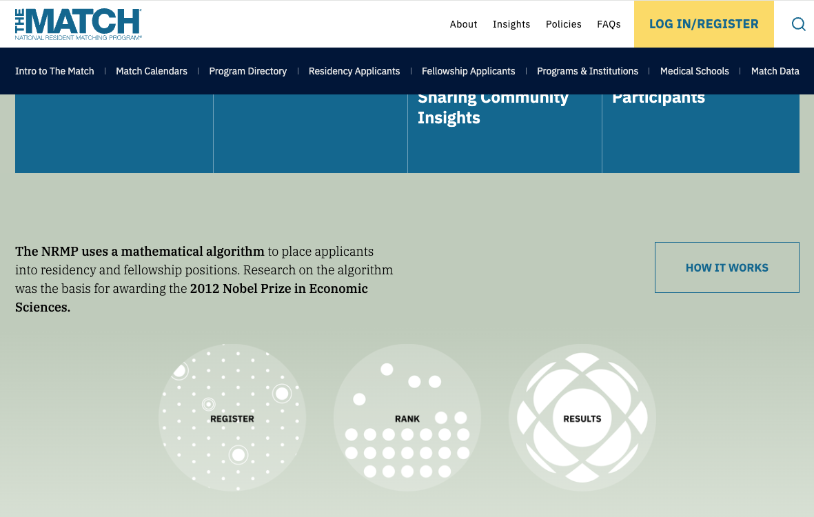

# Lecture 24 - Stable Matching and Gale-Shapley Algorithm

_Fall 2025, Korea University_

Instructor: Gabin An ([gabin_an@korea.ac.kr](mailto:gabin_an@korea.ac.kr))


---

## Course Outline (After Midterm)

- Part 3: Data Structures
   - Graphs, Graph Search (DFS, BFS) and Applications (Finding SSCs w/ DFS)
- Part 4: Dynamic Programming
   - Shortest-Path: Dijkstra, Bellman-Ford, Floyd-Warshall Algorithms
   - More General DP: Longest Common Subsequence, Knapsack Problem
- Part 5: Greedy Algorithms and Others
   - Activity Selection, Scheduling, Optimal Codes 
   - Minimum Spanning Trees
   - Max Flow, Min Cut and Ford-Fulkerson Algorithms
   - **Stable Matching, Gale-Shapley Algorithm** 🎅🌲
  
---

# Motivation 🏥

In the US, each year, thousands of doctors are matched to hospitals through the **National Resident Matching Program (NRMP)** - https://www.nrmp.org/.

- Both **doctors** and **hospitals** have preferences.

  <div class="one-one-columns">

  <div>

  | Doctor     | 1st  | 2nd  | 3rd  |
  |:-----------|------|------|------|
  | Alice      | Y  | X  | Z  |
  | Bob        | X  | Y  | Z  |
  | Charlie    | X  | Y  | Z  |

  </div>

  <div>

  | Hospital  | 1st     | 2nd     | 3rd     |
  |:---------:|---------|---------|---------|
  | X       | Alice   | Charlie | Bob     |
  | Y       | Charlie | Alice   | Bob     |
  | Z       | Bob     | Charlie | Alice   |

  </div>

  </div>


---



---


# Motivation 🏥

In the US, each year, thousands of doctors are matched to hospitals through the **National Resident Matching Program (NRMP)**.

- Both **doctors** and **hospitals** have preferences.
- A centralized algorithm must produce a **fair and stable** outcome.
- We will study the **Gale–Shapley (Deferred Acceptance)** algorithm.
  - the foundation of [this real-world matching process](https://www.nrmp.org/intro-to-the-match/how-matching-algorithm-works/)!
  - invented by *David Gale* and *Lloyed Shapley*


---

## Similar Scenarios

Stable matching problems appear in many real-world contexts:

- Students ↔️ Labs / Professors (graduate admissions)
- Employers ↔️ Teams (HR allocation)
- ...


---

# Problem Setup: Stable Matching

We have:

- $n$ **doctors** 🧑‍⚕️ and $n$ **hospitals** 🏥 (each hospital fills one position)
- Each doctor ranks all hospitals.
- Each hospital ranks all doctors.

Goal: find a **stable matching** between doctors and hospitals.

A matching $M$ is **stable** if there is **no blocking pair** $(d, h)$ such that:

1. Doctor $d$ prefers hospital $h$ to her current match in $M$, **and**
  
2. Hospital $h$ prefers doctor $d$ to its current match in $M$.


---

# Example

<div class="one-one-columns">

<div>

| Doctor     | 1st  | 2nd  | 3rd  |
|:-----------|------|------|------|
| Alice      | Y  | X  | Z  |
| Bob        | X  | Y  | Z  |
| Charlie    | X  | Y  | Z  |

</div>

<div>

| Hospital  | 1st     | 2nd     | 3rd     |
|:---------:|---------|---------|---------|
| X       | Alice   | Charlie | Bob     |
| Y       | Charlie | Alice   | Bob     |
| Z       | Bob     | Charlie | Alice   |

</div>

</div>


---

## Example 1: (Alice–X), (Bob–Z), (Charlie–Y)

<div class="one-one-columns">

<div>

| Doctor     | 1st  | 2nd  | 3rd  |
|:-----------|------|------|------|
| Alice      | Y  | **X**  | Z  |
| Bob        | X  | Y  | **Z**  |
| Charlie    | X  | **Y**  | Z  |

</div>

<div>

| Hospital  | 1st     | 2nd     | 3rd     |
|:---------:|---------|---------|---------|
| X       | **Alice**   | Charlie | Bob     |
| Y       | **Charlie** | Alice   | Bob     |
| Z       | **Bob**     | Charlie | Alice   |

</div>

</div>

- Stable matching ✅
- Every hospital gets its top choice. -> No blocking pair can exist.


---

## Example 2: (Alice–Y), (Bob–Z), (Charlie–X)

<div class="one-one-columns">

<div>

| Doctor     | 1st  | 2nd  | 3rd  |
|:-----------|------|------|------|
| Alice      | **Y**  | X  | Z  |
| Bob        | X  | Y  | **Z**  |
| Charlie    | **X**  | Y  | Z  |

</div>

<div>

| Hospital  | 1st     | 2nd     | 3rd     |
|:---------:|---------|---------|---------|
| X       | Alice   | **Charlie** | Bob     |
| Y       | Charlie | **Alice**   | Bob     |
| Z       | **Bob**     | Charlie | Alice   |

</div>

</div>

- Stable matching ✅
- Bob prefers X and Y over Z, but X and Y prefer other doctors over Bob.

> As you can see there can be multiple possible stable matching.

---

## Example 3: (Alice–Z), (Bob–X), (Charlie–Y)

<div class="one-one-columns">

<div>

| Doctor     | 1st  | 2nd  | 3rd  |
|:-----------|------|------|------|
| Alice      | Y  | X  | **Z**  |
| Bob        | **X**  | Y  | Z  |
| Charlie    | X  | **Y**  | Z  |

</div>

<div>

| Hospital  | 1st     | 2nd     | 3rd     |
|:---------:|---------|---------|---------|
| X       | Alice   | Charlie | **Bob**     |
| Y       | **Charlie** | Alice   | Bob     |
| Z       | Bob     | Charlie | **Alice**   |

</div>

</div>

- Unstable matching ❌
- **(Alice, X)** form a **blocking pair**!
  1. Alice prefers X to her current match, Z. 🤕
  2. and.. X also prefers Alice to its current match, Bob. 🙁


---

# The Gale–Shapley Algorithm 🤝

(also called **Deferred Acceptance Algorithm**)

is an algorithm designed to compute a stable matching based on the given preference lists!


---

## The Gale–Shapley Algorithm (**doctor-proposing version**)

1. All doctors start free.
2. Each free doctor proposes to her/his most-preferred hospital not yet rejected.
3. Each hospital:
   - keeps the best proposal (tentatively engaged 💍),
   - rejects others.
4. Repeat until no free doctors remain.


---

## Example: Doctor-Proposing version

<div class="one-two-columns">

<div>

| Doctor     | 1st  | 2nd  | 3rd  |
|:-----------|------|------|------|
| Alice      | **Y** 💍| X  | Z  |
| Bob        | X  | Y  | Z  |
| Charlie    | X  | Y  | Z  |


| Hospital  | 1st     | 2nd     | 3rd     |
|:---------:|---------|---------|---------|
| X       | Alice   | Charlie | Bob     |
| Y       | Charlie | **Alice** 💍  | Bob     |
| Z       | Bob     | Charlie | Alice   |

</div>

<div>

<br>

1. **Alice → Y** → Y is free → ✅ accepts  


</div>

</div>


---


## Example: Doctor-Proposing version

<div class="one-two-columns">

<div>

| Doctor     | 1st  | 2nd  | 3rd  |
|:-----------|------|------|------|
| Alice      | **Y** 💍 | X  | Z  |
| Bob        | **X** 💍 | Y  | Z  |
| Charlie    | X  | Y  | Z  |


| Hospital  | 1st     | 2nd     | 3rd     |
|:---------:|---------|---------|---------|
| X       | Alice   | Charlie | **Bob**  💍 |
| Y       | Charlie | **Alice**  💍 | Bob     |
| Z       | Bob     | Charlie | Alice   |

</div>

<div>

<br>

1. **Alice → Y** → Y is free → ✅ accepts  
2. **Bob → X** → X is free → ✅ accepts  

</div>

</div>


---


## Example: Doctor-Proposing version

<div class="one-two-columns">

<div>

| Doctor     | 1st  | 2nd  | 3rd  |
|:-----------|------|------|------|
| Alice      | **Y** 💍 | X  | Z  |
| Bob        | ~~X~~ 🥲 | Y  | Z  |
| Charlie    | **X** 💍 | Y  | Z  |


| Hospital  | 1st     | 2nd     | 3rd     |
|:---------:|---------|---------|---------|
| X       | Alice   | **Charlie** 💍 | ~~Bob~~ 👋|
| Y       | Charlie | **Alice**  💍 | Bob     |
| Z       | Bob     | Charlie | Alice   |

</div>

<div>

<br>

1. **Alice → Y** → Y is free → ✅ accepts  
2. **Bob → X** → X is free → ✅ accepts  
3. **Charlie → X** → X prefers Charlie → ❌ rejects Bob → Bob becomes free  

</div>

</div>


---


## Example: Doctor-Proposing version

<div class="one-two-columns">

<div>

| Doctor     | 1st  | 2nd  | 3rd  |
|:-----------|------|------|------|
| Alice      | **Y** 💍 | X  | Z  |
| Bob        | ~~X~~ 🥲 | ~~Y~~ 🥲 | Z  |
| Charlie    | **X** 💍 | Y  | Z  |


| Hospital  | 1st     | 2nd     | 3rd     |
|:---------:|---------|---------|---------|
| X       | Alice   | **Charlie** 💍 | ~~Bob~~ 👋|
| Y       | Charlie | **Alice**  💍 | ~~Bob~~ 👋|
| Z       | Bob     | Charlie | Alice   |


</div>

<div>

<br>

1. **Alice → Y** → Y is free → ✅ accepts  
2. **Bob → X** → X is free → ✅ accepts  
3. **Charlie → X** → X prefers Charlie → ❌ rejects Bob → Bob becomes free  
4. **Bob → Y** → Y prefers Alice → ❌ rejects Bob  

</div>

</div>


---


## Example: Doctor-Proposing version

<div class="one-two-columns">

<div>

| Doctor     | 1st  | 2nd  | 3rd  |
|:-----------|------|------|------|
| Alice      | **Y** 💍 | X  | Z  |
| Bob        | ~~X~~ 🥲 | ~~Y~~ 🥲 | **Z** 💍 |
| Charlie    | **X** 💍 | Y  | Z  |


| Hospital  | 1st     | 2nd     | 3rd     |
|:---------:|---------|---------|---------|
| X       | Alice   | **Charlie** 💍 | ~~Bob~~ 👋|
| Y       | Charlie | **Alice**  💍 | ~~Bob~~ 👋|
| Z       | **Bob**  💍   | Charlie | Alice   |

</div>

<div>

<br>

1. **Alice → Y** → Y is free → ✅ accepts  
2. **Bob → X** → X is free → ✅ accepts  
3. **Charlie → X** → X prefers Charlie → ❌ rejects Bob → Bob becomes free  
4. **Bob → Y** → Y prefers Alice → ❌ rejects Bob  
5. **Bob → Z** → Z is free → ✅ accepts  

- **Final Matching:** (Alice–Y), (Bob–Z), (Charlie–X)

</div>

</div>


---


## Example: Doctor-Proposing version

<div class="one-two-columns">

<div>

| Doctor     | 1st  | 2nd  | 3rd  |
|:-----------|------|------|------|
| Alice      | **Y** 💍 | X  | Z  |
| Bob        | ~~X~~ 🥲 | ~~Y~~ 🥲 | **Z** 💍 |
| Charlie    | **X** 💍 | Y  | Z  |


| Hospital  | 1st     | 2nd     | 3rd     |
|:---------:|---------|---------|---------|
| X       | Alice   | **Charlie** 💍 | ~~Bob~~ 👋|
| Y       | Charlie | **Alice**  💍 | ~~Bob~~ 👋|
| Z       | **Bob**  💍   | Charlie | Alice   |

</div>

<div>

<br>
<br>
<br>
<br>

Hospitals only improve over time,
and doctors gradually move down their list.  

</div>

</div>


---

### Pseudocode


```
for each doctor d:
    d.i = 0  # index in preference list
for each hospital h:
    h.match = NIL

free_doctors = all doctors

while free_doctors:
    d = pick any free doctor
    d.i += 1
    h = d.pref[d.i]
    if h.match == NIL or h.prefers(d, h.match):
        if h.match != NIL:
            free_doctors.add(h.match)
        h.match = d
        free_doctors.remove(d)
```


---

### Proposition 1. Once a hospital is matched, it never becomes unmatched again.

**Proof.**

<div class="one-one-columns">

<div>

- We only assign NIL values at initialization.
- So once a hospital has a *potential match* it can never run out of matches again; it will only reject a potential match for another match (a *more preferred* one).

</div>

<div>

```
for each doctor d:
    d.i = 0  # index in preference list
for each hospital h:
    h.match = NIL 👈

free_doctors = all doctors

while free_doctors:
    d = pick any free doctor
    d.i += 1
    h = d.pref[d.i]
    if h.match == NIL or h.prefers(d, h.match):
        if h.match != NIL:
            free_doctors.add(h.match)
        h.match = d 👈
        free_doctors.remove(d)
```

</div>

</div>


---

### Proposition 2. Every doctor eventually gets matched (no one “runs out”).

**Proof.** Suppose, for contradiction, some doctor **$d$** “runs out” of hospitals to propose to.  
- Then $d$ must have already proposed to **all $n$ hospitals**.
- Every hospital that rejected $d$ must have been **already matched** to some other doctor.  
  - By **Proposition 1**, once a hospital is matched, it never becomes unmatched again.
- Therefore, at this point:  
  - All $n$ hospitals are matched,  
  - ... but only to the other $n − 1$ doctors (excluding $d$).
- ❌ Contradiction! It’s impossible for $n$ hospitals have a match if one doctor remains unmatched.


---

### Proposition 3. Algorithm terminates in $\le O(n^2)$ steps.

**Proof.**
- In every iteration, some $d.i$ gets incremented by 1.
- Since they start at $0$ and can never reach $n+1$, in total the number of increments is at most $n \times O(n) = O(n^2)$.
- By **Proposition 2** (*"Every doctor eventually gets matched"*), when the algorithm terminates, we have a full matching.


---

### Theorem 1. The resulting matching is **STABLE**.

This is the results from the doctor-proposing version of Gale-Shapley.

<div class="one-one-columns">

<div>

| Doctor     | 1st  | 2nd  | 3rd  |
|:-----------|------|------|------|
| Alice      | **Y**  | X  | Z  |
| Bob        | X  | Y  | **Z**  |
| Charlie    | **X**  | Y  | Z  |

</div>

<div>

| Hospital  | 1st     | 2nd     | 3rd     |
|:---------:|---------|---------|---------|
| X       | Alice   | **Charlie** | Bob     |
| Y       | Charlie | **Alice**   | Bob     |
| Z       | **Bob**     | Charlie | Alice   |

</div>

</div>

✅ This is stable! 
❓ *Why does the algorithm produce the stable matching?*


---

### Theorem 1. The resulting matching is **STABLE**.

- Note that hospitals’ matches only **improve** over the course of the algorithm.
  - This is because $h$ will only reject a potential match for a **better** one.
- Assume by contradition, that there is a blocking pair $(d, h)$ in the final matching.
  - By definition, $d$ prefers $h$ to her match, and $h$ prefers $d$ to its match.
  - Let $h'$ be the hospital $d$ got matched to.
  - $d$ must have proposed to $h$ before her final match $h'$ because $h'$ comes later in the doctor $d$'s preference list than $h$.
  - **$h$ must have rejected $d$ for someone it prefers more**.
- ❌ Contradiction because hospitals’ matches only improve → no blocking pairs exist!


---

## Doctor-Optimality 👩‍⚕️

We say a stable matching $\sigma$ is **doctor-optimal** if for any other stable matching $\sigma'$ and any docter $d$, the doctor $d$ weakly prefers her hospital in $\sigma$ to her hospital in $\sigma'$.


<div class="one-one-columns">

<div>

✅ Stable matching from the doctor-proposing version of Gale-Sharpley
| Doctor     | 1st  | 2nd  | 3rd  |
|:-----------|------|------|------|
| Alice      | **Y**  | X  | Z  |
| Bob        | X  | Y  | **Z**  |
| Charlie    | **X**  | Y  | Z  |

> doctor-optimal 
</div>

<div>

✅ Stable matching - but Alice prefers $Y$ over $X$, and Charlie prefers $X$ over $Y$.
| Doctor     | 1st  | 2nd  | 3rd  |
|:-----------|------|------|------|
| Alice      | Y  | **X**  | Z  |
| Bob        | X  | Y  | **Z**  |
| Charlie    | X  | **Y**  | Z  |

</div>

</div>


---

### Theorem 2. The output of the **doctor-proposing** version of Gale-Sharpley is **doctor-optimal**.

**Proof.**

For each doctor $d$, let $h^*(d)$ be the **best feasible hospital** for $d$ (the one she prefers most among all stable matchings).

Assume by contradiction that the algorithm is not doctor-optimal: some doctor $d$ gets rejected by $h^*(d)$ at some point during the algorithm.

Consider the **first** time where this happens: $h^*(d)$ rejects $d$ because of $d'$
- **Case 1:** If $h^*(d') = h^*(d)$, then $(d', h^*(d))$ would block any matching that pairs $d$ with $h^*(d)$ → ❌ Contradiction. $h^*(d)$ cannot be feasible for $d$ in a stable matching.
- **Case 2:** Otherwise, $d'$ must have been rejected by her own $h^*(d')$ earlier, contradicting that $d$ is the **first** doctor rejected by her best feasible hospital. ❌


---

## Incentive Compatibility 🧩

- An algorithm is **incentive-compatible** if **no participant can benefit by lying** about their true preferences.
- In our context, a matching algorithm is **incentive-compatible for doctors** if no doctor can get a better hospital by **misreporting** her preferences.

- **Why it matters:** In real-world systems like *The Match* (NRMP), thousands of participants submit preferences. If someone could gain by lying, others would be forced to lie too, leading to chaos and unfair outcomes.


The **doctor-proposing Gale–Shapley algorithm** is:
> ✅ **Incentive-compatible for doctors** (proved by Dubins & Freedman, 1981)
> ❌ **Not incentive-compatible for hospitals**


---

### The **doctor-proposing** Gale–Shapley algorithm is **not incentive-compatible for hospitals**. (*Hospitals can get better matches by lying🤥!*)

<div class="one-one-columns">

<div>

| Doctor     | 1st  | 2nd  | 3rd  |
|:-----------|------|------|------|
| Alice      | **Y**  | X  | Z  |
| Bob        | X  | Y  | **Z**  |
| Charlie    | **X**  | Y  | Z  |

</div>

<div>

| Hospital  | 1st     | 2nd     | 3rd     |
|:---------:|---------|---------|---------|
| X       | Alice   | **Charlie** 🫡 | Bob 🫡 |
| Y       | Charlie | **Alice**   | Bob     |
| Z       | **Bob**     | Charlie | Alice   |


</div>

</div>

<div class="one-one-columns">

<div>

| Doctor     | 1st  | 2nd  | 3rd  |
|:-----------|------|------|------|
| Alice      | Y  | **X**  | Z  |
| Bob        | X  | Y  | **Z**  |
| Charlie    | X  | **Y**  | Z  |

</div>

<div>

| Hospital  | 1st     | 2nd     | 3rd     |
|:---------:|---------|---------|---------|
| X       | **Alice**   | Bob 🤥 | Charlie 🤥     |
| Y       | **Charlie** | Alice   | Bob     |
| Z       | **Bob**     | Charlie | Alice   |

</div>

</div>


---

# Summary

| Property                | Gale–Shapley Algorithm     |
| :---------------------- | :------------------------- |
| Termination             | Always halts in O($n^2$) |
| Stability               | No blocking pairs        |
| Doctor-optimal          | Best for proposers       |
| Incentive-compatibility | For proposers only       |


---

# Final Exam Information (Offline & In-Person)

- Date & Time:
  - Thursday, December 18
  - 1:30 – 2:45 PM

- Location:
  - Room 609 – Students with odd student IDs (33 students)
  - Room 610 – Students with even student IDs (32 students)

> ⚠️ Please sit with one empty seat between each student.
> 📚 Format: Closed book — but one A4 cheat sheet (both sides) is allowed.

**Good luck with your exam! 🎅**


---

# Credits & Resources

Gale & Shapley, *[College Admissions and the Stability of Marriage](https://www.jstor.org/stable/2312726)*, 1962.

Lecture materials adapted from:
- Stanford CS161 slides and lecture notes
  - https://stanford-cs161.github.io/winter2025/
- _Algorithms Illuminated_ by Tim Roughgarden
  - https://algorithmsilluminated.com/

<style>
  img[alt~='center'] {
    display: block;
    margin-left: auto;
    margin-right: auto;
  }

  .one-one-columns {
    display: grid;
    grid-template-columns: repeat(2, minmax(0, 1fr));
    gap: 0.5rem;
  }

  .one-two-columns {
    display: grid;
    grid-template-columns: 1fr 2fr;
    gap: 0.5rem;
  }

  .two-one-columns {
    display: grid;
    grid-template-columns: 2fr 1fr;
    gap: 0.5rem;
  }

  .three-one-columns {
    display: grid;
    grid-template-columns: 3fr 1fr;
    gap: 0.5rem;
  }

  .five-one-columns {
    display: grid;
    grid-template-columns: 5fr 1fr;
    gap: 0.5rem;
  }

</style>