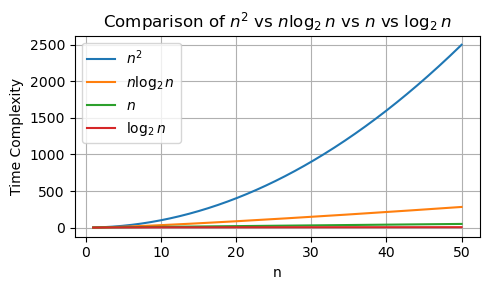

# Lecture 3 - Sorting Algorithms (InsertionSort & MergeSort)

_Fall 2025, Korea University_

Instructor: Gabin An ([gabin_an@korea.ac.kr](mailto:gabin_an@korea.ac.kr))


---

### Recap: Course Outline (Before Midterm)

- Part 1: Basics
   - ~~Divide and Conquer (w/ Integer Multiplication)~~ ✅
   - **Basic Sorting Algorithms (Insertion Sort & Merge Sort)** 👈
   - Asymptotic Analysis (Big-O, Big-Theta, Big-Omega)
   - Solving Recurrences Using Master Method
- Part 2: Advanced Selection and Sorting
   - Median and Selection Algorithm
   - Solving Recurrences Using Substitution Method
   - Quick Sort, Counting Sort, Radix Sort
- Part 3: Data Structures
   - Heaps, Binary Search Trees, Balanced BSTs


---

# We’re already at Week 2! 👀

In today’s class, we’ll dive into:
- the **Sorting** problem
- SelectionSort and BubbleSort (the simplest sorting algorithms)
- InsertionSort (as a warm-up for formal analysis)
- MergeSort (a classic Divide-and-Conquer example)

As we explore these algorithms, we’ll focus on two key questions:
- **Correctness** — Does it actually work?
- **Efficiency** — How fast is it?


---

# The Sorting Problem

> Input: An array of $n$ numbers, in arbitrary order.
> Output: An array of the same numbers, sorted from smallest to largest.

For example, given the input array
```python
[5,4,1,8,7,2,6,3]
```

the desired output array is
```python
[1,2,3,4,5,6,7,8]
```


---

# Simplest Sorting Algorithms

If you don't care about optimizing the running time, it's not too difficult to come up with a correct sorting algorithm.

- SelectionSort
- BubbleSort
- InsertionSort


---

## SelectionSort

- Idea: Repeatedly find the smallest element from the unsorted part and move it to the front.

```python
# [ sorted part | unsorted part ]

[|5, 4, 1, 8, 7, 2, 6, 3] # 1 is the smallest, swap with 5
[1 | 4, 5, 8, 7, 2, 6, 3] # 2 is next smallest, swap with 4 
[1, 2 | 5, 8, 7, 4, 6, 3] # 3 is next, swap with 5 
[1, 2, 3 | 8, 7, 4, 6, 5] # 4 is next, swap with 8
[1, 2, 3, 4 | 7, 8, 6, 5] # 5 is next, swap with 7
[1, 2, 3, 4, 5 | 8, 6, 7] # 6 is next, swap with 8
[1, 2, 3, 4, 5, 6 | 8, 7] # 7 is next, swap with 8
[1, 2, 3, 4, 5, 6, 7 | 8] # Done!
```
- SelectionSort makes $n-1$ swaps, but always scans the rest of the array.
  - \# Scan: $n + (n-1) + \ldots + 2 + 1 = n(n-1)/2 = O(n^2)$


---

## BubbleSort 🫧

- Idea: Repeatedly swap adjacent elements if they're in the wrong order. Largest values “bubble up” to the end.

```python
# Pass 1
# [ unsorted part | sorted part ]
[5, 4, 1, 8, 7, 2, 6, 3|] # compare 5, 4 (swap) -> 4, 5
[4, 5, 1, 8, 7, 2, 6, 3|] # compare 5, 1 (swap) -> 1, 5
[4, 1, 5, 8, 7, 2, 6, 3|] # compare 5, 8 (do not swap) -> 5, 8
[4, 1, 5, 8, 7, 2, 6, 3|] # compare 8, 7 (swap) -> 7, 8
[4, 1, 5, 7, 8, 2, 6, 3|] # compare 8, 2 (swap) -> 2, 8
[4, 1, 5, 7, 2, 8, 6, 3|] # compare 8, 6 (swap) -> 6, 8
[4, 1, 5, 7, 2, 6, 8, 3|] # compare 8, 3 (swap) -> 3, 8          
[4, 1, 5, 7, 2, 6, 3 | 8] # the largest element 8 'bubble up' to the end!
```

---

## BubbleSort - Let's Pratice Together ✏️

```python
# Pass 2
[4, 1, 5, 7, 2, 6, 3 | 8]


```


---

## BubbleSort - Continued

```python
[4, 1, 5, 7, 2, 6, 3 | 8] # After Pass 1 
[1, 4, 5, 2, 6, 3 | 7, 8] # After Pass 2
[1, 4, 2, 5, 3 | 6, 7, 8] # After Pass 3
[1, 2, 4, 3 | 5, 6, 7, 8] # After Pass 4
[1, 2, 3 | 4, 5, 6, 7, 8] # After Pass 5
[1, 2 | 3, 4, 5, 6, 7, 8] # After Pass 6
[1 | 2, 3, 4, 5, 6, 7, 8] # After Pass 7
```
- at most $(n-1) + (n-2) + ... + 1$ swaps = $O(n^2)$
- Both SelectionSort and Buble Sort have quadratic running times, meaning that the number of operations performed on arrays of length $n$ scales with $n^2$, i.e., $O(n^2)$.


---

## InsertionSort

- Idea: In each step, larger elements are shifted right until the correct position for the current value is found.

Suppose we want to sort `5`, `4`, `2`, `3`
```python
[_, _, _, _]
------------
[5, _, _, _] # Insert 5
------------
[_, 5, _, _] # 5 > 4. Shift 5 to the right
[4, 5, _, _] # Insert 4
------------
[4, _, 5, _] # 5 > 2. Shift 5 to the right 
[_, 4, 5, _] # 4 > 2. Shift 5 to the right
[2, 4, 5, _] # Insert 2
```


---

## InsertionSort - Let's Pratice Together ✏️

Insert `3` to the array!
```python
[_, _, _, _]
------------
[5, _, _, _] # Insert 5
------------
[_, 5, _, _] # 5 > 4. Shift 5 to the right
[4, 5, _, _] # Insert 4
------------
[4, _, 5, _] # 5 > 2. Shift 5 to the right 
[_, 4, 5, _] # 4 > 2. Shift 5 to the right
[2, 4, 5, _] # Insert 2
------------
```


---

## InsertionSort - Algorithm

```python
def insertion_sort(A):
    for i in range(1, len(A)):
        current = A[i]    # save the current element
        j = i - 1         # start scanning
        while j >= 0 and A[j] > current: 
            A[j+1] = A[j] # shift larger elements to the right
            j -= 1
        A[j+1] = current
```
Example:
```python
# 1st iteration of the outer loop
[5, 4, 2, 3] # i = 1, current = 4, j = 0
[5, 5, 2, 3] # i = 1, current = 4, j = -1 (the inner loop ends because j < 0)
[4, 5, 2, 3] # A[0] = 4
```

---

### Correctness of InsertionSort

- Goal: We want to prove that after `insertion_sort(A)` finishes, **the array $A$ is sorted in non-decreasing order**.
- We'll do the proof by maintaining a **Loop Invariant**:
    > After iteration $i$ of the outer loop, the subarray $A[:i+1]$ is sorted.

    ```python
    [5, 4, 2, 3]
    → [4, 5, 2, 3] # After iteration 1, A[:2] is sorted.
    → [2, 4, 5, 3] # After iteration 2, A[:3] is sorted.
    → [2, 3, 4, 5] # After iteration 3, A[:4] (= A) is sorted.
    ```

--- 

### Correctness of InsertionSort - **Proof by Induction**

- **Inductive Hypothesis**
  After iteration $i$, $A[:i+1]$ is sorted.
- **Base Case** ($i = 0$)
  $A[:1]$ contains one element, so it is trivially sorted. ✅
- **Inductive Step**
  Assume the hypothesis holds for iteration $i-1$:
    > **After iteration $i-1$, $A[:i]$ is sorted**.
- Now consider iteration $i$:


---
- Now consider iteration $i$:

  - At iteration $i$, let $j$ be the largest index such that $0 \leq j < i$ and $A[j] \leq A[i]$. 
  - Then, $A[i]$ is inserted between $A[j]$ and $A[j+1]$
    $$
    A[j] \leq A[i] \leq A[j+1]
    $$
  - Since $A[:i]$ was already sorted: 
    $$
    A[0] \leq A[1] \leq \dots \leq A[j] \leq A[i] \leq A[j+1] \leq \dots \leq A[i-1]
    $$
    
    - **$A[:i+1]$ is sorted**!! ✅

**Conclusion**
- By induction, the invariant holds for all $i$.
- After the final iteration ($i = n - 1$), $A[:n]$ (the entire array) is sorted. ✅


---

### Running Time of InsertionSort

- The running time of InsertionSort is about $n^2$ operations.
- At iteration $i$, the algorithm may have to look through and move $i$ elements, so that's about $1 + 2 + \ldots + n - 1 = \frac{n(n-1)}{2}$ operations.

- Can we do *asymptotically better* than $n^2$?
  - Can we come up with an algorithm that sorts an arbitrary list of $n$ intergers in time that scales less than $n^2$? For example, like $n^{1.5}$, or $n \log(n)$, or even $n$.


---

# Recap: Divide-and-Conquer

Recall the Divide-and-conquer paradigm from the previous lecture. In this paradigm, we use the following strategy:
- Break the problem into sub-problems.
- Solve the sub-problems (often recursively)
- Combine the results of the sub-problems to solve the big problem

At some point, the sub-problems become small enough that they are easy to solve, and then we can stop recursing.

> Sorting is a perfect candidate for this strategy!


---

# New Sorting Algorithm: **MergeSort**

```python
                          [6 5 12 10 9 1]


```


---


```python
                          [6 5 12 10 9 1]
                         /              \
                     [6 5 12] divide [10 9 1]
                      /    \          /     \
                   [6]    [5 12]   [10]    [9 1]
                    |      /  \      |      /  \
                   [6]   [5]  [12] [10]    [9] [1]  # small enough
                    |      \   /     |      \   /
                   [6]    [5 12]   [10]     [1 9]
                     \    /           \     /
                    [5 6 12] combine  [1 9 10]
                         \             /
                         [1 5 6 9 10 12]
```


---

## MergeSort - Implementation

```python
def merge_sort(A):
    n = len(A)
    if n <= 1:
        return A
    L = merge_sort(A[:n//2]) # left half
    R = merge_sort(A[n//2:]) # right half
    return merge(L, R) # key subroutine! ⭐️
```

- `merge` is a procedure that take two sorted arrays and merge them into a sorted array that contains both of their elements.

    ```python
    merge([1,3,5],[4,6,8]) # Output: [1,3,4,5,6,8]
    ```


---

## Merging Two Arrays

```python
def merge(L, R):
    i = j = 0
    S = []
    while i < len(L) and j < len(R):
        if L[i] < R[j]:
            S.append(L[i])
            i += 1
        else:
            S.append(R[j])
            j += 1
    while i < len(L):
        S.append(L[i])
        i += 1
    while j < len(R):
        S.append(L[k])
        j += 1
    return S
```


---

## Correctness of MergeSort

```python
def merge_sort(A):
    n = len(A)
    if n <= 1:
        return A
    L = merge_sort(A[:n//2]) # solving left half
    R = merge_sort(A[n//2:]) # solving right half
    return merge(L, R)       # combine
```
- Goal: We want to prove that after `merge_sort(A)` finishes, **the array $A$ is sorted in non-decreasing order**.
- This time, we'll maintain a **Recursion Invariant** that any time MergeSort returns, it returns a sorted array.
    > Whenever MergeSort returns an array of size $\leq n$, that array is sorted.


---

## Correctness of MergeSort - **Proof by Induction**

- **Inductive Hypothesis**: Whenever MergeSort returns an array of size $\leq n$, that array is sorted.
- **Base Case** ($i = 0$ or $i = 1$): Whenever MergeSort returns an array of length 0 or length 1, that array is sorted. ✅ (this is trivial!)

---

- **Inductive Step**: Suppose the inductive hypothesis holds for $i-1$.
  - Suppose that MergeSort has an input of length $i$ ($\ge 2$). Then `L` and `R` are both of length $\leq i − 1$, so by induction, `L` and `R` are both sorted.
  - Therefore, we only need to show that *"When `merge` takes as inputs two sorted arrays `L` and `R`, then it returns a sorted array containing all of the elements of `L`, along with all of the elements of `R`."* (intuitively true; another proof needed!)
- **Conclusion**: By induction, the inductive hypothesis holds for all $i$. ✅

---

## Running Time of `merge_sort`

Suppose the input array $A$ has length $m$.
1. Base Case Check: **2 operations**
   - Retrieving length: 1 operation
   - Comparing if $m = 1$: 1 operation
2. Recursive Call Setup: **$m + 2$ operations**
   - Copying elements into `L` and `R`: $m$ operations
   - Storing into variables `L` and `R`: 2 operations
3. Merging Two Halves: the merge step takes **$3 + 3m \leq 6m$ operations**
   - Why? 3 assignments + $m$ scans + $m$ appending + $m$ cursor increase
- Total number of operations $\leq 2 + (m + 2) + 6m \leq 11m$


---

## Running Time of MergeSort

- **Claim**: For every input array of $n$ numbers, Merge Sort produces a sorted output array and uses at most $11n\log_{2}n+11n$ operations. i.e., $O(n \log_{2}n)$.
- MergeSort typically runs much faster than the simpler sorting algorithms with $O(n^2)$.
    


---

### Proof of Claim (assuming n = power of 2)
```
level 0:                       4
                             /   \
level 1:                    2     2
                           / \   / \
level 2:                  1   1 1   1
```
```
level 0:                      n
                            /   \
level 1:                 n/2     n/2
                        /   \    /   \
level 2:              n/4  n/4  n/4  n/4
                       .              .
                       .              .
                       .              .
                  |  |  |  |       |  |  |  |
level log_2(n):   1  1  1  1  ...  1  1  1  1
```


---

### Proof of Claim - Finding the Pattern

```
level 0:                      n
                            /   \
level 1:                 n/2     n/2
                        /   \    /   \
level 2:              n/4  n/4  n/4  n/4
                       .              .
                       .              .
                  |  |  |  |       |  |  |  |
level log_2(n):   1  1  1  1  ...  1  1  1  1
```
- At each level $j = 0, 1, \ldots, ..., \log_{2}n$, there are $2^j$ subproblems, each of size $n/2^j$.
- Work at each level $j$ = (\#subproblems * Work per subproblem) $\leq 2^j \cdot 11(\frac{n}{2^j})= 11n$

Total Work = (Work per level * \#levels) $\leq 11n \cdot (1+ \log_2(n)) = 11n\log_2{n}+11n$. ✅

---

# Next Time
- Asymptotic Notation (Big-O, Big-Theta, Big-Omega)

---

# Credits & Resources

Lecture materials adapted from:
- Stanford CS161 slides and lecture notes
  - https://stanford-cs161.github.io/winter2025/
- _Algorithms Illuminated_ by Tim Roughgarden
  - https://algorithmsilluminated.com/