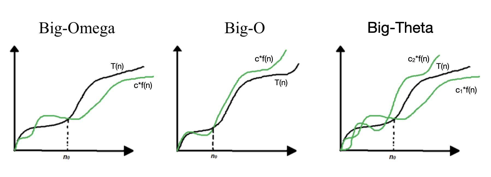
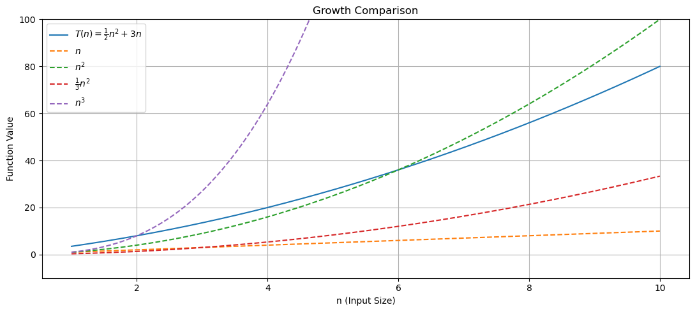

# Lecture 4 - Asymptotic Notation (Big-O, Big-Theta, Big-Omega)

_Fall 2025, Korea University_

Instructor: Gabin An ([gabin_an@korea.ac.kr](mailto:gabin_an@korea.ac.kr))


---

### Course Outline (Before Midterm)

- Part 1: Basics
   - ~~Divide and Conquer (w/ Integer Multiplication)~~ ✅
   - ~~Basic Sorting Algorithms (Insertion Sort & Merge Sort)~~ ✅
   - **Asymptotic Analysis (Big-O, Big-Theta, Big-Omega)** 👈
   - Solving Recurrences Using Master Method
- Part 2: Advanced Selection and Sorting
   - Median and Selection Algorithm
   - Solving Recurrences Using Substitution Method
   - Quick Sort, Counting Sort, Radix Sort
- Part 3: Data Structures
   - Heaps, Binary Search Trees, Balanced BSTs

---

## 👀 Review: MergeSort Implementation

```python
def merge_sort(A):
    n = len(A)

    if n <= 1:
        return A

    L = merge_sort(A[:n//2]) # left half
    R = merge_sort(A[n//2:]) # right half

    return merge(L, R) # key subroutine! ⭐️
```


---

## ✏️ Correction: Running Time of ~~`merge`~~ -> `merge_sort`

Suppose the input array $A$ has length $m$.
1. Base Case Check: **2 operations**
   - Retrieving length: 1 operation
   - Comparing if $m = 1$: 1 operation
2. Recursive Call Setup: **$m + 2$ operations**
   - Copying elements into `L` and `R`: $m$ operations
   - Storing into variables `L` and `R`: 2 operations
3. Merging Two Halves: the merge step takes **$3 + 3m \leq 6m$ operations**
   - Why? 3 assignments + $m$ scans + $m$ appending + $m$ cursor increase
- Total number of operations $\leq 2 + (m + 2) + 6m \leq 11m$


---

## 👀 Review: Running Time of `merge_sort`

```
level 0:                      n
                            /   \
level 1:                 n/2     n/2
                        /   \    /   \
level 2:              n/4  n/4  n/4  n/4
                       .              .
                       .              .
                  |  |  |  |       |  |  |  |
level log_2(n):   1  1  1  1  ...  1  1  1  1
```
- At each level $j = 0, 1, \ldots, ..., \log_{2}n$, there are $2^j$ subproblems, each of size $n/2^j$.
- Work at each level $j$ = (\#subproblems * Work per subproblem) $\leq 2^j \cdot 11(\frac{n}{2^j})= 11n$

Total Work = (Work per level * \#levels) $\leq 11n \cdot (1+ \log_2(n)) = 11n\log_2{n}+11n$. ✅

---

# We've **Roughly** Analyzed the Running Time So Far...

- O($n^2$) algorithms: SelectionSort, BubbleSort, InsertionSort
- O($n \log n$) algorithm: MergeSort (divide-and-conquer)

1. The algorithm never "looks at" the input.
   - MergeSort runs through all $\log_{2}n+1$ levels of recursion for an input $[1,2,3,4]$.
2. In our analysis, we’ve given a very loose upper bound on the time required of `merge` and dropped some constant factors and lower-order terms.

> Is this a problem? Have we been too sloppy? 🧐

We'll argue that these are *features*, not bugs, in the design and analysis of the algorithm.


---

# Today's Objectives

> Big Question!! 🤓
> **What do we really mean by a “fast” algorithm?**


- Adopt three foundational principles for reasoning about performance:
  1. **Worst-Case Analysis** – focus on the most demanding inputs
  2. **Big-Picture Analysis** – ignore low-level machine details
  3. **Asymptotic Analysis** – emphasize scalability for large inputs
- Learn **Asymptotic Notation**: $O(n), \Omega(n), \Theta(n)$.


---

# Principle #1: Worst-Case Analysis

- We want our **performance guarantees to hold for *every* possible input**.
- Think of it as a game against an **adversary**:
   - You choose the algorithm and claim it runs in time $T(n)$.
   - The adversary picks the **worst-case input** of size $n$.
   - You win if the algorithm still runs in $\leq T(n)$ time.
- Why Worst-Case?
  - Provides a **strong, robust guarantee**
  - No assumptions made about input distribution
  - Ensures the algorithm behaves well **even in the most challenging cases**


---

# Principle #2: Big-Picture Analysis

- We won't pay much attention to **constants** and **lower-order terms**.
  - e.g., treat $5n$, $n + 100$, and $0.01n$ all as $O(n)$
  - e.g., treat $11n\log_2{n}+11n$ as $O(n \log_{2} n)$, or just $O(n \log n)$ 🧐
  
- Why?
  - **Simplifies** analysis and comparisons
  - Constants vary with **hardware, compilers, coding style**
  - We lose **very little predictive power** (as we'll soon see)


---

# Principle #3: Asymptotic Analysis

- We focus on running time for large input sizes ($n \to \infty$)
- Small inputs can be solved even with brute force.
- However, for large inputs, efficiency **matters** — brute force breaks down.

> Only big problems are interesting!


---

# Principle #3: Asymptotic Analysis - Continued

- e.g., $11n(\log_{2} n + 1)$ (MergeSort) is better than $\frac{n(n-1)}{2}$ (InsertionSort)


---

# 🚀 What Counts as “Fast”? 

- A “fast” algorithm is one whose running time grows **slowly** with $n$.
- Ideally: as close to **linear** as possible
- This motivates a **formal system** for comparing algorithm growth rates.
  - 🔧 **Asymptotic Notation** 🔧


---

# Asymptotic Notation: $O(n), \Omega(n), \Theta(n), \ldots$

- We use **asymptotic notation** to describe algorithm performance.
  - Each describes a different kind of bound.
- Let $T(n)$ be the running time of an algorithm on input of size $n$.
- Example: Karatsuba Multiplication (from Lecture 2)
  $$
  T(n) = 3T(\frac{n}{2}) = \ldots = 3^tT(\frac{n}{2^t}) = 3^{\log_{2}n}T(1) \approx n^{1.58}T(1)
  $$


---




---

## 1. Big-O Notation: $O(f(n))$

* Describes an **upper bound** on the running time
* Used to express the **worst-case** performance
* Interpretation: “$T(n)$ grows *no faster than* $f(n)$ up to constant factors”

**Formal Definition:**

$$
T(n) = O(f(n)) \iff \exists\ c > 0,\ n_0 \text{ such that } \forall n \geq n_0,\ 0 \leq T(n) \leq c \cdot f(n)
$$

---

### Big-O Example #1: **Karatsuba Multiplication is $O(n^{1.58})$**

$$
T(n) \approx  n^{1.58}T(1) = O(n^{1.58})
$$
This is true because:

$$
\exists\ c > 0, \ n_0\ \text{such that} \ \forall n \geq n_0,\ T(n) \leq c \cdot n^{1.58}
$$

- For **sufficiently large $n$**, the algorithm takes **no more than** $c \cdot n^{1.58}$ time
- This gives a **guaranteed upper bound** on the running time

    > Karatsuba is **faster than $O(n^2)$** multiplication.

- Technically, it is also  $O(n^2)$, but $O(n^2)$ is **not tight** and gives less precise information.

--- 

### Big-O Example #2: **All degree-k polynomials are $O(n^k)$**

**Claim**: If $T(n) = a_k n^k + a_{k-1} n^{k-1} + \ldots + a_1 n + a_0$, then $T(n) = O(n^k)$

**Proof**:
- Choose: $n_0 = 1$ and $c = |a_k| + |a_{k-1}| + \ldots + |a_1| + |a_0|$
- We want to show: $\forall n \geq 1,\ T(n) \leq c \cdot n^k$ (*Definition of Big-O*)
  > $T(n) = O(f(n)) \iff \exists\ c > 0,\ n_0 \text{ such that } \forall n \geq n_0,\ 0 \leq T(n) \leq c \cdot f(n)$
- $\forall n \geq 1$, we have:
$$
\begin{aligned}
T(n) &= a_k n^k + \ldots + a_1 n + a_0 \\
     &\leq |a_k| n^k + \ldots + |a_1| n + |a_0| \\
     &\leq (|a_k| + \ldots + |a_1| + |a_0|) \cdot n^k = c \cdot n^k
\end{aligned}
$$
- Hence, $T(n) = O(n^k)$ ✅


---

### Big-O Example #3: **For every $k \geq 1$, $n^k$ is not $O(n^{k-1})$**
**Proof (by contradiction)**:

Suppose, for contradiction, that: $T(n) = n^k = O(n^{k-1})$

Then, by the definition of Big-O, there exist constants $c > 0$, $n_0 \geq 1$ such that:

$$
n^k \leq c \cdot n^{k-1} \quad \forall n \geq n_0
$$

Divide both sides by $n^{k-1}$:

$$
n \leq c \quad \forall n \geq n_0
$$

But this is **clearly false**, since $n \to \infty$ as $n$ increases. So we have a **contradiction**.
Hence, $n^k$ is not $O(n^{k-1})$. ✅

> This shows that Big-O cannot *underestimate* growth rate.


---

## 2. Big-Omega Notation: $\Omega(f(n))$

- Describes a **lower bound** on the running time
- Indicates **best-case** or guaranteed performance
- Interpretation: “T(n) grows *at least as fast as* f(n)”

**Formal Definition:**

$$
T(n) = \Omega(f(n)) \iff \exists\ c > 0,\ n_0 \text{ such that } \forall n \geq n_0,\ 0 \leq c \cdot f(n) \leq T(n)
$$

**Example:**
Karatsuba's runtime, $T(n) \approx n^{1.58}T(1)$, grows **faster than linear**, i.e., $T(n) = \Omega(n)$.


---

## 3. Big-Theta Notation: $\Theta(f(n))$

- Describes a **tight bound**: both upper and lower
- Indicates that the algorithm grows at **exactly** the rate of $f(n)$ (up to constants)
- Interpretation: “T(n) grows *as fast as* f(n)”

**Formal Definition:**

$$
T(n) = \Theta(f(n)) \iff \exists\ c_1, c_2 > 0,\ n_0 \text{ such that } \forall n \geq n_0,\ 0 \leq c_1 f(n) \leq T(n) \leq c_2 f(n)
$$

**Example:**
- Karatsuba's runtime grows **asymptotically exactly like** $n^{1.58}$, i.e., $T(n) = \Theta(n^{1.58})$
  

---

## Check Your Understanding 🤓

Let 
$$
T(n) = \frac{1}{2}n^2 + 3n
$$

Which of the following are **true**? Choose *all that apply*.

1) $T(n) = O(n)$
2) $T(n) = \Omega(n)$
3) $T(n) = \Theta(n^2)$
4) $T(n) = O(n^3)$


---



---

## Check Your Understanding 🤔 - 2nd try!

Let

$$
T(n) = 7n \log n + 20n
$$

Which of the following are **true**? Choose *all that apply*.

1. $T(n) = O(n)$
2. $T(n) = O(n \log n)$
3. $T(n) = \Omega(n \log n)$
4. $T(n) = \Theta(n^2)$


---

# ✨ Heads up! Quiz #1 is coming up next Tuesday.

- It will cover material from Lectures 2, 3, and 4.
- 5-6 questions :-)
- 15 minutes
- I recommend running through the Python code we covered in class at least once!


---

# Credits & Resources

Lecture materials adapted from:
- Stanford CS161 slides and lecture notes
  - https://stanford-cs161.github.io/winter2025/
- _Algorithms Illuminated_ by Tim Roughgarden
  - https://algorithmsilluminated.com/