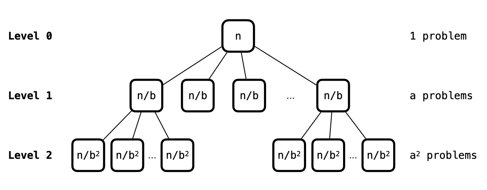

# Lecture 5 - Solving Recurrences (Master Method)

_Fall 2025, Korea University_

Instructor: Gabin An ([gabin_an@korea.ac.kr](mailto:gabin_an@korea.ac.kr))


---

# Welcome Back! 👀

In today’s class, we’ll
- Take a Quiz#1
- Revisit Divide and Conquer
- Learn **how to solve recurrences** using **Master Method**
  - i.e,, compute the running time of divide and conquer algorithms


---

# Quiz #1 ⭐️

- Time limit: 15 minutes
- Start time: 13:40
- Materials: Lecture slides/notes may be used (open notes, not open internet)
- Please prepare a sheet of paper and a pen/pencil for small calculations.
- Password: `                `
  


---

# Recap: Divide and Conquer

1. *Divide* the input into smaller subproblems
2. *Conquer* the subproblems recursively
3. *Combine* the solutions for the subproblems into a solution for the original problem.

Examples
- Karatsuba's Integer Multiplication Algorithm
- MergeSort

> Divide and Conquer algorithms are **recursive algorithms**!


---

## Recurrence Examples

Let $T(n)$ be the runtime of the algorithm, given an input of size $n$.

- The simple recursive multiplication algorithm: $T(n) = 4T(\frac{n}{2}) + O(n)$
- The Karatsuba multiplication algorithm: $T(n) = 3T(\frac{n}{2}) + O(n)$
- MergeSort: $T(n) = 2T(\frac{n}{2}) + O(n)$

> The running time of divide and conquer algorithms can be naturally expressed in terms of the running time of smaller inputs.


---

## Recurrence Examples - Running Time of Algorithms ✍️

- The simple recursive multiplication algorithm: $T(n) = 4T(\frac{n}{2}) + O(n)$
  - $O(n^2)$ - _See Lecture 2_
- The Karatsuba multiplication algorithm: $T(n) = 3T(\frac{n}{2}) + O(n)$
  - $O(n^{1.58})$ - _See Lecture 2_
- MergeSort: $T(n) = 2T(\frac{n}{2}) + O(n)$
  - $O(n \log_{2} n)$ - _See Lecture 3_

> Is there easier way to compute the running time of these recursive algorithms? 🤔

---

# Solving Recurrernces

There are techniques to solve these recurrences.
- **Master Method**: This method can only be used when the size of all the subproblems is the same (as was the case in the examples) - 📍 _Covered in Today's Class_
- **Substitution Method**: This method is used to solve more complex recurrences.


---

# What is Master Method?

- A general method for solving recurrences
- Assumption: **All the subproblems have equal size**.
  - Karatsuba ($n=4$) will be split into three subproblems of size 2
    - Karatsuba (**$n=2$**), Karatsuba (**$n=2$**), and Karatsuba (**$n=2$**)
  - MergeSort ($n=8$) will be split into two subproblems of size 4
    - MergeSort (**$n=4$**) and MergeSort (**$n=4$**)


---

## Standard Recurrence Format

1. Base Case: For a sufficiently small $n$ (say, when $n=1$), the worst-case runtime of the algorithm is constant, namely $T(n) = O(1)$.
2. For all larger $n$:
    $$
    T(n) \leq a \cdot T(\frac{n}{b}) + O(n^{d})
    $$

    - $a$ is the number of subproblems that we create from one problem (i.e., $a \geq 1$)
    - $b$ is the factor by which the input size shrinks (i.e., $b > 1$).
    - $d$ is the exponent of $n$ in the time it takes to generate the subproblems and combine their solutions.


---

## **Master Theorem**

If $T(n)$ is defined by a standard recurrence, i.e., $T(n) \leq a \cdot T(\frac{n}{b}) + O(n^{d})$ where $a \geq 1$, $b > 1$ and $d \geq 0$, then

$$
T(n) = 
\begin{cases}
O(n^d \log n) & \text{if } a = b^d \quad \text{(Case 1)} \\
O(n^d) & \text{if } a < b^d \quad \text{(Case 2)} \\
O(n^{\log_b a}) & \text{if } a > b^d \quad \text{(Case 3)}
\end{cases}
$$


---

## Master Theorem - Example for **Case 1**

If $T(n)$ is defined by a standard recurrence, i.e., $T(n) \leq a \cdot T(\frac{n}{b}) + O(n^{d})$ where $a \geq 1$, $b > 1$ and $d \geq 0$, then
$$
T(n) = 
\begin{cases}
O(n^d \log n) & \text{if } a = b^d \quad \textbf{(Case 1)} \\
O(n^d) & \text{if } a < b^d \quad \text{(Case 2)} \\
O(n^{\log_b a}) & \text{if } a > b^d \quad \text{(Case 3)}
\end{cases}
$$

**Example:**

MergeSort: $T(n) = 2T(\frac{n}{2}) + O(n)$
- $a=2, b=2, d=1$, so $a = b^d$, hence $T(n) = O(n\log n)$.


---

## Master Theorem - Example for **Case 2**

If $T(n)$ is defined by a standard recurrence, i.e., $T(n) \leq a \cdot T(\frac{n}{b}) + O(n^{d})$ where $a \geq 1$, $b > 1$ and $d \geq 0$, then
$$
T(n) = 
\begin{cases}
O(n^d \log n) & \text{if } a = b^d \quad \text{(Case 1)} \\
O(n^d) & \text{if } a < b^d \quad \textbf{(Case 2)} \\
O(n^{\log_b a}) & \text{if } a > b^d \quad \text{(Case 3)}
\end{cases}
$$

**Example:**

If an algorithm's running time is: $T(n) = 3T(\frac{n}{2}) + O(n^2)$
- $a=3, b=2, d=2$, so $a < b^d$, hence $T(n) = O(n^{2})$

---

## Master Theorem - Example for **Case 3**

If $T(n)$ is defined by a standard recurrence, i.e., $T(n) \leq a \cdot T(\frac{n}{b}) + O(n^{d})$ where $a \geq 1$, $b > 1$ and $d \geq 0$, then
$$
T(n) = 
\begin{cases}
O(n^d \log n) & \text{if } a = b^d \quad \text{(Case 1)} \\
O(n^d) & \text{if } a < b^d \quad \text{(Case 2)} \\
O(n^{\log_b a}) & \text{if } a > b^d \quad \textbf{(Case 3)}
\end{cases}
$$

**Example:**

The simple recursive multiplication algorithm: $T(n) = 4T(\frac{n}{2}) + O(n)$
- $a=4, b=2, d=1$, so $a > b^d$, hence $T(n) = O(n^{\log_{2}4}) = O(n^2)$


---

## Master Theorem - Example for **Case 3**

If $T(n)$ is defined by a standard recurrence, i.e., $T(n) \leq a \cdot T(\frac{n}{b}) + O(n^{d})$ where $a \geq 1$, $b > 1$ and $d \geq 0$, then
$$
T(n) = 
\begin{cases}
O(n^d \log n) & \text{if } a = b^d \quad \text{(Case 1)} \\
O(n^d) & \text{if } a < b^d \quad \text{(Case 2)} \\
O(n^{\log_b a}) & \text{if } a > b^d \quad \textbf{(Case 3)}
\end{cases}
$$

**Example:**

The Karatsuba multiplication algorithm: $T(n) = 3T(\frac{n}{2}) + O(n)$
- $a=3, b=2, d=1$, so $a > b^d$, hence $T(n) = O(n^{\log_{2}3}) = O(n^{1.58})$


---

## Proof of the Master Theorem - Preamble

**Assumption**

A recurrence is
1. $T(1) \leq c$ (For some constant $c$)
2. $T(n) \leq aT(\frac{n}{b}) + cn^d$
and $n$ is a power of $b$.

**Idea**: Generalize MergeSort analysis (i.e., use a **recursion tree**)


---

### Recap: MergeSort Running Time Analysis

```
level 0:                      n
                            /   \
level 1:                 n/2     n/2
                        /   \    /   \
level 2:              n/4  n/4  n/4  n/4
                       .              .
                       .              .
                  |  |  |  |       |  |  |  |
level log_2(n):   1  1  1  1  ...  1  1  1  1
```

- At each level $j = 0, 1, \ldots, ..., \log_{2}n$, there are $2^j$ subproblems, each of size $n/2^j$.
- Work at each level $j$ = (\#subproblems * Work per subproblem) $\leq 2^j \cdot 11(\frac{n}{2^j})= 11n$

Total Work = (Work per level * \#levels) $\leq 11n \cdot (1+ \log_2(n)) = O(n \log n)$. ✅


---

### Quiz!

Let $T(n) = aT(\frac{n}{b}) + cn^d$, then in a recursion tree, at each level $j=0,1,2,\ldots,\log_b{n}$, there are ____ subproblems, each of size ____.

1. $a^j$ and $n/a^j$, respectively.
2. $a^j$ and $n/b^j$, respectively. 3. $b^j$ and $n/a^j$, respectively.
4. $b^j$ and $n/b^j$, respectively.


---

## The Recursion Tree





---


- Work at level 1 $\leq a \cdot c(\frac{n}{b})^d$, Work at level 2 $\leq a^2 \cdot c(\frac{n}{b^2})^d$, ... 
- Work at each level $j$ $\leq a^j \cdot c(\frac{n}{b^j})^d = cn^d \cdot (\frac{a}{b^d})^j$ (*ignoring work in recursive calls*)
  - $a$ = rate of subproblem proliferation (RSP)
  - $b^d$ = rate of work shrinkage (RWS) - per subproblem
- Total Work $\leq \sum_{j=0}^{\log_{b}n}\left\{cn^d\cdot(\frac{a}{b^d})^j\right\} = cn^d \cdot \sum_{j=0}^{\log_{b}n}(\frac{a}{b^d})^j$


---


## Intuition for the 3 Cases 💡

$$
T(n) = 
\begin{cases}
O(n^d \log n) & \text{if } a = b^d \quad \text{(Case 1)} \\
O(n^d) & \text{if } a < b^d \quad \text{(Case 2)} \\
O(n^{\log_b a}) & \text{if } a > b^d \quad \text{(Case 3)}
\end{cases}
$$

> Upper bound for level $j$: $cn^d \cdot (\frac{a}{b^d})^j$ 

- Case 1: $a = b^d$ (RSP = RWS), i.e., $\frac{a}{b^d}=1$
  - 🟰 Same amount of work each level (like MergeSort)
- Case 2: $a < b^d$ (RSP < RWS), i.e., $\frac{a}{b^d} < 1$
  - ⬆️ Top-heavy work: most work is done near the root. 
- Case 3: $a > b^d$ (RSP > RWS), i.e., $\frac{a}{b^d} > 1$
  - ⬇️ Bottom-heavy work: most work is at the leaves.


---

## Proof of the Master Theorem - Case 1 ($a = b^d$)

- Total Work 
  $\leq cn^d \cdot \sum_{j=0}^{\log_{b}n}(\frac{a}{b^d})^j$
  $= cn^d \cdot \sum_{j=0}^{\log_{b}n}1$
  $= cn^d(\log_{b}n+1)$
  $= O(n^d\log n)$


---

## Proof of the Master Theorem - Case 2 ($a < b^d$)

- Total Work 
  $\leq cn^d \cdot \sum_{j=0}^{\log_{b}n}(\frac{a}{b^d})^j$
  $= cn^d \cdot \sum_{j=0}^{\log_{b}n}r^j$ (where $r=\frac{a}{b^d} < 1$)
  $= cn^d \cdot (1 + r^1 + r^2 + \cdots + r^{\log_{b}n})$
  $\leq cn^d \cdot (\frac{1}{1-r}) (\because r < 1)$
  $=O(n^d)$

- Basic Fact
  - If $|r| < 1$, $\sum_{j=1}^{\infty}ar^{n-1}=a+ar+ar^2+\cdots+ar^k+\cdots = \frac{a}{1-r}$ 
  

---

## Proof of the Master Theorem - Case 3 ($a > b^d$)

- Total Work 
  $\leq cn^d \cdot \sum_{j=0}^{\log_{b}n}(\frac{a}{b^d})^j$
  $= cn^d \cdot \sum_{j=0}^{\log_{b}n}r^j$ (where $r=\frac{a}{b^d} > 1$)
  $= cn^d \cdot (1 + r^1 + r^2 + \cdots + r^{\log_{b}n})$
  $= cn^d \cdot \frac{r^{\log_{b}n} - 1}{r - 1}$
  $= O(n^d \cdot r^{\log_{b}n})$
  $= O(n^d \cdot (\frac{a}{b^d})^{\log_{b}n})$
  $= O(a^{\log_{b}n} \cdot n^d \cdot b^{-d\log_{b}n})$
  $= O(a^{\log_{b}n} \cdot n^d \cdot n^{-d})$
  $= O(a^{\log_{b}n})$ (*this equals to $\# \text{leaves}$ 🍃*)
  $= O(b^{\log_{b}a\log_{b}n}) = O((b^{\log_{b}n})^{\log_{b}a}) = O(n^{\log_{b}a})$


---

## The Master Method 🧙‍♂️

If $T(n) \leq a \cdot T(\frac{n}{b}) + O(n^{d})$ where $a \geq 1$, $b > 1$ and $d \geq 0$, then

$$
T(n) = 
\begin{cases}
O(n^d \log n) & \text{if } a = b^d \quad \text{(Case 1)} \\
O(n^d) & \text{if } a < b^d \quad \text{(Case 2)} \\
O(n^{\log_b a}) & \text{if } a > b^d \quad \text{(Case 3)}
\end{cases}
$$


Note that this method can only be used when the size of all the subproblems is the same!


---

# Credits & Resources

Lecture materials adapted from:
- Stanford CS161 slides and lecture notes
  - https://stanford-cs161.github.io/winter2025/
- _Algorithms Illuminated_ by Tim Roughgarden
  - https://algorithmsilluminated.com/


<style>
  img[alt~='center'] {
    display: block;
    margin-left: auto;
    margin-right: auto;
  }
</style>