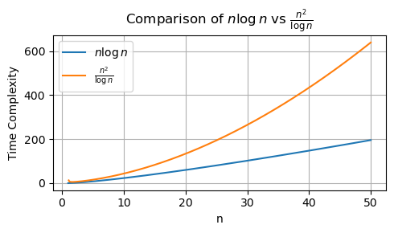

# Lecture 9 - Sorting Lower Bounds, Counting Sort, Radix Sort

_Fall 2025, Korea University_

Instructor: Gabin An ([gabin_an@korea.ac.kr](mailto:gabin_an@korea.ac.kr))


---

# Welcome Back! 👋

* Today, we’ll prove that **every deterministic comparison-based sorting algorithm** requires **Ω(n log n)** time in the worst case.
* We’ll also introduce **non-comparison-based** sorting algorithms, including **Counting Sort** and **Radix Sort**.


---

# Comparison-Based Sorting Algorithms ⚖️

- The sorting algorithms we have learned in this course (i.e., SelectionSort, BubbleSort, InsertionSort, MergeSort, QuickSort) are all **COMPARISON-based** sorting algorithms!
  - i.e., they sort an array via asking *whether a given element is greater than, less than, or equal to some other element*.
- For such algorithms, there exists **theoretical lower bounds** for running time.

## Lower Bounds for Sorting

> Any *comparison-based* deterministic sorting algorithm takes $\Omega(n \log n)$ time.


---

### Lower Bounds for Sorting (Worst-Case Bound)

> Any **deterministic comparison-based** sorting algorithm must make $\Omega(n \log n)$ comparisons.

- Based on:
  - There are **n!** possible permutations for sorting outputs.
  - Sorting algorithm must **distinguish** between all of them.
- Think about:
  - Each comparison at best halves the search space ⇒ need $\log_{2}(n!)$ steps
  - Game of "20 Questions" (스무고개)


---

### Example: Sorting 3 Elements
- Input: three numbers $x_1, x_2, x_3$
- Possible orders: $3! = 6$ permutations
  - List: (123), (132), (213), (231), (312), (321)
  - (123) means $x_1 > x_2 > x_3$

#### Comparison as Information
- Each comparison is a **yes/no** question, cutting possibilities at most in half.
- Example: check $x_1 > x_2$
  - If true: possible → (123), (132), (312)
  - If false: possible → (213), (231), (321)
  - So the 6 possibilities reduce to 3.


---

###  Minimum number of comparisons

- After each comparison, at most half of the candidates remain.
- Need enough comparisons to distinguish among all $3! = 6$ orders.
  * $\text{\#comparisons} \ge \left\lceil\log_{2}(6)\right\rceil = \left\lceil2.58\right\rceil = 3$
- Hence, 3 comparisons are sufficient to fully determine the order of three elements.


---

### Time Complexity Analysis

- Any deterministic comparison-based sorting algorithm must make at least $\log_2(n!)$ comparisons before it can halt.

$$
\begin{aligned}
\log_2(n!) &= \log_2(n \times (n-1) \times \cdots \times 1)\\
           &= \log_2(n) + \log_2(n-1) + \cdots + \log_2(1)\\
           &= \Omega(n \log n). \quad\blacksquare
\end{aligned}
$$


---

### Randomized Algorithms

> Randomized comparison-based sorting also requires $\Omega(n \log n)$ comparisons on average.

* Treat randomized algorithm as a **distribution over deterministic ones**
* Expected runtime is weighted average over deterministic algorithms
* Since all have $\Omega(n \log n)$ average, so must the randomized algorithm


---

## Non-Comparison-Based Sorting Algorithms?

> Comparison-based sorting has a known lower bound of $\Omega(n \log n)$.

- This bound applies to algorithms that only compare values (e.g., MergeSort, QuickSort).
- But what if we **don’t use comparisons** to sort?

    ➡️ **Counting Sort** and **Radix Sort** escape this lower bound!


---

## Counting Sort

- For a given input of $n$ objects, each with a corresponding key (or value) in the range $\{0, 1, \ldots, r-1\}$, Counting Sort will sort the objects by their keys:
  1. Create an array $A$ of $r$ buckets where each bucket contains a linked list.
  2. For each element in the input array with key $k$, concatenate the element to the end of the linked list $A[k]$.
  3. Concatenate all the linked lists: $A[0], \ldots, A[r-1]$.


---

### Counting Sort: Example
- Input: `[o1(k=4), o2(k=2), o3(k=2), o4(k=8), o5(k=3), o6(k=3), o7(k=1)]`  
- Assume keys range from $0$ to $r-1 = 9$ (so $r = 10$)
1. Create 10 buckets
    ```
    A[0]: [], ..., A[9]: []
    ```
2. Distribute elements into buckets
    ```
    A[1]: [o7]
    A[2]: [o2, o3]
    A[3]: [o5, o6]
    A[4]: [o1]
    A[8]: [o4]
    ```
3. Sorted output: `[o7, o2, o3, o5, o6, o1, o4]` (Sorted without comparisons!)


---

### Counting Sort: Why It Works

- Items are grouped by key.
- Bucket `i` (key = $i$) appears before bucket `j` (key = $j$) when $i < j$.
- Resulting order is **correct** and **stable**.

  - **Stability**: If $x$ appears before $y$ in input and both have same key, $x$ appears before $y$ in output.
    - Example: `Input = [o1(k=4), o2(k=2), o3(k=2), o4(k=8), o5(k=3), o6(k=3), o7(k=1)]`, `Output = [o7, o2, o3, o5, o6, o1, o4]`,
      - `o2` appears before `o3`, and `o5` appears before `o6` in output.


---

### Counting Sort: Time and Space Complexity

- Time: $O(n + r)$  
  (one pass over input + one pass over buckets)
- Space: $O(n + r)$

> ⚠️ Works best when $r$ is **small** (e.g., constant or $O(n)$).

- Counting Sort behaves poorly if the range of values $r$ is very large.
  - Radix Sort builds on Counting Sort and fixes this issue!


---

## Radix Sort

- Input: $n$ numbers with $d$ digits (each digit in $\{0, 1, \dots, r-1\}$)
- **Idea:** Sort digit-by-digit from **least** to **most** significant

    ```text
    for j = 1 to d:
        CountingSort(A, key = j-th digit)
    ```


---

### Radix Sort: Example

- Input: 7 numbers with **3 digits** `[329, 457, 657, 839, 436, 720, 355]`  
  - Base: $r = 10$ (digits range from 0–9)
1. Sort by **1st digit (units)**
    - Digits: `[9, 7, 7, 9, 6, 0, 5]`  
    - Counting Sort: `[720, 355, 436, 457, 657, 329, 839]`
2. Sort by **2nd digit (tens)**
    - Digits: `[2, 5, 3, 5, 5, 2, 3]`
    - Counting Sort: `[720, 329, 436, 839, 355, 457, 657]`
3. Sort by **3rd digit (hundreds)**
    - Digits: `[7, 3, 4, 8, 3, 4, 6]`
    - Counting Sort: `[329, 355, 436, 457, 657, 720, 839]`


---

### Radix Sort: Why It Works

We prove correctness by **induction on digit position**:

- **Base case** ($j = 1$):  
  After the 1st pass, the array is correctly sorted by the **least significant digit**.

- **Inductive step**:  
  Suppose array is correctly sorted by the first $j-1$ digits.  
  When we sort by the $j$-th digit using a **stable** sort:
    - Elements with the same $j$-th digit **retain their order** from earlier digits.
    - So the array becomes sorted by the **first $j$ digits**.

    ➡️ After the $d$-th pass, the array is sorted by all $d$ digits → **Fully sorted!**


---

### Radix Sort: Time Complexity
- Each digit uses Counting Sort: $O(n + r)$
- Total time: $O(d(n + r))$
    - If $r = O(n)$ and $d = O(1)$, then:
        - $O(n)$ time


---

### Radix Sort: Varying the Base $r$

- The number of **passes** (digits $d$) depends on:
  - The **maximum value** in the input: $M$
  - The **base** $r$ used for digit representation

$$
d = \lfloor \log_r M \rfloor + 1
$$

- So the **runtime** is:

$$
O(d(n + r)) \rightarrow O\left((\log_r M + 1)(n + r)\right)
$$

- How should we choose $r$?
    - One smart strategy would be setting $r = n$ to balance the two terms in $(n + r)$
      - It leads to runtime: $O\left(n \cdot (\log_n M + 1)\right)$


---

### When is Radix Sort Fast?
- When $r = n$, the runtime is $O(n \cdot (\log_n M + 1))$
  - If $M = n^c$ for constant $c$, $O(n)$ time ✅
  - If $M = 2^n$, $O(n^2 / \log n)$ ❌ *This is worse than $O(n \log n)$*
    $$
    O(n \cdot (\log_n 2^n + 1))
    = O(n \cdot (n \log_n 2 + 1))
    = O(n \cdot (n \frac{\log_2 2}{\log_2 n} + 1))
    = O(n \cdot (\frac{n}{\log_2 n} + 1))
    = O(n^2 / \log n)
    $$



---

### When is Radix Sort Fast?

- Radix Sort (with $r=n$) is efficient when $M$ is **not too large** relative to $n$.
  - Use Radix Sort **when the sorting keys (numbers) are bounded**!
    - E.g., Student IDs, dates..
  - When $M$ grows exponentially in $n$ (e.g., $M = 2^n$), Radix Sort becomes inefficient and loses its edge over comparison-based sorts.


---

# Credits & Resources

Lecture materials adapted from:
- Stanford CS161 slides and lecture notes
  - https://stanford-cs161.github.io/winter2025/
- _Algorithms Illuminated_ by Tim Roughgarden
  - https://algorithmsilluminated.com/

<style>
  img[alt~='center'] {
    display: block;
    margin-left: auto;
    margin-right: auto;
  }
</style>
